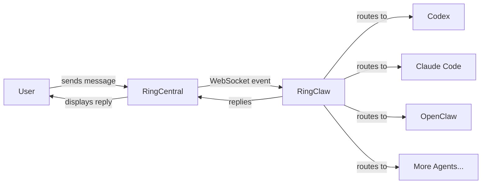
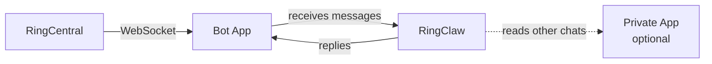

# RingClaw

[中文文档](README_CN.md)

RingCentral AI Agent Bridge — connect RingCentral Team Messaging to AI agents (Claude, Codex, Gemini, Kimi, etc.).

> This project is inspired by [WeClaw](https://github.com/fastclaw-ai/weclaw/) — the original WeChat AI Agent Bridge, which was in turn inspired by [@tencent-weixin/openclaw-weixin](https://npmx.dev/package/@tencent-weixin/openclaw-weixin).


## Quick Start

```bash
# One-line install (macOS/Linux)
curl -sSL https://raw.githubusercontent.com/ringclaw/ringclaw/main/install.sh | sh

# One-line install (Windows PowerShell)
irm https://raw.githubusercontent.com/ringclaw/ringclaw/main/install.ps1 | iex

# Set bot token (required)
export RC_BOT_TOKEN="your_bot_token"

# Start
ringclaw start
```

That's it. On first start, RingClaw will:
1. Connect to RingCentral via the Bot App's WebSocket
2. Auto-detect installed AI agents (Claude, Codex, Gemini, etc.)
3. Save config to `~/.ringclaw/config.json`
4. Start receiving and replying to messages

### RingCentral Setup

> **Tip:** After creating your apps, run `ringclaw setup` for an interactive wizard that collects credentials, validates them, and saves the config file.

#### Step 1: Create a Bot App (Required)

1. Go to [RingCentral Developer Console](https://developers.ringcentral.com/console) and sign in
2. Click **Register App** → select **Bot Add-in (No UI)**
3. Configure the app:
   - **Security** → App Scopes: check **ReadAccounts**, **TeamMessaging**, **WebSocketsSubscription**
   - **Access**: Private (only your own account)
4. Click **Create**
5. Go to the **Bot** tab → click **Add** to install the bot to your account
6. Copy the **Bot Token** shown on the Bot tab

#### Step 2: Find Chat IDs

1. Open [API Explorer → List Chats](https://developers.ringcentral.com/api-reference/Chats/listGlipChatsNew)
2. Sign in and click **Try It Out**
3. Find the chat you want to monitor and copy its `id` field

#### Step 3: Create a Private App (Optional)

A Private App (REST API with JWT) enables additional features:
- **Summarize** conversations from other chats
- **Cross-chat actions** (read messages, create tasks in other chats)

1. In the Developer Console, click **Register App** → select **REST API App**
2. Configure the app:
   - **Auth**: JWT auth flow
   - **Security** → App Scopes: check **ReadAccounts**, **TeamMessaging**, **WebSocketsSubscription**
   - **Access**: Private
3. Click **Create** — you'll get a **Client ID** and **Client Secret**
4. Go to **Credentials** tab → **JWT Credentials** → click **Create JWT Token**
5. Copy the JWT token

#### Interactive Setup

```bash
ringclaw setup
```

The wizard will:
- Prompt for Bot Token (required)
- Prompt for chat IDs to monitor
- Optionally configure Private App credentials (Client ID, Secret, JWT Token)
- Validate credentials against the RingCentral API
- Save everything to `~/.ringclaw/config.json`

**Install channels:**

```bash
curl -sSL .../install.sh | sh                 # stable (latest tag)
curl -sSL .../install.sh | sh -s -- beta      # beta (latest main build)
curl -sSL .../install.sh | sh -s -- alpha feature/my-branch  # alpha (specific branch)
```

**Switch channels via CLI:**

```bash
ringclaw update                                    # update to latest stable
ringclaw update --channel beta                     # switch to beta channel
ringclaw update --channel alpha --branch feature/foo  # switch to alpha branch
```

> **macOS note:** The installer and `ringclaw update` automatically clear Gatekeeper quarantine attributes (`com.apple.quarantine`, `com.apple.provenance`), so the binary won't be killed after download.

### Other install methods

```bash
# Via Go
go install github.com/ringclaw/ringclaw@latest

# Via Docker
docker run -it -v ~/.ringclaw:/root/.ringclaw \
  -e RC_BOT_TOKEN=xxx \
  ghcr.io/ringclaw/ringclaw start
```

## How It Works



RingClaw connects to RingCentral Team Messaging via WebSocket to receive messages in real-time. When a message arrives, it routes it to the configured AI agent, then posts the reply back to the chat. While the agent is processing, a "Thinking..." placeholder message is shown and updated with the final reply.

**Agent modes:**

| Mode | How it works | Examples |
|------|-------------|----------|
| ACP  | Long-running subprocess, JSON-RPC over stdio. Fastest — reuses process and sessions. | Claude, Codex, Cursor, Kimi, Gemini, OpenCode, OpenClaw, Pi, Copilot, Droid, iFlow, Kiro, Qwen |
| CLI  | Spawns a new process per message. Supports session resume via `--resume`. | Claude (`claude -p`), Codex (`codex exec`) |
| HTTP | OpenAI-compatible chat completions API. Supports `openai` (default), `nanoclaw`, and `dify` formats. | OpenClaw, Dify Chatflow |

Auto-detection picks ACP over CLI when both are available.

## Chat Commands

Send these as messages in your RingCentral chat:

| Command | Description |
|---------|-------------|
| `hello` | Send to default agent |
| `/codex write a function` | Send to a specific agent |
| `/cc explain this code` | Send to agent by alias |
| `/cc /cx explain this` | Broadcast to multiple agents in parallel |
| `/claude` | Switch default agent to Claude |
| `/new` or `/clear` | Reset current agent session |
| `/cwd /path/to/project` | Switch workspace directory for all agents |
| `/task list\|create\|get\|update\|delete\|complete` | Manage tasks |
| `/note list\|create\|get\|update\|delete\|lock\|unlock` | Manage notes |
| `/event list [chatId]\|create\|get\|update\|delete` | Manage calendar events |
| `/card get\|delete` | Manage adaptive cards |
| `/chatinfo [chatId]` | Show chat details (name, type, members) |
| `summarize my chat with John` | Summarize a conversation |
| `/cron list\|add\|delete\|enable\|disable` | Manage scheduled tasks |
| `/info` | Show current agent info (alias: `/status`) |
| `/help` | Show help message |

Unknown `/commands` (e.g. `/status`, `/compact`) are forwarded to the default agent, so agent-specific slash commands work transparently.

### Aliases

| Alias | Agent |
|-------|-------|
| `/cc` | claude |
| `/cx` | codex |
| `/cs` | cursor |
| `/km` | kimi |
| `/gm` | gemini |
| `/ocd` | opencode |
| `/oc` | openclaw |
| `/pi` | pi |
| `/cp` | copilot |
| `/dr` | droid |
| `/if` | iflow |
| `/kr` | kiro |
| `/qw` | qwen |

Switching default agent is persisted to config — survives restarts.

### Multi-Agent Broadcast

Send the same message to multiple agents in parallel:

```
/cc /cx review this function     # broadcast to Claude and Codex in parallel
```

Each agent replies in a separate message prefixed with `[agent-name]`.

### Custom Aliases

You can define custom trigger aliases per agent in `config.json`:

```json
{
  "claude": {
    "type": "acp",
    "command": "/usr/local/bin/claude-agent-acp",
    "aliases": ["gpt", "ai"]
  }
}
```

Then `/gpt hello` will route to Claude. RingClaw warns on startup if custom aliases conflict with built-in aliases or other agents.

### Session Management

| Command | Description |
|---------|-------------|
| `/new`   | Reset the default agent's session and start fresh |
| `/clear` | Same as `/new` |

> **Dify note:** For Dify agents, `/new` and `/clear` also call `DELETE /v1/conversations/{id}` on the Dify server to wipe history on both sides. Use HTTPS endpoints to avoid nginx 301 redirect issues.

### Dynamic Workspace

```bash
/cwd ~/projects/my-app    # switch all agents to this directory
/cwd                       # show current workspace info
```

Tilde (`~`) is expanded to the home directory. The new working directory applies to all running agents immediately.

## Tasks, Notes & Calendar Events

Full CRUD for RingCentral Team Messaging resources directly from chat:

```
/task create Fix login bug         # create a task
/task list                         # list tasks in this chat
/task complete <id>                # mark task done
/note create Meeting Notes | body  # create a note (auto-published)
/event list                        # list calendar events
```

Each command supports: `list`, `create`, `get`, `update`, `delete`. Tasks also support `complete`.

## Adaptive Cards

AI agents can generate [Adaptive Cards](https://adaptivecards.io/) for rich structured display (progress reports, dashboards, forms, etc.). When the agent includes an `ACTION:CARD` block in its response, RingClaw automatically posts the card to the chat:

```
ACTION:CARD
{"type":"AdaptiveCard","version":"1.3","body":[{"type":"TextBlock","text":"Sprint Status","weight":"bolder"},{"type":"FactSet","facts":[{"title":"Completed","value":"12"},{"title":"Remaining","value":"3"}]}]}
END_ACTION
```

Manage cards via chat commands:

```
/card get <id>       # view card details
/card delete <id>    # delete a card
```

## AI-Driven Actions

AI agents can automatically create notes, tasks, events, and adaptive cards during conversation. When a user's request implies creating these resources, the agent appends ACTION blocks to its response and RingClaw executes them via the RC API:

```
ACTION:NOTE title=Meeting Summary
Key decisions from today's standup...
END_ACTION

ACTION:TASK subject=Update deployment scripts
END_ACTION

ACTION:EVENT title=Sprint Review start=2026-04-01T14:00:00Z end=2026-04-01T15:00:00Z
END_ACTION
```

Actions can target a different chat via `chatid=<id>` parameter (disabled in bot context for security). No configuration needed — the action prompt is injected automatically.

## Chat Summarization

Summarize conversations from any chat:

```
summarize my chat with John           # summarize today's chat with John
summarize my chat with Raye from Monday  # summarize since Monday
```

RingClaw resolves the target chat by name, fetches messages using the private app client, and sends the summary to the current chat via an AI agent.

> **Security:** Summarization is blocked in group chats when using a bot client, since the summary would be visible to all group members. Use it in a direct message with the bot instead.

## Cron (Scheduled Tasks)

Schedule recurring or one-shot tasks that send messages to AI agents on a timer:

```
/cron add "standup" every:24h "summarize yesterday's work"
/cron add "check" */30 * * * * "check for new PRs"
/cron add "reminder" at:2026-04-01T09:00:00 "sprint review today"
/cron list
/cron enable <id>
/cron disable <id>
/cron delete <id>
```

**Schedule formats:**

| Format | Example | Description |
|--------|---------|-------------|
| `every:<duration>` | `every:5m`, `every:24h` | Fixed interval |
| Cron expression | `*/30 * * * *`, `0 9 * * 1-5` | Standard 5-field cron |
| `at:<time>` | `at:2026-04-01T09:00:00` | One-shot (auto-disables after run) |

Jobs are persisted to `~/.ringclaw/cron/jobs.json` and survive restarts. Each job can optionally target a specific agent or chat.

## Heartbeat

Periodic agent check-in driven by a user-authored checklist. Create `~/.ringclaw/HEARTBEAT.md`:

```markdown
# Heartbeat checklist
- Check if any urgent emails arrived
- Scan for open PRs needing review
- Check CI pipeline status
```

RingClaw reads this file on each heartbeat interval, sends it to the default agent, and:
- Agent replies `HEARTBEAT_OK` → suppressed (nothing to report)
- Agent replies with content → delivered to the default chat with `[Heartbeat]` prefix
- Duplicate replies within 24h are suppressed to avoid noise

**Config:**

```json
{
  "heartbeat": {
    "enabled": true,
    "interval": "30m",
    "active_hours": "09:00-18:00",
    "timezone": "Asia/Shanghai"
  }
}
```

| Option | Default | Description |
|--------|---------|-------------|
| `enabled` | `false` | Enable heartbeat runner |
| `interval` | `30m` | Time between heartbeat checks |
| `active_hours` | — | Only run during these hours (e.g. `09:00-18:00`) |
| `timezone` | local | IANA timezone for active hours |

## Architecture

RingClaw uses a **Bot App** (required) for messaging and an optional **Private App** for advanced features.



### Routing

Messages from chats not in `chat_ids` are silently dropped by the monitor.

| Source chat | Reply client | Read/Action client |
|-------------|-------------|-------------------|
| Bot DM (auto-discovered) | Bot | Private App (if configured) or Bot |
| Chat in `chat_ids` | Bot | Private App (if configured) or Bot |

### Group chat behavior

- **`bot_mention_only: true`** (default) — Bot only responds when @mentioned in group chats
- **`bot_mention_only: false`** — Bot responds to all messages in allowed group chats
- **`group_summary_group_id: "..."`** — Only this exact group ID is allowed to use in-group summarize
- **`group_summary_message_limit: 200`** (default) — When group summarize is enabled, pull this many recent messages before time filtering

If `group_summary_group_id` is set, in-group summarize is enabled automatically. It is only allowed when the current group ID exactly matches that configured value.

### User allowlist

`source_user_ids` restricts which users the bot responds to. Accepts numeric RingCentral user IDs or email addresses (resolved to IDs at startup via the directory API). Empty = respond to everyone.

```json
"ringcentral": {
  "source_user_ids": ["alice@example.com", "3061708020"]
}
```

Find a user's numeric ID in RingClaw logs: `creatorID=XXXXXXXX` appears on every received message.

### Permission matrix

| Operation | Bot DM | Bot Group (owner) | Bot Group (others) |
|---|---|---|---|
| Chat with agent | Bot replies | Bot replies | Bot replies |
| Summarize | Private App read, Bot reply | **Blocked** (data leak) | **Blocked** (data leak) |
| Summarize (no Private App) | **Disabled** | **Disabled** | **Disabled** |
| `/clear`, `/new` | Allowed | Allowed | **Blocked** (owner only) |
| `/cwd` | Allowed | Allowed | **Blocked** (owner only) |
| Agent switch (`/cc`) | Allowed | Allowed | **Blocked** (owner only) |
| `/info`, `/help` | Allowed | Allowed | Allowed |
| `/task`, `/note`, `/event` | Private App (or Bot) | Private App (or Bot) | Private App (or Bot) |
| ACTION blocks | Private App (or Bot) | Private App (or Bot) | Private App (or Bot) |

**Client responsibilities:**

| Role | Client | Why |
|------|--------|-----|
| WebSocket connection | Bot App | Bot token drives WS |
| Send replies & placeholders | Bot App | Bot identity in all chats |
| Read other chats & summarize | Private App (optional) | Bot cannot access private chats |
| `/task`, `/note`, `/event` API | Private App if available, else Bot | Broader access with Private App |
| ACTION block execution | Private App if available, else Bot | Cross-chat access needs Private App |

### Bot App vs Private App API permissions

The two client types have different RingCentral API permissions. Understanding this helps you decide whether to configure a Private App.

**Bot App** receives the `TeamMessaging` permission automatically. **Private App** (REST API with JWT) can be granted `TeamMessaging` + `ReadAccounts`.

| Feature | API Endpoint | Required Permission | Bot App | Private App |
|---------|-------------|---------------------|---------|-------------|
| Send / update / delete posts | `/team-messaging/v1/chats/{chatId}/posts` | TeamMessaging | YES | YES |
| List / manage chats | `/team-messaging/v1/chats` | TeamMessaging | YES | YES |
| Upload files | `/team-messaging/v1/files` | TeamMessaging | YES | YES |
| Tasks CRUD | `/team-messaging/v1/tasks` | TeamMessaging | YES | YES |
| Notes CRUD | `/team-messaging/v1/notes` | TeamMessaging | YES | YES |
| Calendar Events CRUD | `/team-messaging/v1/events` | TeamMessaging | YES | YES |
| Adaptive Cards CRUD | `/team-messaging/v1/adaptive-cards` | TeamMessaging | YES | YES |
| Get person info | `/team-messaging/v1/persons/{id}` | TeamMessaging | YES | YES |
| Create conversation (DM) | `/team-messaging/v1/conversations` | TeamMessaging | YES | YES |
| Get own extension info | `/restapi/v1.0/account/~/extension/~` | (self-info) | YES | YES |
| **Search company directory** | `/restapi/v1.0/account/~/directory/entries/search` | **ReadAccounts** | **NO** | YES |

Features that depend on Directory Search (`ReadAccounts`):

| Feature | What happens without Private App |
|---------|--------------------------------|
| Summarize conversations | Disabled — bot cannot read other users' chats |
| Name resolution in ACTION blocks (`chatid=John`, `assignee=Alice`) | Fails — cannot look up person by name |
| Email-based `source_user_ids` (`alice@example.com`) | Ignored — cannot resolve email to user ID |
| Cross-chat actions (create tasks/notes in other chats) | Limited to chats the bot is a member of |

> **Tip:** If you only need basic messaging and agent interaction, Bot App alone is sufficient. Add a Private App when you need summarization, name resolution, or cross-chat features.

## Media Messages

RingClaw supports sending images, videos, and files to RingCentral chats.

**From agent replies:** When an AI agent returns markdown with images (``), RingClaw automatically extracts the image URLs, downloads them, and uploads them to the chat via the RingCentral file upload API.

**Markdown support:** RingCentral Team Messaging natively supports markdown, so agent responses are sent as-is without conversion.

## Proactive Messaging

Send messages to RingCentral chats without waiting for incoming messages.

**CLI:**

```bash
# Send text (uses default chat from config)
ringclaw send --text "Hello from RingClaw"

# Send text to a specific chat
ringclaw send --to "chatId" --text "Hello"

# Send image
ringclaw send --media "https://example.com/photo.png"

# Send text + image
ringclaw send --text "Check this out" --media "https://example.com/photo.png"

# Send file
ringclaw send --media "https://example.com/report.pdf"
```

**HTTP API** (runs on `127.0.0.1:18011` when `ringclaw start` is running):

```bash
# Send text (uses default chat)
curl -X POST http://127.0.0.1:18011/api/send \
  -H "Content-Type: application/json" \
  -d '{"text": "Hello from RingClaw"}'

# Send text to a specific chat
curl -X POST http://127.0.0.1:18011/api/send \
  -H "Content-Type: application/json" \
  -d '{"to": "chatId", "text": "Hello"}'

# Send image
curl -X POST http://127.0.0.1:18011/api/send \
  -H "Content-Type: application/json" \
  -d '{"media_url": "https://example.com/photo.png"}'

# Send text + media
curl -X POST http://127.0.0.1:18011/api/send \
  -H "Content-Type: application/json" \
  -d '{"text": "See this", "media_url": "https://example.com/photo.png"}'
```

Supported media types: images (png, jpg, gif, webp), videos (mp4, mov), files (pdf, doc, zip, etc.).

Set `RINGCLAW_API_ADDR` to change the listen address (e.g. `0.0.0.0:18011`).

**Resource APIs** (Tasks, Notes, Events, Cards):

| Method | Endpoint | Description |
|--------|----------|-------------|
| `GET/POST` | `/api/tasks` | List / create tasks |
| `GET/PATCH/DELETE` | `/api/tasks/{id}` | Get / update / delete task |
| `POST` | `/api/tasks/{id}/complete` | Complete a task |
| `GET/POST` | `/api/notes` | List / create notes |
| `GET/PATCH/DELETE` | `/api/notes/{id}` | Get / update / delete note |
| `GET/POST` | `/api/events` | List / create events |
| `GET/PUT/DELETE` | `/api/events/{id}` | Get / update / delete event |
| `POST` | `/api/cards` | Create adaptive card |
| `GET/PUT/DELETE` | `/api/cards/{id}` | Get / update / delete card |

## Configuration

Config file: `~/.ringclaw/config.json`

```json
{
  "default_agent": "claude",
  "agent_workspace": "/home/user/my-project",
  "ringcentral": {
    "bot_token": "your_bot_token",
    "chat_ids": ["chat_id_1", "chat_id_2"],
    "source_user_ids": ["alice@example.com"],
    "bot_mention_only": true,
    "group_summary_group_id": "1234567",
    "group_summary_message_limit": 200,
    "server_url": "https://platform.ringcentral.com",
    "client_id": "",
    "client_secret": "",
    "jwt_token": ""
  },
  "agents": {
    "claude": {
      "type": "acp",
      "command": "/usr/local/bin/claude-agent-acp",
      "model": "sonnet",
      "aliases": ["ai"],
      "env": {
        "ANTHROPIC_API_KEY": "sk-xxx"
      }
    },
    "codex": {
      "type": "acp",
      "command": "/usr/local/bin/codex-acp"
    },
    "openclaw": {
      "type": "http",
      "endpoint": "https://api.example.com/v1/chat/completions",
      "api_key": "sk-xxx",
      "model": "openclaw:main"
    },
    "dify": {
      "type": "http",
      "format": "dify",
      "endpoint": "https://api.dify.ai/v1/chat-messages",
      "api_key": "app-xxx",
      "aliases": ["df"]
    }
  },
  "heartbeat": {
    "enabled": true,
    "interval": "30m",
    "active_hours": "09:00-18:00",
    "timezone": "Asia/Shanghai"
  }
}
```

`agent_workspace` sets the default working directory for agent processes. RingClaw will start the agent from that workspace before invoking it. An agent-level `cwd` still takes precedence when set.

Environment variables:
- `RC_BOT_TOKEN` — Bot App token (required)
- `RC_CLIENT_ID` — Private App client ID (optional, enables summarize)
- `RC_CLIENT_SECRET` — Private App client secret (optional)
- `RC_JWT_TOKEN` — Private App JWT credential (optional)
- `RC_SERVER_URL` — RingCentral server URL (default: `https://platform.ringcentral.com`)
- `RINGCLAW_DEFAULT_AGENT` — override default agent
- `OPENCLAW_GATEWAY_URL` — OpenClaw HTTP fallback endpoint
- `OPENCLAW_GATEWAY_TOKEN` — OpenClaw API token

### Permission bypass

By default, some agents require interactive permission approval which doesn't work in a messaging bot context. Add `args` to your agent config to bypass:

| Agent | Flag | What it does |
|-------|------|-------------|
| Claude (CLI) | `--dangerously-skip-permissions` | Skip all tool permission prompts |
| Codex (CLI) | `--skip-git-repo-check` | Allow running outside git repos |

Example:

```json
{
  "agent_workspace": "/home/user/my-project",
  "claude": {
    "type": "cli",
    "command": "/usr/local/bin/claude",
    "cwd": "/home/user/my-project",
    "args": ["--dangerously-skip-permissions"]
  },
  "codex": {
    "type": "cli",
    "command": "/usr/local/bin/codex",
    "cwd": "/home/user/my-project",
    "args": ["--skip-git-repo-check"]
  }
}
```

Set top-level `agent_workspace` to define the default workspace for all agents. Set per-agent `cwd` to override it for a specific agent. If neither is set, RingClaw defaults to `~/.ringclaw/workspace`.

> **Warning:** These flags disable safety checks. Only enable them if you understand the risks. ACP agents handle permissions automatically and don't need these flags.

## CLI Command Map

RingClaw provides a full CLI for interacting with RingCentral Team Messaging without the bridge running. All commands support `--json` for machine-readable output.

```
ringclaw
├── start [-f] [--api-addr]           # start bridge
├── stop                               # stop background process
├── restart                            # restart
├── status                             # check if running
├── setup                              # interactive credential wizard
├── update [--channel beta|alpha] [--branch X]  # self-update
├── upgrade / version                  # aliases
│
├── message                            # message operations
│   ├── send <chatId> <text>           # send a message
│   ├── get  <chatId> <postId>         # fetch a single message
│   ├── list <chatId> [--count N]      # list recent messages
│   ├── edit <chatId> <postId> <text>  # edit a message
│   └── delete <chatId> <postId>       # delete a message
│
├── chat                               # chat operations
│   ├── list [--type X] [--recent]     # list chats
│   └── get <chatId>                   # get chat details
│
├── task                               # task operations
│   ├── list <chatId>                  # list tasks
│   ├── create <chatId> <subject>      # create task
│   ├── get <taskId>                   # get task details
│   ├── update <taskId> <key=value>    # update task
│   ├── complete <taskId>              # mark complete
│   └── delete <taskId>               # delete task
│
├── note                               # note operations
│   ├── list <chatId>                  # list notes
│   ├── create <chatId> <title> [body] # create + auto-publish
│   ├── get <noteId>                   # get note
│   ├── update <noteId> <key=value>    # update note
│   ├── lock <noteId>                  # lock for editing
│   ├── unlock <noteId>               # unlock
│   └── delete <noteId>               # delete
│
├── event                              # event operations
│   ├── list [chatId]                  # list events
│   ├── create <title> <start> <end>   # create event
│   ├── get <eventId>                  # get event
│   ├── update <eventId> <key=value>   # update event
│   └── delete <eventId>              # delete event
│
├── card                               # adaptive card operations
│   ├── create <chatId> <json-file>    # create from JSON file
│   ├── get <cardId>                   # get card
│   └── delete <cardId>               # delete card
│
├── user                               # user operations
│   ├── search <query>                 # search company directory
│   └── get <personId>                # get person info
│
└── file                               # file operations
    └── upload <chatId> <file-path>    # upload local file
```

Examples:

```bash
# List chats sorted by recent activity
ringclaw chat list --recent --json

# Send a message
ringclaw message send 123456 "Hello from CLI"

# List tasks in a chat
ringclaw task list 123456

# Search company directory
ringclaw user search "Alice"

# Upload a file
ringclaw file upload 123456 ./report.pdf
```

## Background Mode

```bash
# Start (runs in background by default)
ringclaw start

# Check if running
ringclaw status

# Stop
ringclaw stop

# Run in foreground (for debugging)
ringclaw start -f
```

Logs are written to `~/.ringclaw/ringclaw.log`.

### System service (auto-start on boot)

**macOS (launchd):**

```bash
cp service/com.ringclaw.ringclaw.plist ~/Library/LaunchAgents/
launchctl load ~/Library/LaunchAgents/com.ringclaw.ringclaw.plist
```

**Linux (systemd):**

```bash
sudo cp service/ringclaw.service /etc/systemd/system/
sudo systemctl enable --now ringclaw
```

## Docker

```bash
# Build
docker build -t ringclaw .

# Start with bot token
docker run -d --name ringclaw \
  -v ~/.ringclaw:/root/.ringclaw \
  -e RC_BOT_TOKEN=xxx \
  ringclaw

# With Private App (enables summarize) and HTTP agent
docker run -d --name ringclaw \
  -v ~/.ringclaw:/root/.ringclaw \
  -e RC_BOT_TOKEN=xxx \
  -e RC_CLIENT_ID=xxx \
  -e RC_CLIENT_SECRET=xxx \
  -e RC_JWT_TOKEN=xxx \
  -e OPENCLAW_GATEWAY_URL=https://api.example.com \
  -e OPENCLAW_GATEWAY_TOKEN=sk-xxx \
  ringclaw

# View logs
docker logs -f ringclaw
```

> Note: ACP and CLI agents require the agent binary inside the container.
> The Docker image ships only RingClaw itself. For ACP/CLI agents, mount
> the binary or build a custom image. HTTP agents work out of the box.

## Release

Multi-stage CI pipeline:

| Trigger | Channel | Tag format |
|---------|---------|------------|
| Push to feature branch | Alpha | `alpha-<branch>` |
| Push to main | Beta | `beta-latest` |
| Push version tag | Stable | `v0.1.0` |

```bash
# Stable release
git tag v0.1.0
git push origin v0.1.0
```

All channels build binaries for `darwin/linux/windows` x `amd64/arm64` with checksums.

## Development

```bash
# Hot reload
make dev

# Build
go build -o ringclaw .

# Run
./ringclaw start
```

## Contributors

<a href="https://github.com/ringclaw/ringclaw/graphs/contributors">
  
</a>

## Star History

[](https://star-history.com/#ringclaw/ringclaw&Timeline)

## License

[MIT](LICENSE)
