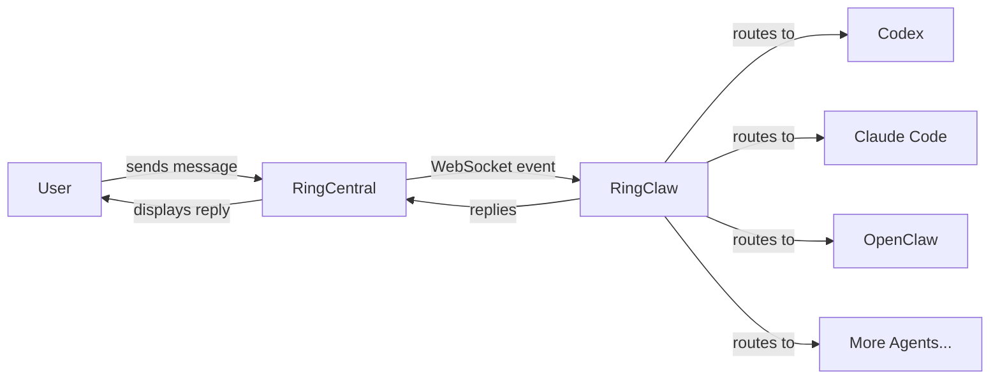

# RingClaw

[中文文档](README_CN.md)

RingCentral AI Agent Bridge — connect RingCentral Team Messaging to AI agents (Claude, Codex, Gemini, Kimi, etc.).

> This project is inspired by [WeClaw](https://github.com/fastclaw-ai/weclaw/) — the original WeChat AI Agent Bridge, which was in turn inspired by [@tencent-weixin/openclaw-weixin](https://npmx.dev/package/@tencent-weixin/openclaw-weixin).

<p align="center">
  
</p>

## Quick Start

```bash
# One-line install (macOS/Linux)
curl -sSL https://raw.githubusercontent.com/ringclaw/ringclaw/main/install.sh | sh

# One-line install (Windows PowerShell)
irm https://raw.githubusercontent.com/ringclaw/ringclaw/main/install.ps1 | iex

# Set RingCentral credentials
export RC_CLIENT_ID="your_client_id"
export RC_CLIENT_SECRET="your_client_secret"
export RC_JWT_TOKEN="your_jwt_token"
export RC_CHAT_ID="your_chat_id"

# Start
ringclaw start
```

That's it. On first start, RingClaw will:
1. Authenticate with RingCentral via JWT
2. Auto-detect installed AI agents (Claude, Codex, Gemini, etc.)
3. Save config to `~/.ringclaw/config.json`
4. Connect to RingCentral via WebSocket and start receiving messages

### RingCentral Setup

1. Go to [RingCentral Developer Portal](https://developers.ringcentral.com/) and register an app
2. Enable the `Team Messaging` and `WebSocketsSubscription` scopes
3. Create a JWT credential under your app
4. Find the chat ID of the conversation you want the bot to listen in (use the [API Explorer](https://developers.ringcentral.com/api-reference/Chats/listGlipChatsNew) to list chats)

### Other install methods

```bash
# Via Go
go install github.com/ringclaw/ringclaw@latest

# Via Docker
docker run -it -v ~/.ringclaw:/root/.ringclaw \
  -e RC_CLIENT_ID=xxx -e RC_CLIENT_SECRET=xxx \
  -e RC_JWT_TOKEN=xxx -e RC_CHAT_ID=xxx \
  ghcr.io/ringclaw/ringclaw start
```

## How It Works



RingClaw connects to RingCentral Team Messaging via WebSocket to receive messages in real-time. When a message arrives, it routes it to the configured AI agent, then posts the reply back to the chat. While the agent is processing, a "Thinking..." placeholder message is shown and updated with the final reply.

**Agent modes:**

| Mode | How it works | Examples |
|------|-------------|----------|
| ACP  | Long-running subprocess, JSON-RPC over stdio. Fastest — reuses process and sessions. | Claude, Codex, Cursor, Kimi, Gemini, OpenCode, OpenClaw, Pi, Copilot, Droid, iFlow, Kiro, Qwen |
| CLI  | Spawns a new process per message. Supports session resume via `--resume`. | Claude (`claude -p`), Codex (`codex exec`) |
| HTTP | OpenAI-compatible chat completions API. | OpenClaw (HTTP fallback) |

Auto-detection picks ACP over CLI when both are available.

## Chat Commands

Send these as messages in your RingCentral chat:

| Command | Description |
|---------|-------------|
| `hello` | Send to default agent |
| `/codex write a function` | Send to a specific agent |
| `/cc explain this code` | Send to agent by alias |
| `/claude` | Switch default agent to Claude |
| `/status` | Show current agent info |
| `/help` | Show help message |

### Aliases

| Alias | Agent |
|-------|-------|
| `/cc` | claude |
| `/cx` | codex |
| `/cs` | cursor |
| `/km` | kimi |
| `/gm` | gemini |
| `/ocd` | opencode |
| `/oc` | openclaw |
| `/pi` | pi |
| `/cp` | copilot |
| `/dr` | droid |
| `/if` | iflow |
| `/kr` | kiro |
| `/qw` | qwen |

Switching default agent is persisted to config — survives restarts.

## Media Messages

RingClaw supports sending images, videos, and files to RingCentral chats.

**From agent replies:** When an AI agent returns markdown with images (``), RingClaw automatically extracts the image URLs, downloads them, and uploads them to the chat via the RingCentral file upload API.

**Markdown support:** RingCentral Team Messaging natively supports markdown, so agent responses are sent as-is without conversion.

## Proactive Messaging

Send messages to RingCentral chats without waiting for incoming messages.

**CLI:**

```bash
# Send text (uses default chat from config)
ringclaw send --text "Hello from RingClaw"

# Send text to a specific chat
ringclaw send --to "chatId" --text "Hello"

# Send image
ringclaw send --media "https://example.com/photo.png"

# Send text + image
ringclaw send --text "Check this out" --media "https://example.com/photo.png"

# Send file
ringclaw send --media "https://example.com/report.pdf"
```

**HTTP API** (runs on `127.0.0.1:18011` when `ringclaw start` is running):

```bash
# Send text (uses default chat)
curl -X POST http://127.0.0.1:18011/api/send \
  -H "Content-Type: application/json" \
  -d '{"text": "Hello from RingClaw"}'

# Send text to a specific chat
curl -X POST http://127.0.0.1:18011/api/send \
  -H "Content-Type: application/json" \
  -d '{"to": "chatId", "text": "Hello"}'

# Send image
curl -X POST http://127.0.0.1:18011/api/send \
  -H "Content-Type: application/json" \
  -d '{"media_url": "https://example.com/photo.png"}'

# Send text + media
curl -X POST http://127.0.0.1:18011/api/send \
  -H "Content-Type: application/json" \
  -d '{"text": "See this", "media_url": "https://example.com/photo.png"}'
```

Supported media types: images (png, jpg, gif, webp), videos (mp4, mov), files (pdf, doc, zip, etc.).

Set `RINGCLAW_API_ADDR` to change the listen address (e.g. `0.0.0.0:18011`).

## Configuration

Config file: `~/.ringclaw/config.json`

```json
{
  "default_agent": "claude",
  "ringcentral": {
    "client_id": "your_client_id",
    "client_secret": "your_client_secret",
    "jwt_token": "your_jwt_token",
    "chat_id": "your_chat_id",
    "server_url": "https://platform.ringcentral.com"
  },
  "agents": {
    "claude": {
      "type": "acp",
      "command": "/usr/local/bin/claude-agent-acp",
      "model": "sonnet"
    },
    "codex": {
      "type": "acp",
      "command": "/usr/local/bin/codex-acp"
    },
    "openclaw": {
      "type": "http",
      "endpoint": "https://api.example.com/v1/chat/completions",
      "api_key": "sk-xxx",
      "model": "openclaw:main"
    }
  }
}
```

Environment variables:
- `RC_CLIENT_ID` — RingCentral app client ID
- `RC_CLIENT_SECRET` — RingCentral app client secret
- `RC_JWT_TOKEN` — RingCentral JWT credential
- `RC_CHAT_ID` — Target chat ID to listen and post to
- `RC_SERVER_URL` — RingCentral server URL (default: `https://platform.ringcentral.com`)
- `RINGCLAW_DEFAULT_AGENT` — override default agent
- `OPENCLAW_GATEWAY_URL` — OpenClaw HTTP fallback endpoint
- `OPENCLAW_GATEWAY_TOKEN` — OpenClaw API token

### Permission bypass

By default, some agents require interactive permission approval which doesn't work in a messaging bot context. Add `args` to your agent config to bypass:

| Agent | Flag | What it does |
|-------|------|-------------|
| Claude (CLI) | `--dangerously-skip-permissions` | Skip all tool permission prompts |
| Codex (CLI) | `--skip-git-repo-check` | Allow running outside git repos |

Example:

```json
{
  "claude": {
    "type": "cli",
    "command": "/usr/local/bin/claude",
    "cwd": "/home/user/my-project",
    "args": ["--dangerously-skip-permissions"]
  },
  "codex": {
    "type": "cli",
    "command": "/usr/local/bin/codex",
    "cwd": "/home/user/my-project",
    "args": ["--skip-git-repo-check"]
  }
}
```

Set `cwd` to specify the agent's working directory (workspace). If omitted, defaults to `~/.ringclaw/workspace`.

> **Warning:** These flags disable safety checks. Only enable them if you understand the risks. ACP agents handle permissions automatically and don't need these flags.

## Background Mode

```bash
# Start (runs in background by default)
ringclaw start

# Check if running
ringclaw status

# Stop
ringclaw stop

# Run in foreground (for debugging)
ringclaw start -f
```

Logs are written to `~/.ringclaw/ringclaw.log`.

### System service (auto-start on boot)

**macOS (launchd):**

```bash
cp service/com.ringclaw.ringclaw.plist ~/Library/LaunchAgents/
launchctl load ~/Library/LaunchAgents/com.ringclaw.ringclaw.plist
```

**Linux (systemd):**

```bash
sudo cp service/ringclaw.service /etc/systemd/system/
sudo systemctl enable --now ringclaw
```

## Docker

```bash
# Build
docker build -t ringclaw .

# Start with RingCentral credentials
docker run -d --name ringclaw \
  -v ~/.ringclaw:/root/.ringclaw \
  -e RC_CLIENT_ID=xxx \
  -e RC_CLIENT_SECRET=xxx \
  -e RC_JWT_TOKEN=xxx \
  -e RC_CHAT_ID=xxx \
  ringclaw

# With HTTP agent
docker run -d --name ringclaw \
  -v ~/.ringclaw:/root/.ringclaw \
  -e RC_CLIENT_ID=xxx \
  -e RC_CLIENT_SECRET=xxx \
  -e RC_JWT_TOKEN=xxx \
  -e RC_CHAT_ID=xxx \
  -e OPENCLAW_GATEWAY_URL=https://api.example.com \
  -e OPENCLAW_GATEWAY_TOKEN=sk-xxx \
  ringclaw

# View logs
docker logs -f ringclaw
```

> Note: ACP and CLI agents require the agent binary inside the container.
> The Docker image ships only RingClaw itself. For ACP/CLI agents, mount
> the binary or build a custom image. HTTP agents work out of the box.

## Release

```bash
# Tag a new version to trigger GitHub Actions build & release
git tag v0.1.0
git push origin v0.1.0
```

The workflow builds binaries for `darwin/linux/windows` x `amd64/arm64`, creates a GitHub Release, and uploads all artifacts with checksums.

## Development

```bash
# Hot reload
make dev

# Build
go build -o ringclaw .

# Run
./ringclaw start
```

## Contributors

<a href="https://github.com/ringclaw/ringclaw/graphs/contributors">
  
</a>

## Star History

[](https://star-history.com/#ringclaw/ringclaw&Timeline)

## License

[MIT](LICENSE)
