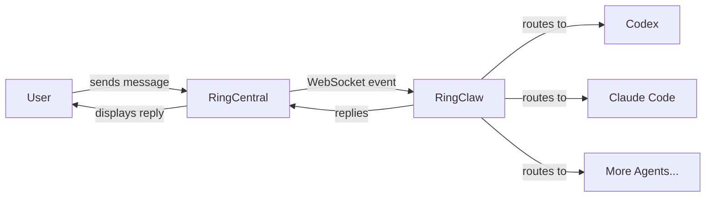

# RingClaw

[中文文档](README_CN.md) · [Documentation](https://ringclaw.github.io/ringclaw/)

RingCentral AI Agent Bridge — connect RingCentral Team Messaging to AI agents (Claude, Codex, Gemini, Kimi, etc.).

> Inspired by [WeClaw](https://github.com/fastclaw-ai/weclaw/) — the original WeChat AI Agent Bridge.


## Quick Start

```bash
# One-line install (macOS/Linux)
curl -sSL https://raw.githubusercontent.com/ringclaw/ringclaw/main/install.sh | sh

# One-line install (Windows PowerShell)
irm https://raw.githubusercontent.com/ringclaw/ringclaw/main/install.ps1 | iex

# Set bot token and start
export RC_BOT_TOKEN="your_bot_token"
ringclaw start
```

On first start, RingClaw auto-detects installed AI agents and saves config to `~/.ringclaw/config.json`. Run `ringclaw setup` for an interactive credential wizard.

## Features

- **Multi-Agent Support** — route messages to Claude, Codex, Gemini, Kimi, and more via ACP/CLI/HTTP. [→ Agents](https://ringclaw.github.io/ringclaw/guide/agents.html)
- **Chat Commands** — `/cc`, `/cx`, `/cs` aliases, multi-agent broadcast, session management. [→ Commands](https://ringclaw.github.io/ringclaw/guide/commands.html)
- **Chat Summarization** — summarize conversations across chats with natural language. [→ Summarize](https://ringclaw.github.io/ringclaw/features/summarize.html)
- **AI-Driven Actions** — agents auto-create notes, tasks, events, and adaptive cards. [→ Actions](https://ringclaw.github.io/ringclaw/features/actions.html)
- **Cron & Heartbeat** — scheduled tasks and periodic agent check-ins. [→ Cron](https://ringclaw.github.io/ringclaw/features/cron.html) · [→ Heartbeat](https://ringclaw.github.io/ringclaw/features/heartbeat.html)
- **Proactive Messaging** — CLI and HTTP API for sending messages and media. [→ Media & API](https://ringclaw.github.io/ringclaw/features/media.html)
- **Security** — API token auth, Host validation, ACP write permissions, credential redaction. [→ Security](https://ringclaw.github.io/ringclaw/security/)
- **Full CLI** — manage messages, chats, tasks, notes, events, cards, users, files from the command line. [→ CLI](https://ringclaw.github.io/ringclaw/guide/commands.html#cli-command-map)
- **Docker & systemd** — background mode, auto-start on boot. [→ Deployment](https://ringclaw.github.io/ringclaw/deployment/background.html)

## How It Works


```mermaid
graph LR
    User -->|sends message| RC[RingCentral]
    RC -->|WebSocket event| RingClaw
    RingClaw -->|routes to| Codex
    RingClaw -->|routes to| Claude[Claude Code]
    RingClaw -->|routes to| More[More Agents...]
    RingClaw -->|replies| RC
    RC -->|displays reply| User
```

📖 **Full documentation:** [ringclaw.github.io/ringclaw](https://ringclaw.github.io/ringclaw/)

## Contributors

<a href="https://github.com/ringclaw/ringclaw/graphs/contributors">
  
</a>

## Star History

[](https://star-history.com/#ringclaw/ringclaw&Timeline)

## License

[MIT](LICENSE)
