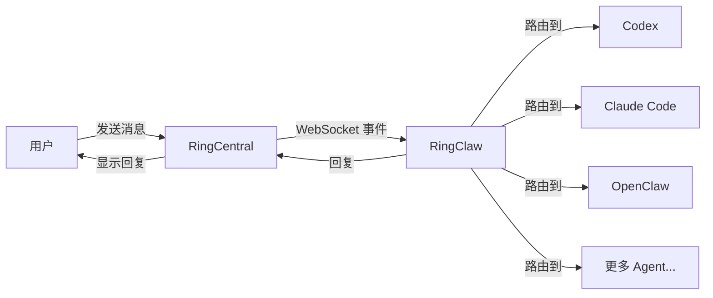
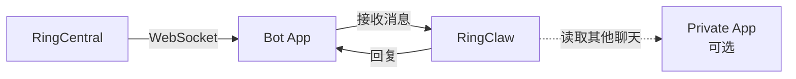

# RingClaw

[English](README.md)

RingCentral AI Agent 桥接器 — 将 RingCentral Team Messaging 接入 AI Agent（Claude、Codex、Gemini、Kimi、Copilot、Droid 等）。

> 本项目灵感来自 [WeClaw](https://github.com/fastclaw-ai/weclaw/) — 原版微信 AI Agent 桥接器，WeClaw 则参考了 [@tencent-weixin/openclaw-weixin](https://npmx.dev/package/@tencent-weixin/openclaw-weixin)。

<p align="center">
  
</p>

## 快速开始

```bash
# 一键安装（macOS/Linux）
curl -sSL https://raw.githubusercontent.com/ringclaw/ringclaw/main/install.sh | sh

# 一键安装（Windows PowerShell）
irm https://raw.githubusercontent.com/ringclaw/ringclaw/main/install.ps1 | iex

# 设置 Bot Token（必需）
export RC_BOT_TOKEN="your_bot_token"

# 启动
ringclaw start
```

就这么简单。启动时，RingClaw 会：

1. 通过 Bot App 的 WebSocket 连接 RingCentral
2. 自动检测已安装的 AI Agent（Claude、Codex、Gemini、Copilot、Droid 等）
3. 保存配置到 `~/.ringclaw/config.json`
4. 开始接收和回复消息

### RingCentral 配置步骤

> **提示：** 创建好应用后，运行 `ringclaw setup` 可启动交互式向导，自动收集凭据、验证并保存配置文件。

#### 第一步：创建 Bot App（必须）

1. 前往 [RingCentral 开发者控制台](https://developers.ringcentral.com/console) 并登录
2. 点击 **Register App** → 选择 **Bot Add-in (No UI)**
3. 配置应用：
   - **Security** → App Scopes：勾选 **ReadAccounts**、**TeamMessaging**、**WebSocketsSubscription**
   - **Access**：Private（仅限自己的账号）
4. 点击 **Create**
5. 进入 **Bot** 标签 → 点击 **Add** 将 Bot 安装到你的账号
6. 复制 Bot 标签页上显示的 **Bot Token**

#### 第二步：获取 Chat ID

1. 打开 [API Explorer → List Chats](https://developers.ringcentral.com/api-reference/Chats/listGlipChatsNew)
2. 登录后点击 **Try It Out**
3. 找到要监控的聊天，复制其 `id` 字段

#### 第三步：创建 Private App（可选）

Private App（REST API + JWT）可以启用以下高级功能：
- **Summarize** 其他聊天的对话
- **跨聊天操作**（读取其他聊天消息、在其他聊天创建任务等）

1. 在开发者控制台，点击 **Register App** → 选择 **REST API App**
2. 配置应用：
   - **Auth**：JWT auth flow
   - **Security** → App Scopes：勾选 **ReadAccounts**、**TeamMessaging**、**WebSocketsSubscription**
   - **Access**：Private
3. 点击 **Create** — 获取 **Client ID** 和 **Client Secret**
4. 进入 **Credentials** 标签 → **JWT Credentials** → 点击 **Create JWT Token**
5. 复制 JWT Token

#### 交互式配置向导

```bash
ringclaw setup
```

向导会：
- 提示输入 Bot Token（必需）
- 提示输入要监控的 Chat ID
- 可选配置 Private App 凭据（Client ID、Secret、JWT Token）
- 通过 RingCentral API 验证凭据有效性
- 将所有配置保存到 `~/.ringclaw/config.json`

**安装渠道：**

```bash
curl -sSL .../install.sh | sh                 # stable（最新正式版）
curl -sSL .../install.sh | sh -s -- beta      # beta（最新 main 构建）
curl -sSL .../install.sh | sh -s -- alpha feature/my-branch  # alpha（指定分支构建）
```

> **macOS 提示：** 安装脚本和 `ringclaw update` 会自动清除 Gatekeeper 隔离属性（`com.apple.quarantine`、`com.apple.provenance`），下载后的二进制文件不会被系统拦截。

### 其他安装方式

```bash
# 通过 Go 安装
go install github.com/ringclaw/ringclaw@latest

# 通过 Docker
docker run -it -v ~/.ringclaw:/root/.ringclaw \
  -e RC_BOT_TOKEN=xxx \
  ghcr.io/ringclaw/ringclaw start
```

## 架构



RingClaw 通过 WebSocket 连接 RingCentral Team Messaging 实时接收消息。当消息到达时，路由到配置的 AI Agent 处理，然后将回复发回聊天。Agent 处理期间，会显示 "Thinking..." 占位消息，处理完成后更新为最终回复。

**Agent 接入模式：**

| 模式 | 工作方式                                                         | 支持的 Agent                                            |
| ---- | ---------------------------------------------------------------- | ------------------------------------------------------- |
| ACP  | 长驻子进程，通过 stdio JSON-RPC 通信。速度最快，复用进程和会话。 | Claude, Codex, Cursor, Kimi, Gemini, OpenCode, OpenClaw, Pi, Copilot, Droid, iFlow, Kiro, Qwen |
| CLI  | 每条消息启动一个新进程，支持通过 `--resume` 恢复会话。           | Claude (`claude -p`)、Codex (`codex exec`)              |
| HTTP | OpenAI 兼容的 Chat Completions API。                             | OpenClaw（HTTP 回退）                                   |

同时存在 ACP 和 CLI 时，自动优先选择 ACP。

## 聊天命令

在 RingCentral 聊天中发送以下命令：

| 命令                         | 说明                                       |
| ---------------------------- | ------------------------------------------ |
| `你好`                       | 发送给默认 Agent                           |
| `/codex 写一个排序函数`      | 发送给指定 Agent                           |
| `/cc 解释一下这段代码`       | 通过别名发送                               |
| `/cc /cx 解释一下这段代码`   | 同时广播给多个 Agent，并行处理             |
| `/claude`                    | 切换默认 Agent 为 Claude                   |
| `/new` 或 `/clear`           | 重置当前 Agent 会话                        |
| `/cwd /path/to/project`     | 切换所有 Agent 的工作目录                  |
| `/task list\|create\|get\|update\|delete\|complete` | 管理任务               |
| `/note list\|create\|get\|update\|delete` | 管理笔记                         |
| `/event list\|create\|get\|update\|delete` | 管理日历事件                    |
| `/card get\|delete`          | 管理 Adaptive Card                         |
| `总结我和 John 的聊天`       | 总结某个对话                               |
| `/info`                      | 查看当前 Agent 信息（别名：`/status`）     |
| `/help`                      | 查看帮助信息                               |

未知的 `/命令`（如 `/status`、`/compact`）会被转发给默认 Agent，因此 Agent 自身的斜杠命令可以透明使用。

### 快捷别名

| 别名   | Agent    |
| ------ | -------- |
| `/cc`  | Claude   |
| `/cx`  | Codex    |
| `/cs`  | Cursor   |
| `/km`  | Kimi     |
| `/gm`  | Gemini   |
| `/ocd` | OpenCode |
| `/oc`  | OpenClaw |
| `/pi`  | Pi       |
| `/cp`  | Copilot  |
| `/dr`  | Droid    |
| `/if`  | iFlow    |
| `/kr`  | Kiro     |
| `/qw`  | Qwen     |

切换默认 Agent 会写入配置文件，重启后仍然生效。

### 多 Agent 广播

将同一条消息同时发送给多个 Agent，并行处理：

```
/cc /cx review this function  # 同时广播给 Claude 和 Codex，并行处理
```

每个 Agent 的回复以 `[agent-name]` 前缀分别发送。

### 自定义别名

可以在 `config.json` 中为每个 Agent 定义自定义触发别名：

```json
{
  "claude": {
    "type": "acp",
    "command": "/usr/local/bin/claude-agent-acp",
    "aliases": ["gpt", "ai"]
  }
}
```

之后 `/gpt 你好` 会路由到 Claude。如果自定义别名与内置别名或其他 Agent 冲突，RingClaw 启动时会发出警告。

### 会话管理

| 命令     | 说明                         |
| -------- | ---------------------------- |
| `/new`   | 重置默认 Agent 会话，重新开始 |
| `/clear` | 同 `/new`                    |

### 动态工作目录

```bash
/cwd ~/projects/my-app    # 切换所有 Agent 到此目录
/cwd                       # 显示当前工作目录信息
```

波浪号（`~`）会自动展开为 home 目录。新工作目录立即对所有运行中的 Agent 生效。

## 任务、笔记与日历事件

在聊天中直接对 RingCentral Team Messaging 资源进行完整的增删改查：

```
/task create 修复登录 bug        # 创建任务
/task list                       # 列出当前聊天的任务
/task complete <id>              # 标记任务完成
/note create 会议纪要 | 内容     # 创建笔记（自动发布）
/event list                      # 列出日历事件
```

每个命令支持：`list`、`create`、`get`、`update`、`delete`。任务还支持 `complete`。

## Adaptive Card（自适应卡片）

AI Agent 可以生成 [Adaptive Card](https://adaptivecards.io/) 用于富文本结构化展示（进度报告、仪表盘、表单等）。当 Agent 在回复中包含 `ACTION:CARD` 块时，RingClaw 会自动将卡片发送到聊天：

```
ACTION:CARD
{"type":"AdaptiveCard","version":"1.3","body":[{"type":"TextBlock","text":"Sprint 状态","weight":"bolder"},{"type":"FactSet","facts":[{"title":"已完成","value":"12"},{"title":"剩余","value":"3"}]}]}
END_ACTION
```

通过聊天命令管理卡片：

```
/card get <id>       # 查看卡片详情
/card delete <id>    # 删除卡片
```

## AI 驱动的自动操作

AI Agent 在对话中可以自动创建笔记、任务、日历事件和 Adaptive Card。当用户的请求暗示需要创建这些资源时，Agent 会在回复中附加 ACTION 块，RingClaw 通过 RC API 自动执行：

```
ACTION:NOTE title=会议纪要
今天站会的关键决定...
END_ACTION

ACTION:TASK subject=更新部署脚本
END_ACTION

ACTION:EVENT title=Sprint 评审 start=2026-04-01T14:00:00Z end=2026-04-01T15:00:00Z
END_ACTION
```

通过 `chatid=<id>` 参数可以将操作定向到其他聊天（Bot 模式下出于安全考虑已禁用）。无需额外配置 — ACTION 提示词会自动注入。

## 聊天总结

总结任意聊天的对话内容：

```
总结我和 John 的聊天               # 总结今天与 John 的聊天
summarize my chat with Raye from Monday  # 总结从周一开始的聊天
```

RingClaw 通过名字解析目标聊天，使用 Private App 获取消息，然后通过 AI Agent 生成摘要发送到当前聊天。

> **安全限制：** 使用 Bot 时，群聊中禁止使用总结功能（摘要会被群内所有人看到）。请在与 Bot 的私聊中使用。

## Bot 客户端

RingClaw 使用 **Bot App**（必需）进行消息收发，可选的 **Private App** 提供高级功能。



### 路由规则

不在 `chat_ids` 中的消息会被 monitor 直接丢弃。

| 消息来源 | 回复客户端 | 读取/操作客户端 |
|----------|-----------|---------------|
| Bot 私聊（自动发现） | Bot | Private App（如已配置）或 Bot |
| `chat_ids` 中的聊天 | Bot | Private App（如已配置）或 Bot |

### 群聊行为

- **`bot_mention_only: true`**（默认）— Bot 在群聊中只有被 @mention 时才响应
- **`bot_mention_only: false`** — Bot 响应允许群中的所有消息

### 权限矩阵

| 操作 | Bot 私聊 | Bot 群聊 (owner) | Bot 群聊 (非 owner) |
|---|---|---|---|
| 与 Agent 聊天 | Bot 回复 | Bot 回复 | Bot 回复 |
| 总结 (Summarize) | Private App 读, Bot 回复 | **禁止** (防泄露) | **禁止** (防泄露) |
| 总结 (无 Private App) | **不可用** | **不可用** | **不可用** |
| `/clear`、`/new` | 允许 | 允许 | **禁止** (仅 owner) |
| `/cwd` | 允许 | 允许 | **禁止** (仅 owner) |
| 切换 Agent (`/cc`) | 允许 | 允许 | **禁止** (仅 owner) |
| `/info`、`/help` | 允许 | 允许 | 允许 |
| `/task`、`/note`、`/event` | Private App 或 Bot | Private App 或 Bot | Private App 或 Bot |
| ACTION blocks | Private App 或 Bot | Private App 或 Bot | Private App 或 Bot |

**客户端职责：**

| 职责 | 使用的客户端 | 原因 |
|------|------------|------|
| WebSocket 连接 | Bot App | Bot Token 驱动 WS 连接 |
| 发送回复和占位消息 | Bot App | 所有聊天中使用 Bot 身份 |
| 读取其他聊天和总结 | Private App（可选） | Bot 无法访问他人的私聊 |
| `/task`、`/note`、`/event` API | Private App（如有），否则 Bot | Private App 有更广的访问权限 |
| ACTION block 执行 | Private App（如有），否则 Bot | 跨聊天操作需要 Private App |

## 富媒体消息

RingClaw 支持向 RingCentral 聊天发送图片、视频和文件。

**Agent 回复自动处理：** 当 AI Agent 返回包含图片的 markdown（``）时，RingClaw 会自动提取图片 URL，下载文件，通过 RingCentral 文件上传 API 发送到聊天。

**Markdown 支持：** RingCentral Team Messaging 原生支持 Markdown，Agent 的回复无需转换直接发送。

## 主动推送消息

无需等待用户发消息，主动向 RingCentral 聊天推送消息。

**命令行：**

```bash
# 发送文本（使用配置中的默认 Chat）
ringclaw send --text "你好，来自 RingClaw"

# 发送文本到指定 Chat
ringclaw send --to "chatId" --text "你好"

# 发送图片
ringclaw send --media "https://example.com/photo.png"

# 发送文本 + 图片
ringclaw send --text "看看这个" --media "https://example.com/photo.png"

# 发送文件
ringclaw send --media "https://example.com/report.pdf"
```

**HTTP API**（`ringclaw start` 运行时，默认监听 `127.0.0.1:18011`）：

```bash
# 发送文本（使用默认 Chat）
curl -X POST http://127.0.0.1:18011/api/send \
  -H "Content-Type: application/json" \
  -d '{"text": "你好，来自 RingClaw"}'

# 发送文本到指定 Chat
curl -X POST http://127.0.0.1:18011/api/send \
  -H "Content-Type: application/json" \
  -d '{"to": "chatId", "text": "你好"}'

# 发送图片
curl -X POST http://127.0.0.1:18011/api/send \
  -H "Content-Type: application/json" \
  -d '{"media_url": "https://example.com/photo.png"}'

# 发送文本 + 媒体
curl -X POST http://127.0.0.1:18011/api/send \
  -H "Content-Type: application/json" \
  -d '{"text": "看看这个", "media_url": "https://example.com/photo.png"}'
```

支持的媒体类型：图片（png、jpg、gif、webp）、视频（mp4、mov）、文件（pdf、doc、zip 等）。

设置 `RINGCLAW_API_ADDR` 环境变量可更改监听地址（如 `0.0.0.0:18011`）。

**资源 API**（任务、笔记、事件、卡片）：

| 方法 | 端点 | 说明 |
|------|------|------|
| `GET/POST` | `/api/tasks` | 列出 / 创建任务 |
| `GET/PATCH/DELETE` | `/api/tasks/{id}` | 查看 / 更新 / 删除任务 |
| `POST` | `/api/tasks/{id}/complete` | 完成任务 |
| `GET/POST` | `/api/notes` | 列出 / 创建笔记 |
| `GET/PATCH/DELETE` | `/api/notes/{id}` | 查看 / 更新 / 删除笔记 |
| `GET/POST` | `/api/events` | 列出 / 创建事件 |
| `GET/PUT/DELETE` | `/api/events/{id}` | 查看 / 更新 / 删除事件 |
| `POST` | `/api/cards` | 创建 Adaptive Card |
| `GET/PUT/DELETE` | `/api/cards/{id}` | 查看 / 更新 / 删除卡片 |

## 配置

配置文件路径：`~/.ringclaw/config.json`

```json
{
  "default_agent": "claude",
  "ringcentral": {
    "bot_token": "your_bot_token",
    "chat_ids": ["chat_id_1", "chat_id_2"],
    "bot_mention_only": true,
    "server_url": "https://platform.ringcentral.com",
    "client_id": "",
    "client_secret": "",
    "jwt_token": ""
  },
  "agents": {
    "claude": {
      "type": "acp",
      "command": "/usr/local/bin/claude-agent-acp",
      "model": "sonnet",
      "aliases": ["ai"],
      "env": {
        "ANTHROPIC_API_KEY": "sk-xxx"
      }
    },
    "codex": {
      "type": "acp",
      "command": "/usr/local/bin/codex-acp"
    },
    "openclaw": {
      "type": "http",
      "endpoint": "https://api.example.com/v1/chat/completions",
      "api_key": "sk-xxx",
      "model": "openclaw:main"
    }
  }
}
```

环境变量：

- `RC_BOT_TOKEN` — Bot App Token（必需）
- `RC_CLIENT_ID` — Private App Client ID（可选，启用 Summarize）
- `RC_CLIENT_SECRET` — Private App Client Secret（可选）
- `RC_JWT_TOKEN` — Private App JWT 凭据（可选）
- `RC_SERVER_URL` — RingCentral 服务器 URL（默认：`https://platform.ringcentral.com`）
- `RINGCLAW_DEFAULT_AGENT` — 覆盖默认 Agent
- `OPENCLAW_GATEWAY_URL` — OpenClaw HTTP 回退地址
- `OPENCLAW_GATEWAY_TOKEN` — OpenClaw API Token

### 权限配置

部分 Agent 默认需要交互式权限确认，在消息机器人场景下无法操作。可通过 `args` 配置跳过：

| Agent        | 参数                              | 说明                     |
| ------------ | --------------------------------- | ------------------------ |
| Claude (CLI) | `--dangerously-skip-permissions`  | 跳过所有工具权限确认     |
| Codex (CLI)  | `--skip-git-repo-check`           | 允许在非 git 仓库目录运行 |

配置示例：

```json
{
  "claude": {
    "type": "cli",
    "command": "/usr/local/bin/claude",
    "cwd": "/home/user/my-project",
    "args": ["--dangerously-skip-permissions"]
  },
  "codex": {
    "type": "cli",
    "command": "/usr/local/bin/codex",
    "cwd": "/home/user/my-project",
    "args": ["--skip-git-repo-check"]
  }
}
```

通过 `cwd` 指定 Agent 的工作目录（workspace）。不设置则默认为 `~/.ringclaw/workspace`。

> **注意：** 这些参数会跳过安全检查，请了解风险后再启用。ACP 模式的 Agent 会自动处理权限，无需配置。

## 后台运行

```bash
# 启动（默认后台运行）
ringclaw start

# 查看状态
ringclaw status

# 停止
ringclaw stop

# 前台运行（调试用）
ringclaw start -f
```

日志输出到 `~/.ringclaw/ringclaw.log`。

### 系统服务（开机自启）

**macOS (launchd)：**

```bash
cp service/com.ringclaw.ringclaw.plist ~/Library/LaunchAgents/
launchctl load ~/Library/LaunchAgents/com.ringclaw.ringclaw.plist
```

**Linux (systemd)：**

```bash
sudo cp service/ringclaw.service /etc/systemd/system/
sudo systemctl enable --now ringclaw
```

## Docker

```bash
# 构建
docker build -t ringclaw .

# 使用 Bot Token 启动
docker run -d --name ringclaw \
  -v ~/.ringclaw:/root/.ringclaw \
  -e RC_BOT_TOKEN=xxx \
  ringclaw

# 使用 Private App（启用 Summarize）和 HTTP Agent 启动
docker run -d --name ringclaw \
  -v ~/.ringclaw:/root/.ringclaw \
  -e RC_BOT_TOKEN=xxx \
  -e RC_CLIENT_ID=xxx \
  -e RC_CLIENT_SECRET=xxx \
  -e RC_JWT_TOKEN=xxx \
  -e OPENCLAW_GATEWAY_URL=https://api.example.com \
  -e OPENCLAW_GATEWAY_TOKEN=sk-xxx \
  ringclaw

# 查看日志
docker logs -f ringclaw
```

> 注意：ACP 和 CLI 模式需要容器内有对应的 Agent 二进制文件。
> 默认镜像只包含 RingClaw 本体。如需使用 ACP/CLI Agent，请挂载二进制文件或构建自定义镜像。
> HTTP 模式开箱即用。

## 发版

多阶段 CI 流水线：

| 触发方式 | 渠道 | Tag 格式 |
|----------|------|----------|
| 推送功能分支 | Alpha | `alpha-<branch>` |
| 推送 main | Beta | `beta-latest` |
| 推送版本 tag | Stable | `v0.1.0` |

```bash
# 正式发版
git tag v0.1.0
git push origin v0.1.0
```

所有渠道均构建 `darwin/linux/windows` x `amd64/arm64` 六个平台的二进制，附带校验文件。

## 开发

```bash
# 热重载
make dev

# 编译
go build -o ringclaw .

# 运行
./ringclaw start
```

## 贡献者

<a href="https://github.com/ringclaw/ringclaw/graphs/contributors">
  
</a>

## Star 趋势

[](https://star-history.com/#ringclaw/ringclaw&Timeline)

## 许可证

[MIT](LICENSE)
