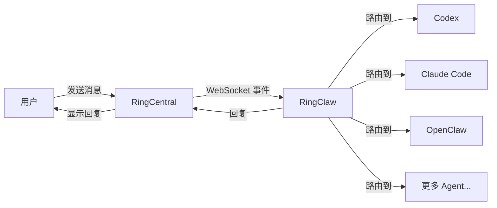

# RingClaw

[English](README.md)

RingCentral AI Agent 桥接器 — 将 RingCentral Team Messaging 接入 AI Agent（Claude、Codex、Gemini、Kimi、Copilot、Droid 等）。

> 本项目灵感来自 [WeClaw](https://github.com/fastclaw-ai/weclaw/) — 原版微信 AI Agent 桥接器，WeClaw 则参考了 [@tencent-weixin/openclaw-weixin](https://npmx.dev/package/@tencent-weixin/openclaw-weixin)。

<p align="center">
  
</p>

## 快速开始

```bash
# 一键安装（macOS/Linux）
curl -sSL https://raw.githubusercontent.com/ringclaw/ringclaw/main/install.sh | sh

# 一键安装（Windows PowerShell）
irm https://raw.githubusercontent.com/ringclaw/ringclaw/main/install.ps1 | iex

# 设置 RingCentral 凭据
export RC_CLIENT_ID="your_client_id"
export RC_CLIENT_SECRET="your_client_secret"
export RC_JWT_TOKEN="your_jwt_token"
export RC_CHAT_ID="your_chat_id"

# 启动
ringclaw start
```

就这么简单。启动时，RingClaw 会：

1. 通过 JWT 认证连接 RingCentral
2. 自动检测已安装的 AI Agent（Claude、Codex、Gemini、Copilot、Droid 等）
3. 保存配置到 `~/.ringclaw/config.json`
4. 通过 WebSocket 连接 RingCentral，开始接收和回复消息

### RingCentral 配置步骤

1. 前往 [RingCentral 开发者门户](https://developers.ringcentral.com/) 注册应用
2. 启用 `Team Messaging` 和 `WebSocketsSubscription` 权限
3. 在应用下创建 JWT 凭据
4. 通过 [API Explorer](https://developers.ringcentral.com/api-reference/Chats/listGlipChatsNew) 查找目标聊天的 Chat ID

### 其他安装方式

```bash
# 通过 Go 安装
go install github.com/ringclaw/ringclaw@latest

# 通过 Docker
docker run -it -v ~/.ringclaw:/root/.ringclaw \
  -e RC_CLIENT_ID=xxx -e RC_CLIENT_SECRET=xxx \
  -e RC_JWT_TOKEN=xxx -e RC_CHAT_ID=xxx \
  ghcr.io/ringclaw/ringclaw start
```

## 架构



RingClaw 通过 WebSocket 连接 RingCentral Team Messaging 实时接收消息。当消息到达时，路由到配置的 AI Agent 处理，然后将回复发回聊天。Agent 处理期间，会显示 "Thinking..." 占位消息，处理完成后更新为最终回复。

**Agent 接入模式：**

| 模式 | 工作方式                                                         | 支持的 Agent                                            |
| ---- | ---------------------------------------------------------------- | ------------------------------------------------------- |
| ACP  | 长驻子进程，通过 stdio JSON-RPC 通信。速度最快，复用进程和会话。 | Claude, Codex, Cursor, Kimi, Gemini, OpenCode, OpenClaw, Pi, Copilot, Droid, iFlow, Kiro, Qwen |
| CLI  | 每条消息启动一个新进程，支持通过 `--resume` 恢复会话。           | Claude (`claude -p`)、Codex (`codex exec`)              |
| HTTP | OpenAI 兼容的 Chat Completions API。                             | OpenClaw（HTTP 回退）                                   |

同时存在 ACP 和 CLI 时，自动优先选择 ACP。

## 聊天命令

在 RingCentral 聊天中发送以下命令：

| 命令                    | 说明                     |
| ----------------------- | ------------------------ |
| `你好`                  | 发送给默认 Agent         |
| `/codex 写一个排序函数` | 发送给指定 Agent         |
| `/cc 解释一下这段代码`  | 通过别名发送             |
| `/claude`               | 切换默认 Agent 为 Claude |
| `/status`               | 查看当前 Agent 信息      |
| `/help`                 | 查看帮助信息             |

### 快捷别名

| 别名   | Agent    |
| ------ | -------- |
| `/cc`  | Claude   |
| `/cx`  | Codex    |
| `/cs`  | Cursor   |
| `/km`  | Kimi     |
| `/gm`  | Gemini   |
| `/ocd` | OpenCode |
| `/oc`  | OpenClaw |
| `/pi`  | Pi       |
| `/cp`  | Copilot  |
| `/dr`  | Droid    |
| `/if`  | iFlow    |
| `/kr`  | Kiro     |
| `/qw`  | Qwen     |

切换默认 Agent 会写入配置文件，重启后仍然生效。

## 富媒体消息

RingClaw 支持向 RingCentral 聊天发送图片、视频和文件。

**Agent 回复自动处理：** 当 AI Agent 返回包含图片的 markdown（``）时，RingClaw 会自动提取图片 URL，下载文件，通过 RingCentral 文件上传 API 发送到聊天。

**Markdown 支持：** RingCentral Team Messaging 原生支持 Markdown，Agent 的回复无需转换直接发送。

## 主动推送消息

无需等待用户发消息，主动向 RingCentral 聊天推送消息。

**命令行：**

```bash
# 发送文本（使用配置中的默认 Chat）
ringclaw send --text "你好，来自 RingClaw"

# 发送文本到指定 Chat
ringclaw send --to "chatId" --text "你好"

# 发送图片
ringclaw send --media "https://example.com/photo.png"

# 发送文本 + 图片
ringclaw send --text "看看这个" --media "https://example.com/photo.png"

# 发送文件
ringclaw send --media "https://example.com/report.pdf"
```

**HTTP API**（`ringclaw start` 运行时，默认监听 `127.0.0.1:18011`）：

```bash
# 发送文本（使用默认 Chat）
curl -X POST http://127.0.0.1:18011/api/send \
  -H "Content-Type: application/json" \
  -d '{"text": "你好，来自 RingClaw"}'

# 发送文本到指定 Chat
curl -X POST http://127.0.0.1:18011/api/send \
  -H "Content-Type: application/json" \
  -d '{"to": "chatId", "text": "你好"}'

# 发送图片
curl -X POST http://127.0.0.1:18011/api/send \
  -H "Content-Type: application/json" \
  -d '{"media_url": "https://example.com/photo.png"}'

# 发送文本 + 媒体
curl -X POST http://127.0.0.1:18011/api/send \
  -H "Content-Type: application/json" \
  -d '{"text": "看看这个", "media_url": "https://example.com/photo.png"}'
```

支持的媒体类型：图片（png、jpg、gif、webp）、视频（mp4、mov）、文件（pdf、doc、zip 等）。

设置 `RINGCLAW_API_ADDR` 环境变量可更改监听地址（如 `0.0.0.0:18011`）。

## 配置

配置文件路径：`~/.ringclaw/config.json`

```json
{
  "default_agent": "claude",
  "ringcentral": {
    "client_id": "your_client_id",
    "client_secret": "your_client_secret",
    "jwt_token": "your_jwt_token",
    "chat_id": "your_chat_id",
    "server_url": "https://platform.ringcentral.com"
  },
  "agents": {
    "claude": {
      "type": "acp",
      "command": "/usr/local/bin/claude-agent-acp",
      "model": "sonnet"
    },
    "codex": {
      "type": "acp",
      "command": "/usr/local/bin/codex-acp"
    },
    "openclaw": {
      "type": "http",
      "endpoint": "https://api.example.com/v1/chat/completions",
      "api_key": "sk-xxx",
      "model": "openclaw:main"
    }
  }
}
```

环境变量：

- `RC_CLIENT_ID` — RingCentral 应用 Client ID
- `RC_CLIENT_SECRET` — RingCentral 应用 Client Secret
- `RC_JWT_TOKEN` — RingCentral JWT 凭据
- `RC_CHAT_ID` — 监听和发送消息的目标 Chat ID
- `RC_SERVER_URL` — RingCentral 服务器 URL（默认：`https://platform.ringcentral.com`）
- `RINGCLAW_DEFAULT_AGENT` — 覆盖默认 Agent
- `OPENCLAW_GATEWAY_URL` — OpenClaw HTTP 回退地址
- `OPENCLAW_GATEWAY_TOKEN` — OpenClaw API Token

### 权限配置

部分 Agent 默认需要交互式权限确认，在消息机器人场景下无法操作。可通过 `args` 配置跳过：

| Agent        | 参数                              | 说明                     |
| ------------ | --------------------------------- | ------------------------ |
| Claude (CLI) | `--dangerously-skip-permissions`  | 跳过所有工具权限确认     |
| Codex (CLI)  | `--skip-git-repo-check`           | 允许在非 git 仓库目录运行 |

配置示例：

```json
{
  "claude": {
    "type": "cli",
    "command": "/usr/local/bin/claude",
    "cwd": "/home/user/my-project",
    "args": ["--dangerously-skip-permissions"]
  },
  "codex": {
    "type": "cli",
    "command": "/usr/local/bin/codex",
    "cwd": "/home/user/my-project",
    "args": ["--skip-git-repo-check"]
  }
}
```

通过 `cwd` 指定 Agent 的工作目录（workspace）。不设置则默认为 `~/.ringclaw/workspace`。

> **注意：** 这些参数会跳过安全检查，请了解风险后再启用。ACP 模式的 Agent 会自动处理权限，无需配置。

## 后台运行

```bash
# 启动（默认后台运行）
ringclaw start

# 查看状态
ringclaw status

# 停止
ringclaw stop

# 前台运行（调试用）
ringclaw start -f
```

日志输出到 `~/.ringclaw/ringclaw.log`。

### 系统服务（开机自启）

**macOS (launchd)：**

```bash
cp service/com.ringclaw.ringclaw.plist ~/Library/LaunchAgents/
launchctl load ~/Library/LaunchAgents/com.ringclaw.ringclaw.plist
```

**Linux (systemd)：**

```bash
sudo cp service/ringclaw.service /etc/systemd/system/
sudo systemctl enable --now ringclaw
```

## Docker

```bash
# 构建
docker build -t ringclaw .

# 使用 RingCentral 凭据启动
docker run -d --name ringclaw \
  -v ~/.ringclaw:/root/.ringclaw \
  -e RC_CLIENT_ID=xxx \
  -e RC_CLIENT_SECRET=xxx \
  -e RC_JWT_TOKEN=xxx \
  -e RC_CHAT_ID=xxx \
  ringclaw

# 使用 HTTP Agent 启动
docker run -d --name ringclaw \
  -v ~/.ringclaw:/root/.ringclaw \
  -e RC_CLIENT_ID=xxx \
  -e RC_CLIENT_SECRET=xxx \
  -e RC_JWT_TOKEN=xxx \
  -e RC_CHAT_ID=xxx \
  -e OPENCLAW_GATEWAY_URL=https://api.example.com \
  -e OPENCLAW_GATEWAY_TOKEN=sk-xxx \
  ringclaw

# 查看日志
docker logs -f ringclaw
```

> 注意：ACP 和 CLI 模式需要容器内有对应的 Agent 二进制文件。
> 默认镜像只包含 RingClaw 本体。如需使用 ACP/CLI Agent，请挂载二进制文件或构建自定义镜像。
> HTTP 模式开箱即用。

## 发版

```bash
# 打 tag 触发 GitHub Actions 自动构建发版
git tag v0.1.0
git push origin v0.1.0
```

自动构建 `darwin/linux/windows` x `amd64/arm64` 六个平台的二进制，创建 GitHub Release 并上传所有产物和校验文件。

## 开发

```bash
# 热重载
make dev

# 编译
go build -o ringclaw .

# 运行
./ringclaw start
```

## 贡献者

<a href="https://github.com/ringclaw/ringclaw/graphs/contributors">
  
</a>

## Star 趋势

[](https://star-history.com/#ringclaw/ringclaw&Timeline)

## 许可证

[MIT](LICENSE)
