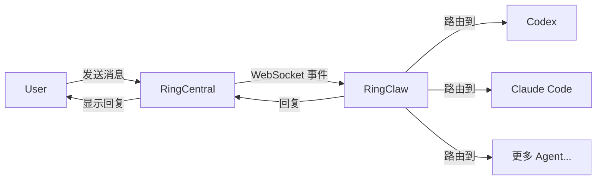

# RingClaw

[English](README.md) · [完整文档](https://ringclaw.github.io/ringclaw/zh/)

RingCentral AI Agent Bridge — 将 RingCentral Team Messaging 连接到 AI 智能体（Claude、Codex、Gemini、Kimi 等）。

> 灵感来自 [WeClaw](https://github.com/fastclaw-ai/weclaw/) — 原创微信 AI Agent 桥接器。


## 快速开始

```bash
# 一键安装 (macOS/Linux)
curl -sSL https://raw.githubusercontent.com/ringclaw/ringclaw/main/install.sh | sh

# 一键安装 (Windows PowerShell)
irm https://raw.githubusercontent.com/ringclaw/ringclaw/main/install.ps1 | iex

# 设置 Bot Token 并启动
export RC_BOT_TOKEN="your_bot_token"
ringclaw start
```

首次启动时，RingClaw 会自动检测已安装的 AI 智能体并保存配置到 `~/.ringclaw/config.json`。运行 `ringclaw setup` 可使用交互式配置向导。

## 功能特性

- **多 Agent 支持** — 通过 ACP/CLI/HTTP 路由消息到 Claude、Codex、Gemini、Kimi 等。[→ Agent 配置](https://ringclaw.github.io/ringclaw/zh/guide/agents.html)
- **聊天命令** — `/cc`、`/cx`、`/cs` 别名，多 Agent 广播，会话管理。[→ 命令](https://ringclaw.github.io/ringclaw/zh/guide/commands.html)
- **聊天总结** — 用自然语言总结跨聊天的对话内容。[→ 总结](https://ringclaw.github.io/ringclaw/zh/features/summarize.html)
- **AI 驱动的操作** — Agent 自动创建笔记、任务、日程和 Adaptive Cards。[→ 操作](https://ringclaw.github.io/ringclaw/zh/features/actions.html)
- **定时任务 & 心跳** — 定时调度和周期性 Agent 检查。[→ 定时任务](https://ringclaw.github.io/ringclaw/zh/features/cron.html) · [→ 心跳](https://ringclaw.github.io/ringclaw/zh/features/heartbeat.html)
- **主动推送** — CLI 和 HTTP API 发送消息和媒体文件。[→ 媒体 & API](https://ringclaw.github.io/ringclaw/zh/features/media.html)
- **安全加固** — API Token 认证、Host 验证、ACP 写权限控制、凭证脱敏。[→ 安全](https://ringclaw.github.io/ringclaw/zh/security/)
- **完整 CLI** — 命令行管理消息、聊天、任务、笔记、日程、卡片、用户、文件。[→ CLI](https://ringclaw.github.io/ringclaw/zh/guide/commands.html#cli)
- **图片解析** — 发送图片给 Bot，AI 自动分析图片内容（仅 ACP 模式）。[→ 图片支持](#图片解析)
- **Docker & systemd** — 后台运行，开机自启。[→ 部署](https://ringclaw.github.io/ringclaw/zh/deployment/background.html)

## 工作原理


```mermaid
graph LR
    User -->|发送消息| RC[RingCentral]
    RC -->|WebSocket 事件| RingClaw
    RingClaw -->|路由到| Codex
    RingClaw -->|路由到| Claude[Claude Code]
    RingClaw -->|路由到| More[更多 Agent...]
    RingClaw -->|回复| RC
    RC -->|显示回复| User
```

### 图片解析

在聊天中发送图片，AI 智能体会自动分析图片内容。支持每条消息最多 5 张图片（单张最大 5MB），格式支持 PNG、JPEG、GIF、WebP。

| Agent | 图片支持 | 说明 |
|-------|:---:|-------|
| Factory Droid | ✅ 已测试 | ACP 模式，`promptCapabilities.image` |
| Claude (ACP) | ✅ 已测试 | 需安装 `claude-agent-acp`（见下方） |
| Gemini (ACP) | 🔷 理论支持 | Gemini 模型原生支持多模态 |
| Cursor (ACP) | 🔷 理论支持 | 取决于底层模型 |
| GitHub Copilot (ACP) | 🔷 理论支持 | GPT-4o 支持多模态 |
| Cline (ACP) | 🔷 理论支持 | Cline 支持图片输入 |
| Claude (CLI) | ❌ 不支持 | CLI 模式无图片参数 |
| Codex (CLI) | ❌ 不支持 | CLI 模式，仅文本回退 |
| HTTP agents | ❌ 不支持 | 仅文本回退 |

**将 Claude 切换到 ACP 模式：**

```bash
npm install -g @agentclientprotocol/claude-agent-acp
ringclaw restart
```

RingClaw 启动时会自动检测 `claude-agent-acp`，并将 Claude 从 CLI 模式升级为 ACP 模式，无需手动修改配置。

📖 **完整文档：** [ringclaw.github.io/ringclaw/zh](https://ringclaw.github.io/ringclaw/zh/)

## 贡献者

<a href="https://github.com/ringclaw/ringclaw/graphs/contributors">
  
</a>

## Star History

[](https://star-history.com/#ringclaw/ringclaw&Timeline)

## 许可证

[MIT](LICENSE)
