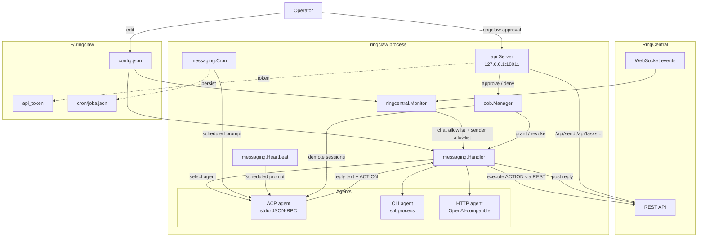

# Architecture Overview

RingClaw is a Go CLI tool that bridges RingCentral Team Messaging
chats to local AI agents (Claude, Codex, Cursor, Gemini, Kimi, etc.)
via the [Agent Client Protocol](https://github.com/zed-industries/agent-client-protocol)
or fallback HTTP / CLI subprocess paths. This page is a quick map of
the package layout, the runtime data flow, and how the security
layers documented in [Security](../security/) compose with it.

## Package layout

```
main.go                  # Entry point → cmd.Execute()
cmd/                     # Cobra CLI commands (start, setup, send, ...)
agent/                   # Agent adapters: ACP, HTTP, CLI
messaging/               # Message dispatch, slash commands, ACTION exec
ringcentral/             # RC REST client + WebSocket monitor
config/                  # ~/.ringclaw/config.json + agent auto-detection
api/                     # Local HTTP API server (loopback only)
internal/util/           # Small shared utilities
service/                 # systemd / launchd service files
```

| Package | What it does | Key files |
|---|---|---|
| `cmd/` | Cobra CLI: `start`, `setup`, `update`, `send`, plus resource subcommands (`task`, `note`, `event`, `card`, `chat`, `file`, `user`, `message`). `cli_client.go` is the HTTP client used by CLI subcommands to talk to a running server. | `cmd/start.go`, `cmd/start_init.go`, `cmd/cli_client.go`, `cmd/approval_cmd.go` |
| `agent/` | `Agent` interface plus three implementations. `ACPAgent` is the preferred path (JSON-RPC over stdio). `CLIAgent` is a one-shot subprocess fallback. `HTTPAgent` speaks OpenAI-compatible or NanoClaw API. | `agent/acp_agent.go`, `agent/acp_terminal.go`, `agent/acp_rpc.go`, `agent/cli_agent.go`, `agent/http_agent.go` |
| `messaging/` | The runtime brain. `Handler` dispatches messages, `handler_commands.go` handles slash commands, `actions.go` parses and executes `ACTION:` blocks emitted by the AI, `cron.go` / `heartbeat.go` run scheduled jobs, `summarize.go` summarises chat history, `prompts.go` centralises every prompt template. | `messaging/handler.go`, `messaging/actions.go`, `messaging/cron.go`, `messaging/heartbeat.go`, `messaging/prompts.go` |
| `ringcentral/` | Bot and Private App REST clients (`client.go`), the WebSocket monitor (`monitor.go`), JWT / token auth (`auth.go`). The monitor enforces the chat allowlist and the trusted-sender allowlist before any handler runs. | `ringcentral/client.go`, `ringcentral/monitor.go`, `ringcentral/auth.go` |
| `config/` | Loads `~/.ringclaw/config.json`, auto-detects installed agents, applies defaults. The previously supported `RC_*` / `RINGCLAW_*` / `OPENCLAW_GATEWAY_*` env-var fallbacks are silently ignored. | `config/config.go`, `config/detect.go` |
| `api/` | HTTP API server bound to `127.0.0.1:18011` by default. Used by the `ringclaw approval` CLI and external integrations. Token-authenticated; validates `Host` header to block DNS rebinding. | `api/server.go`, `api/auth.go`, `api/oob_handlers.go` |

## Runtime flow



The four entry points (WebSocket, HTTP API, cron, heartbeat) are
documented separately in
[Security › Four entry points](../security/index#four-entry-points-not-one).
Only the WebSocket path goes through all four security layers; the
others have their own gates.

## Where the security layers live

| Layer | Code path | Detail page |
|---|---|---|
| -1 (chat allowlist) | `ringcentral/monitor.go` (drops messages from chats outside `ringcentral.chat_ids`) | [Security overview](../security/) |
| 0 (sender allowlist) | `ringcentral/monitor.go` + `messaging/handler.go` (enforced twice) | [Sender Allowlist](../security/sender-allowlist) |
| 1 (per-command authorization) | `messaging/handler.go` + `messaging/handler_commands.go` | [Command Authorization](../security/command-authorization) |
| 2 (cross-chat ACTION) | `messaging/actions.go` (`crossChatOOBChallenge`, `announceCrossChatOrRefuse`) | [Cross-Chat Actions](../security/cross-chat-actions) |
| 3 (ACP session capability) | `agent/acp_agent.go` (`session/set_mode`), `oob/manager.go` (grants), `agent.DemoteAllACPFullAccess` | [ACP Full-Access](../security/full-access) |
| Approval transport | `cmd/approval_cmd.go` → `api/oob_handlers.go` | [Approval CLI](../security/approval-cli) |

## Build and test

```bash
go build -o ./ringclaw .         # build binary
go test ./... -count=1 -race -v  # full test suite
go vet ./...                     # static analysis
make dev                         # hot reload (requires air)
```

CI runs `go test ./... -count=1 -race -v` on every branch and
cross-compiles for darwin / linux / windows × amd64 / arm64.

## Further reading

- [Security overview](../security/) — threat model, four entry
  points, permission matrix.
- [Configuration](../guide/configuration) — every field in
  `config.json` with defaults and effects.
- [How It Works](../guide/how-it-works) — message-handling flow
  with diagrams.
- [Prompt Self-Evolution](./prompt-evolution) — how RingClaw plans
  to apply GEPA-style prompt optimization.
