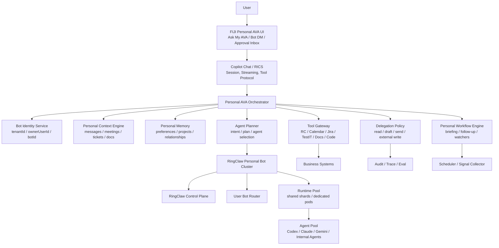
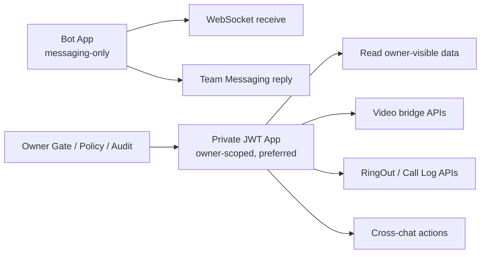
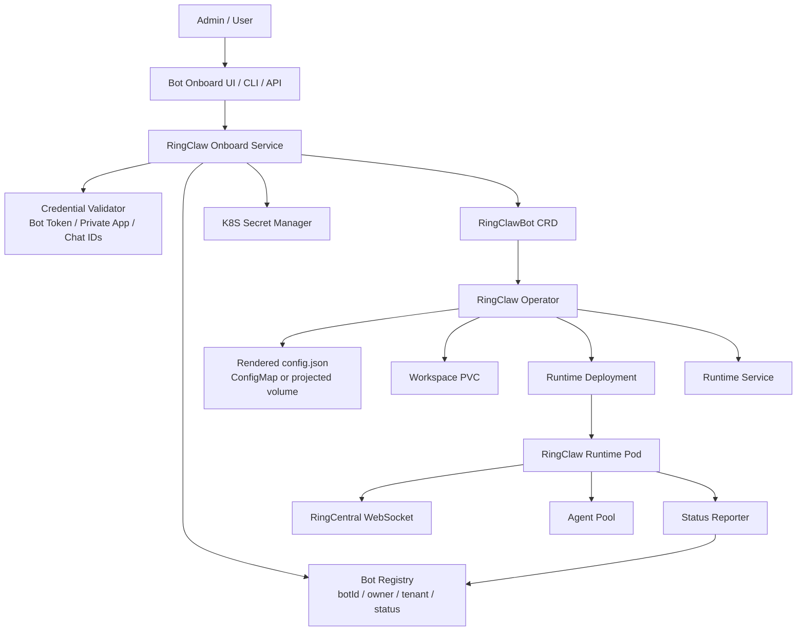
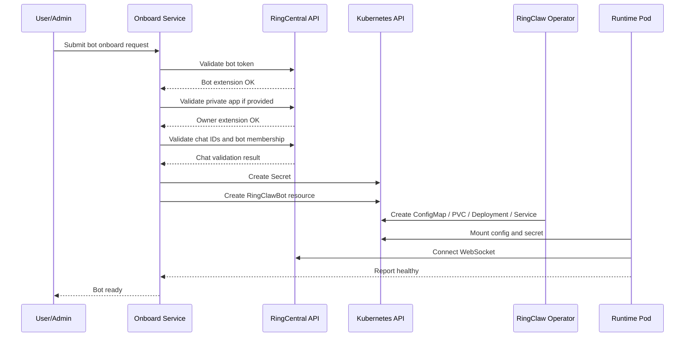
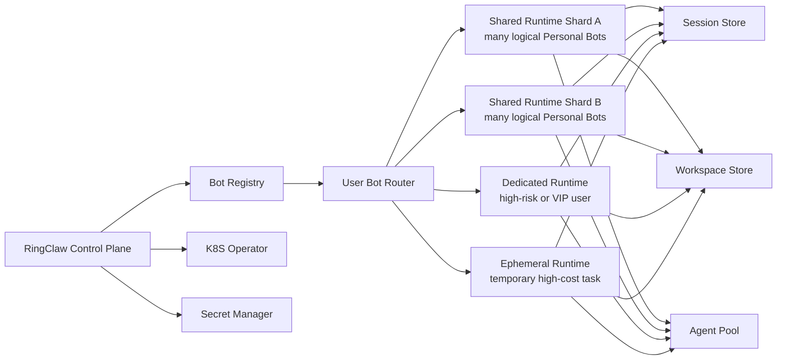
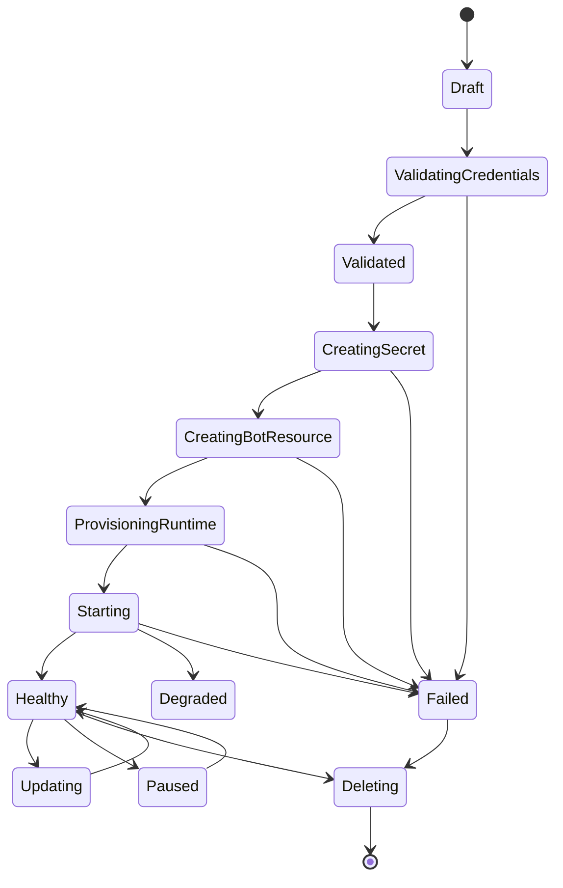
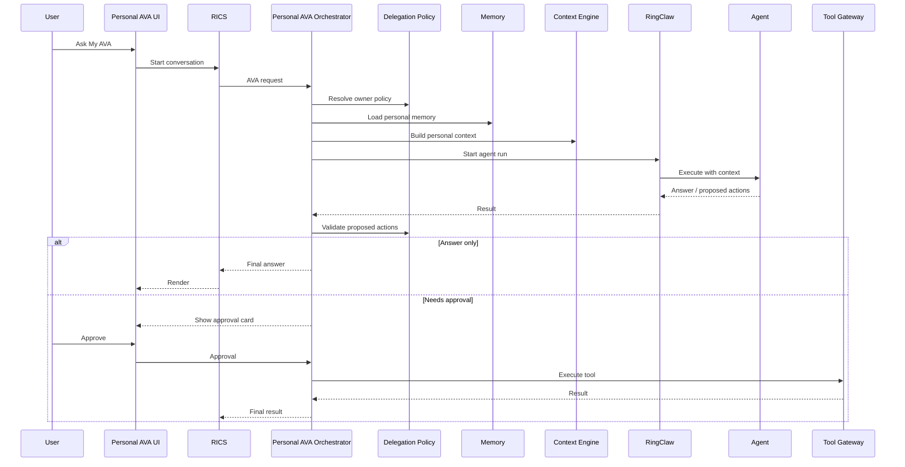

# Personal AVA Bot Platform Architecture

## Executive Summary

Personal AVA Bot changes AVA from a shared assistant into a user-owned AI work delegate. Each user has a logical Bot that understands their work context, tracks follow-ups, prepares briefings, drafts actions, and executes approved workflows.

RingClaw becomes the Bot and Agent execution platform behind this product. It owns Bot onboarding, K8S provisioning, runtime routing, Agent invocation, workspace isolation, approval hooks, and operational status.

The product direction is:

```text
User experience: one Personal AVA Bot per user
Platform reality: many logical Bots hosted by RingClaw runtime shards
```

## Product Principles

- Every Bot has an owner.
- Read, draft, send, and external write are separate permission levels.
- Write operations default to draft and require explicit approval when risk is high.
- Personal memory is visible, editable, and deletable by the user.
- RingClaw should host Bots as platform resources, not local `config.json` hand edits.
- K8S resources are generated from Bot profiles and secrets.
- Tool execution is governed through policy, audit, and approval.

## High-Level Architecture



## RingClaw Role

RingClaw should not own the AVA product semantics. It should own the execution substrate.

| Layer | Responsibility |
| --- | --- |
| FIJI UI | Ask My AVA, Bot DM entry, approvals, memory center, prompts, feedback |
| RICS / Copilot Chat | Session, streaming, assistant protocol, tool-call protocol |
| Personal AVA Orchestrator | Intent, context, memory, planning, workflow, result synthesis |
| RingClaw | Bot onboarding, K8S runtime, Agent gateway, workspace isolation |
| Tool Gateway | Business action execution |
| Policy / Audit | Authorization, approval, traceability, enterprise governance |

## Current RingClaw Capability Baseline

The current implementation supports the Personal AVA Pro MVP substrate:

| Capability | Current Status | Launch Boundary |
| --- | --- | --- |
| Bot onboarding helper | `ringclaw app-url`, `ringclaw onboard --from-env`, manifest-driven local config rendering | RingCentral still requires logged-in Developer Console confirmation for app creation |
| K8S-oriented Bot identity | `bot.id`, `tenant_id`, `owner_user_id`, `conversation_namespace` in config | Operator/CRD remains a platform phase |
| Long-lived Bot runtime | `ringclaw start` can run as one Pod per Bot with projected config/secret | Shared shard runtime is future work |
| AI context isolation | conversation IDs can be prefixed by Bot namespace | Each Bot should use a dedicated namespace and, for hosted AI, dedicated token or tenant key |
| Video | Video bridge create/get/delete via RingCentral Video REST API | Scope belongs on Private JWT App when used with Personal AVA Pro |
| Phone | RingOut status/cancel/create and extension Call Log | Uses the same client resolution path as Message; RingOut remains owner-only in the message bridge |
| Action governance | owner gate, cross-chat audit notice, OOB approval path | External write systems still need Tool Gateway policy integration |

## Permission Model

Personal AVA Pro uses two RingCentral app identities deliberately:



Bot App scopes remain minimal by default:

```text
ReadAccounts, ReadMessages, TeamMessaging, WebSocketsSubscription
```

For Personal AVA Pro, the preferred implementation is a REST API App using JWT auth. That app can receive optional Video/Phone scopes:

```text
Video, RingOut, ReadCallLog
```

This avoids expanding every Bot token into a broad action token while keeping phone/video code paths aligned with message: runtime commands use the resolved RingCentral client, and the selected app token must carry the required scopes. RingOut is still owner-only before any API call is made.

## Bot Types

Personal Bot is the flagship Bot type, but the platform should support other Bot scenarios through templates.

| Bot Type | Owner | Scope | Use Cases | Lifecycle |
| --- | --- | --- | --- | --- |
| Personal Bot | User | User-visible work context | Daily briefing, follow-up, drafts, personal memory | Long-lived |
| Team Bot | Group | Bound group chats | Group summary, team Q&A, action items | Long-lived |
| Project Bot | Project | Project chats, docs, tickets, repo | Status, risks, release readiness, impact analysis | Project lifetime |
| Workflow Bot | Process | Workflow-specific resources | Onboarding, QA flow, release checklist | Run/template |
| Watcher Bot | Entity | Ticket, PR, SLA, keyword, CI job | Change detection and notification | Condition-based |
| Incident Bot | Incident commander | Incident room and related systems | Triage, timeline, postmortem | Temporary |
| Meeting Bot | Meeting organizer | Calendar event, participants, related docs | Briefing, minutes, follow-up | Event lifetime |
| Admin Bot | Platform admin | RingClaw / AVA platform | Bot status, policy, audit, rollout | Long-lived |

## Bot Onboarding Architecture

The current local setup flow is:

```text
ringclaw setup -> ~/.ringclaw/config.json -> ringclaw start
```

The platform onboarding flow should become:

```text
Onboard Request -> Validation -> Secret -> RingClawBot CR -> Operator -> Runtime Pod
```



## Bot Onboarding Sequence



## Runtime Topology

The platform should support three runtime modes.



Recommended adoption:

1. MVP: one Bot equals one dedicated Deployment.
2. Scale phase: shared runtime shards host many logical Bots.
3. Enterprise phase: dedicated runtime for sensitive users, admins, and high-risk workflows.
4. Cost phase: ephemeral runtime for bursty long-running Agent jobs.

## RingClawBot Resource Model

```yaml
apiVersion: ringclaw.ai/v1
kind: RingClawBot
metadata:
  name: personal-ava-summer-gan
spec:
  tenantId: fiji
  ownerUserId: summer.gan
  botType: personal-ava

  ringcentral:
    serverUrl: https://platform.ringcentral.com
    credentialSecretRef: personal-ava-summer-gan-secret
    capabilities:
      - video
      - phone
    chatIds:
      - "123456"
    groupMentionOnly: true

  agents:
    defaultAgent: codex
    allowedAgents:
      - codex
      - claude
      - gemini

  workspace:
    mode: user-isolated
    pvc:
      enabled: true
      size: 5Gi

  policy:
    sourceUserIds:
      - summer.gan
    fullAccessAck: false
    allowGroupMentionAuthorize: false
    requireApproval:
      - send_message
      - cross_chat_message
      - external_write
      - full_access_agent_run

  runtime:
    mode: shared-shard
    replicas: 1
```

Sensitive values must live in K8S Secret, not in the CRD:

```yaml
apiVersion: v1
kind: Secret
metadata:
  name: personal-ava-summer-gan-secret
type: Opaque
stringData:
  bot_token: "<redacted>"
  client_id: "<redacted>"
  client_secret: "<redacted>"
  jwt_token: "<redacted>"
```

## Rendered Runtime Config

For MVP, the Operator can render the existing RingClaw config schema into `/root/.ringclaw/config.json` so the existing runtime boot path remains unchanged.

```json
{
  "default_agent": "codex",
  "bot": {
    "id": "personal-ava-summer-gan",
    "tenant_id": "fiji",
    "owner_user_id": "summer.gan",
    "conversation_namespace": "fiji/personal-ava-summer-gan"
  },
  "ringcentral": {
    "server_url": "https://platform.ringcentral.com",
    "bot_token": "...from secret...",
    "client_id": "...from secret...",
    "client_secret": "...from secret...",
    "jwt_token": "...from secret...",
    "chat_ids": ["123456"],
    "source_user_ids": ["summer.gan"],
    "group_mention_only": true,
    "allow_group_mention_authorize": false
  },
  "agents": {
    "codex": {
      "type": "http",
      "endpoint": "http://agent-gateway/codex"
    }
  },
  "full_access_ack": false
}
```

This preserves the current `ringclaw start` path while shifting desired state into Kubernetes.

## Control Plane APIs

### Create Bot

```http
POST /control/v1/bots/onboard
```

```json
{
  "tenantId": "fiji",
  "ownerUserId": "summer.gan",
  "botType": "personal-ava",
  "displayName": "Summer's AVA",
  "ringcentral": {
    "serverUrl": "https://platform.ringcentral.com",
    "capabilities": ["video", "phone"],
    "botToken": "<redacted>",
    "clientId": "<redacted>",
    "clientSecret": "<redacted>",
    "jwtToken": "<redacted>",
    "chatIds": ["123456"],
    "groupMentionOnly": true
  },
  "agents": {
    "defaultAgent": "codex",
    "allowedAgents": ["codex", "claude", "gemini"]
  },
  "policy": {
    "sourceUserIds": ["summer.gan"],
    "fullAccessAck": false
  }
}
```

Response:

```json
{
  "botId": "personal-ava-summer-gan",
  "status": "provisioning",
  "runtimeMode": "shared-shard",
  "resources": {
    "secret": "personal-ava-summer-gan-secret",
    "cr": "personal-ava-summer-gan"
  }
}
```

### Other APIs

```http
GET    /control/v1/bots/{botId}
GET    /control/v1/bots/{botId}/status
PATCH  /control/v1/bots/{botId}
POST   /control/v1/bots/{botId}/pause
POST   /control/v1/bots/{botId}/resume
DELETE /control/v1/bots/{botId}
```

## Onboarding State Machine



Failure reasons should be machine-readable:

```text
credential_invalid
chat_not_found
bot_not_in_chat
private_app_invalid
secret_create_failed
runtime_start_failed
websocket_connect_failed
agent_unavailable
policy_invalid
```

## Personal Bot Request Flow



## Delegation Policy

| Permission Level | Meaning | Default |
| --- | --- | --- |
| Read | Read owner-visible context | Allowed after user grants source access |
| Draft | Prepare messages, tasks, events, summaries | Allowed |
| Suggest | Recommend owner, deadline, next action | Allowed |
| Execute | Create owner-scoped task/event in allowed systems | Conditional |
| Send | Post messages or cross-chat summaries | User approval required |
| External Write | Update Jira, TestIT, CRM, production-like systems | User approval required |
| Full Access Agent Run | Agent gets broad tool or workspace access | Strong approval required |

Default product posture:

```text
prepare -> summarize -> draft -> ask approval -> execute
```

## Security Requirements

- Bot Token, Client Secret, JWT, API tokens must only be stored in K8S Secrets.
- Secret values must never be returned by control-plane APIs.
- Bot App scopes should remain messaging-only by default; Video, RingOut, and ReadCallLog should normally belong to the owner-scoped Private JWT App.
- Phone and Video commands should use the same resolved RingCentral client path as Message commands; missing scopes should surface as RingCentral permission errors.
- `ACTION:RINGOUT` must be rejected before chat override, OOB challenge, or API execution unless the origin sender is the owner.
- `fullAccessAck` defaults to false.
- `allowGroupMentionAuthorize` defaults to false.
- `sourceUserIds` defaults to owner-only for Personal Bots.
- Private App owner must match `ownerUserId`, unless an admin override is explicitly approved.
- Bot membership must be validated for every configured chat.
- Runtime workspace must be isolated per user or per Bot.
- All Agent runs must carry `tenantId`, `ownerUserId`, `botId`, and `traceId`.
- Each Bot must pass a stable conversation namespace into agent calls; hosted AI providers should receive per-Bot or per-owner tokens to prevent context and billing ambiguity.
- All proposed actions must pass policy before Tool Gateway execution.
- Deleting a Bot must support retention policy for Secret, PVC, memory, and audit history.

## Code Placement Proposal

Current RingClaw reusable points:

- `cmd/setup.go`: credential validation logic should move into reusable onboarding validation package.
- `config/config.go`: existing config schema should remain runtime-compatible.
- `cmd/start.go`: runtime boot path can stay for MVP.
- `api/server.go`: can be extended or separated for control-plane APIs.

Recommended new packages:

```text
control/
  onboard/
    service.go
    validator.go
    renderer.go
  registry/
    store.go
  k8s/
    client.go
    manifests.go

operator/
  controller.go
  ringclawbot_types.go
  reconciler.go

api/
  control_handlers.go

config/
  renderer.go
```

## Roadmap

### Phase 1: Dedicated Runtime MVP

- `POST /control/v1/bots/onboard`
- Validate Bot Token and chat IDs
- Create K8S Secret
- Create `RingClawBot` CR
- Operator creates one Deployment per Bot
- Runtime mounts rendered `config.json`
- Status becomes healthy when WebSocket and Agent are available

### Phase 2: Personal Bot Product MVP

- Ask My AVA
- Personal message summary
- Mention summary
- Follow-up drafts
- Approval inbox
- Basic personal memory

### Phase 3: Runtime Shards

- Shared runtime mode
- User Bot Router
- Session store
- Workspace store
- Runtime autoscaling
- Dedicated runtime option for high-risk users

### Phase 4: Bot Platform

- Bot templates
- Team Bot
- Project Bot
- Watcher Bot
- Workflow Bot
- Admin console
- Usage and cost reporting

### Phase 5: Agentic Enterprise Platform

- Workflow marketplace
- Enterprise policy simulation
- Eval dashboard
- Audit review
- Multi-region readiness
- Proactive signal collector

## North-Star Metric

```text
Weekly Work Delegated per User
```

Supporting metrics:

- Briefings prepared
- Follow-ups tracked
- Drafts accepted
- Actions approved
- Workflows completed
- Agent cost per active user
- Bot health and runtime uptime
