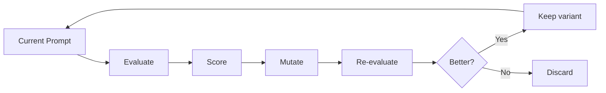
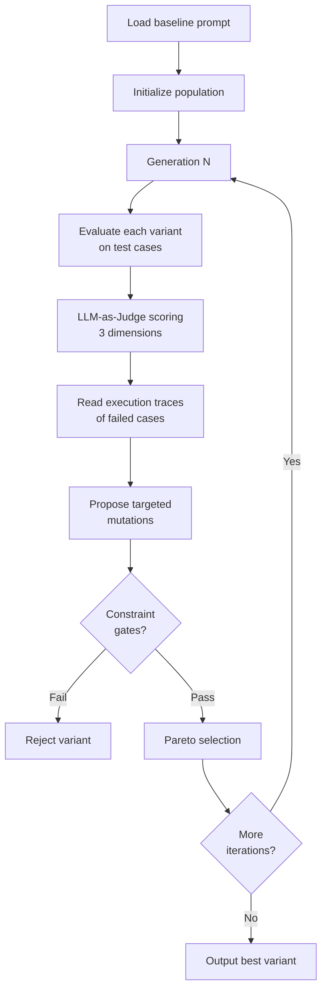
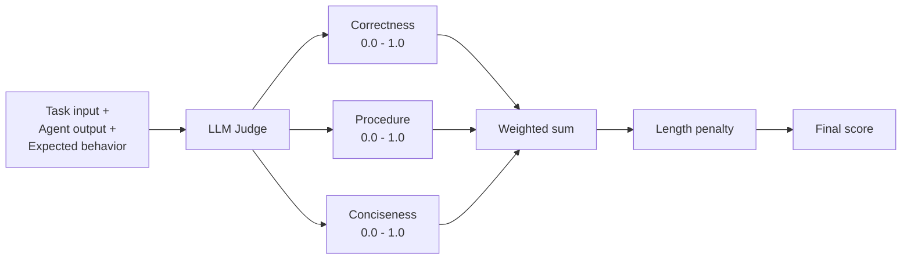
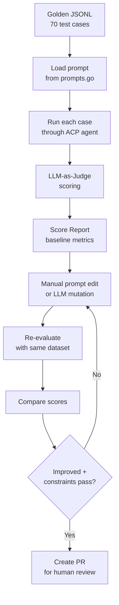

# Prompt Self-Evolution

Prompt self-evolution is a technique for systematically improving prompt text through automated evaluation, mutation, and selection — inspired by evolutionary algorithms. Instead of hand-tuning prompts through trial and error, this approach treats prompt optimization as a measurable search problem.

This document explains the principles behind the [GEPA](https://github.com/gepa-ai/gepa) (Genetic-Pareto Prompt Evolution) algorithm as implemented in [hermes-agent-self-evolution](https://github.com/NousResearch/hermes-agent-self-evolution), and how RingClaw plans to apply these ideas to improve its prompts. See [Plan 006](/plan/006-prompt-self-evolution.md) for the implementation roadmap.

## Why Prompts Need Evolution

Prompts are the most impactful yet least rigorously tested component of an LLM-powered system. A single word change can shift classification boundaries, add or remove failure modes, and change output quality. Yet most teams iterate on prompts through:

1. **Manual tuning** — change text, test a few examples, deploy
2. **Reactive fixes** — wait for user bug reports, patch the prompt
3. **No regression testing** — no way to know if a fix broke something else

Prompt self-evolution replaces this with a data-driven loop:



## The GEPA Algorithm

GEPA (Genetic-Pareto Prompt Evolution) combines ideas from genetic algorithms with LLM-powered mutation. Published at ICLR 2026, it operates entirely via API calls — no GPU training required.

### Core Loop



**Key steps:**

1. **Population initialization** — start with the baseline prompt plus N random perturbations
2. **Evaluation** — run each variant against a dataset of test cases through the actual agent
3. **Scoring** — LLM-as-judge rates each output on multiple dimensions
4. **Trace reflection** — GEPA reads *why* things failed (the execution trace), not just that they failed
5. **Targeted mutation** — propose changes that specifically address observed failures
6. **Constraint gates** — reject variants that violate size, growth, or test suite constraints
7. **Pareto selection** — keep variants on the Pareto frontier (no single variant dominates another on all dimensions)

### What Makes GEPA Different

Traditional prompt optimization (e.g. DSPy's MIPRO) mutates prompts blindly — random insertions, deletions, rewordings. GEPA's key innovation is **reflective mutation**: it reads the execution traces of failed test cases and proposes targeted fixes.

| Approach | Mutation Strategy | Cost per Iteration |
|----------|------------------|-------------------|
| Random rewrite | Replace random sections | Low |
| MIPRO | Generate instruction candidates | Medium |
| **GEPA** | Read failure traces → propose targeted fix | Medium |

Example: if the intent classifier misclassifies "总结 John 的代码" as `summarize` instead of `chat`, GEPA would read the execution trace, identify that the prompt doesn't distinguish "summarize code" from "summarize chat messages", and propose adding a clarification rule.

## LLM-as-Judge Scoring

Each agent output is scored on three dimensions by a separate LLM acting as a judge:



### Dimensions

| Dimension | Weight | What It Measures |
|-----------|--------|-----------------|
| **Correctness** | 0.5 | Did the agent produce the correct output for this task? |
| **Procedure following** | 0.3 | Did the agent follow the prompt's instructions and workflow? |
| **Conciseness** | 0.2 | Was the response appropriately concise without missing key info? |

### Composite Score Formula

```
raw_score = 0.5 × correctness + 0.3 × procedure + 0.2 × conciseness
final_score = max(0, raw_score - length_penalty)
```

The **length penalty** discourages prompt bloat:
- 0% penalty at ≤90% of size limit
- Linear ramp from 0% to 30% penalty between 90%-100% of limit
- Formula: `penalty = min(0.3, (ratio - 0.9) × 3.0)` where `ratio = size / limit`

### Judge Feedback

Beyond numeric scores, the judge produces **textual feedback** — specific, actionable suggestions for improvement. This feedback is fed into GEPA's reflective mutation step, creating a feedback loop where the optimizer can read *why* a score was low and propose targeted fixes.

## Execution Trace Reflection

The most important insight from GEPA: **scores alone are not enough**. Knowing that a test case scored 0.3 on correctness tells you *that* it failed, but not *why*. The execution trace reveals the failure mechanism.

### What's in a Trace

A trace captures the full interaction:

```
Input: "总结 John 的代码"
Prompt used: [full IntentPrompt text]
Agent output: "summarize"
Expected: "chat"
Judge feedback: "The prompt says to classify as 'summarize' if the user
  wants to summarize CHAT HISTORY, but the message asks about code,
  not chat messages. The prompt lacks a rule for distinguishing
  'summarize code' from 'summarize chat messages'."
```

### How Reflection Works

1. Collect all failing test cases + their traces from the current generation
2. Group failures by category (e.g. "boundary cases", "compound intents")
3. Feed grouped failures to the mutation LLM with the prompt: "Here is the current prompt, here are the failures grouped by type. For each failure group, propose a specific change to the prompt text that would fix it."
4. The mutation LLM proposes changes grounded in real failure data, not random perturbation

This is fundamentally different from blind mutation — each proposed change has a *reason* backed by execution evidence.

## Constraint Gates

Every evolved variant must pass hard constraints before being considered. A single constraint failure = immediate rejection.

### Constraint Types

| Constraint | Limit | Rationale |
|-----------|-------|-----------|
| **Size limit** | ≤ 15,000 chars (skill/prompt) | Prevents unbounded growth that hits context limits |
| **Growth limit** | ≤ 20% over baseline | Prevents runaway prompt expansion per iteration |
| **Non-empty** | > 0 chars | Ensures the optimizer didn't produce empty output |
| **Test suite** | 100% pass | Ensures the evolved prompt doesn't break existing behavior |
| **Structural integrity** | Valid format | Ensures required sections/fields are preserved |

### Why Constraints Matter

Without constraints, prompt optimizers tend to:
- **Grow without bound** — adding more and more examples and rules
- **Overfit to eval data** — adding hyper-specific rules that break generalization
- **Destroy structure** — rewriting sections in ways that break parsing

Constraints act as evolutionary pressure against these failure modes.

## Evaluation Data Sources

The quality of evolution depends directly on the quality of evaluation data. There are three sources, each with different tradeoffs:

### 1. Golden Datasets (Hand-Curated)

Manually written test cases with known-correct expected behaviors.

```json
{
  "task_input": "总结 John 的代码",
  "expected_behavior": "chat",
  "difficulty": "hard",
  "category": "boundary"
}
```

| Pros | Cons |
|------|------|
| Highest quality | Labor-intensive to create |
| Covers known edge cases | Limited scale (typically 15-30 cases) |
| Traceable to real bugs (via source PRs) | May not cover unknown failure modes |

### 2. Synthetic Generation (LLM-Generated)

A strong LLM reads the prompt text and generates diverse test cases automatically.

| Pros | Cons |
|------|------|
| Scalable — generate hundreds of cases | May not reflect real usage patterns |
| Covers diverse scenarios | Can be too easy or too hard |
| Cheap and fast | Quality depends on generator model |

### 3. Session History Mining (Real Usage)

Extract real user messages from session logs and score them for relevance.

| Pros | Cons |
|------|------|
| Reflects actual usage patterns | Requires stored conversation history |
| Discovers unknown failure modes | Privacy concerns with user data |
| Most realistic evaluation | Cold-start problem for new systems |

### Recommended Strategy

Start with **golden datasets** derived from historical bug-fix PRs (highest signal-to-noise ratio), then supplement with **synthetic** data for coverage breadth. Session mining is the strongest source but requires conversation logging infrastructure.

## Application to RingClaw

RingClaw has 5 centralized prompts in `messaging/prompts.go`, each controlling a different aspect of the bot's behavior:

| Prompt | Purpose | Evolution Priority |
|--------|---------|-------------------|
| **ActionPrompt** | Instruct agent to generate ACTION blocks | HIGH — most complex, most failure modes |
| **IntentPrompt** | Classify user intent (summarize/task/note/event/chat) | HIGH — boundary cases between summarize and chat |
| **NameExtractPrompt** | Extract person name from message | MEDIUM — time word pollution, compound sentences |
| **SummaryPrompt** | Generate chat message summaries | LOW — works well |
| **HeartbeatPrompt** | Scheduled health check responses | LOW — works well |

### RingClaw Evolution Pipeline



### Current Golden Datasets

RingClaw has 70 hand-curated test cases derived from historical bug-fix PRs:

| Dataset | Cases | Key Sources |
|---------|-------|------------|
| `datasets/prompts/intent/golden.jsonl` | 30 | PR #34 (boundary), PR #62 (time words) |
| `datasets/prompts/action/golden.jsonl` | 20 | PR #40 (pronouns), PR #68 (person ID misuse) |
| `datasets/prompts/name_extract/golden.jsonl` | 20 | PR #40 (compound), PR #62 (time word pollution) |

Each test case is tagged with `source_pr` for traceability and `note` explaining why the case is challenging.

## Further Reading

- [GEPA paper](https://github.com/gepa-ai/gepa) — Genetic-Pareto Prompt Evolution (ICLR 2026 Oral)
- [DSPy](https://github.com/stanfordnlp/dspy) — Programming framework for LLM pipelines
- [hermes-agent-self-evolution](https://github.com/NousResearch/hermes-agent-self-evolution) — Reference implementation
- [Plan 006](/plan/006-prompt-self-evolution.md) — RingClaw implementation roadmap
