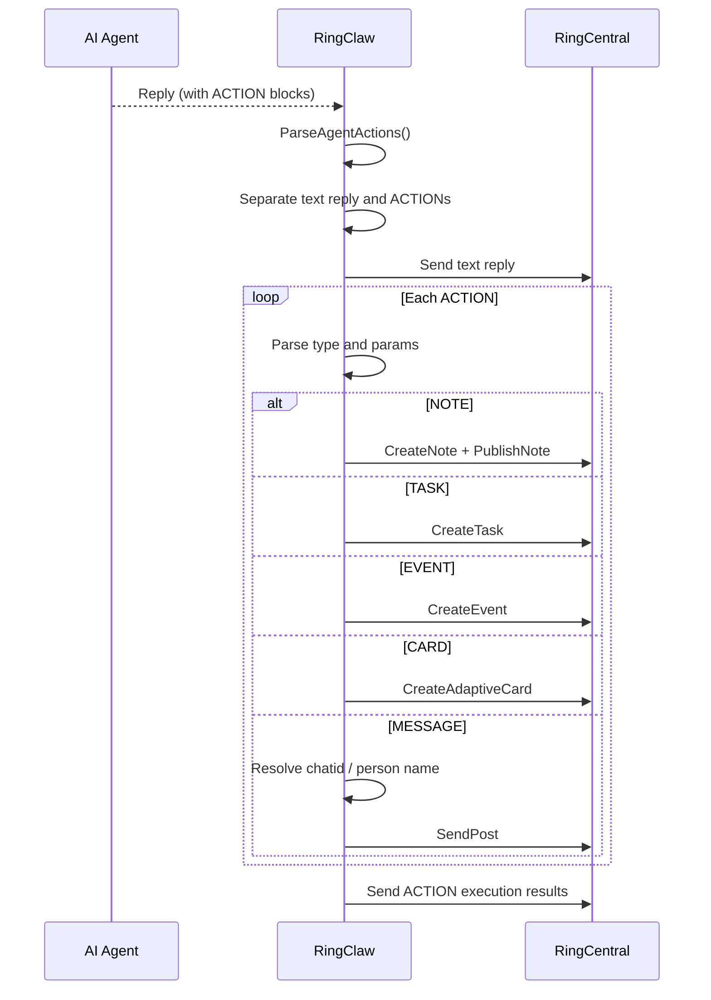

# AI-Driven Actions

AI agents can automatically create notes, tasks, events, and adaptive cards during conversation. When a user's request implies creating these resources, the agent appends ACTION blocks to its response and RingClaw executes them via the RC API.

## How It Works

When an agent's response contains ACTION blocks, RingClaw parses them, sends the text reply, then executes each action against the RingCentral API:



## ACTION Block Format

```
ACTION:NOTE title=Meeting Summary
Key decisions from today's standup...
END_ACTION

ACTION:TASK subject=Update deployment scripts
END_ACTION

ACTION:EVENT title=Sprint Review start=2026-04-01T14:00:00Z end=2026-04-01T15:00:00Z
END_ACTION
```

Actions can target a different chat via `chatid=<id>` parameter (disabled in bot context for security). No configuration needed — the action prompt is injected automatically.

## Task Commands

```
/task create Fix login bug         # create a task
/task list                         # list tasks in this chat
/task complete <id>                # mark task done
/task get <id>                     # get task details
/task update <id> <key=value>      # update a task
/task delete <id>                  # delete a task
```

## Note Commands

```
/note create Meeting Notes | body  # create a note (auto-published)
/note list                         # list notes in this chat
/note get <id>                     # get note details
/note update <id> <key=value>      # update a note
/note lock <id>                    # lock for editing
/note unlock <id>                  # unlock
/note delete <id>                  # delete a note
```

## Event Commands

```
/event list                        # list calendar events
/event list <chatId>               # list events in a specific chat
/event create <title> <start> <end>  # create event
/event get <id>                    # get event details
/event update <id> <key=value>     # update an event
/event delete <id>                 # delete an event
```

## Adaptive Cards

AI agents can generate [Adaptive Cards](https://adaptivecards.io/) for rich structured display (progress reports, dashboards, forms, etc.). When the agent includes an `ACTION:CARD` block in its response, RingClaw automatically posts the card to the chat:

```
ACTION:CARD
{"type":"AdaptiveCard","version":"1.3","body":[{"type":"TextBlock","text":"Sprint Status","weight":"bolder"},{"type":"FactSet","facts":[{"title":"Completed","value":"12"},{"title":"Remaining","value":"3"}]}]}
END_ACTION
```

Manage cards via chat commands:

```
/card get <id>       # view card details
/card delete <id>    # delete a card
```
