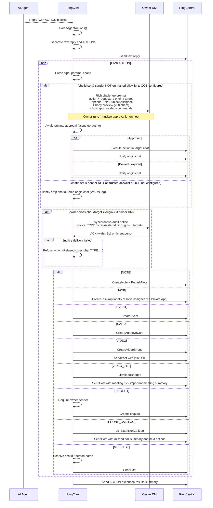

# AI-Driven Actions

AI agents can automatically create notes, tasks, events, adaptive cards, RingCentral Video bridges, and owner-approved RingOut calls during conversation. When a user's request implies creating these resources, the agent appends ACTION blocks to its response and RingClaw executes them via the RC API.

## How It Works

When an agent's response contains ACTION blocks, RingClaw parses them, sends the text reply, then executes each action against the RingCentral API:



## ACTION Block Format

```
ACTION:NOTE title=Meeting Summary
Key decisions from today's standup...
END_ACTION

ACTION:TASK subject=Update deployment scripts
END_ACTION

ACTION:EVENT title=Sprint Review start=2026-04-01T14:00:00Z end=2026-04-01T15:00:00Z
END_ACTION

ACTION:VIDEO title=Design Review type=Scheduled
END_ACTION

ACTION:VIDEO_LIST scope=today important=true limit=5
END_ACTION

ACTION:RINGOUT to=+14155550199 callerid=+14155550100
END_ACTION

ACTION:PHONE_CALLLOG scope=today missing=true summary=true next_actions=true limit=10
END_ACTION
```

Actions may target a different chat via the `chatid=<id>` parameter.
`ACTION:RINGOUT` is owner-only and is refused for non-owner senders.
When `from` is omitted, RingClaw does not synthesize a caller. RingOut runs under the current Private JWT App user's token and uses that user's default callback settings, matching how message sending derives identity from the token.

- **Non-owner senders**: when OOB is configured (Private App + owner DM resolved), a context-rich challenge prompt is posted to the owner DM (action type, requester label with email, origin / target chat names, optional `Title:` / `Subject:` / `Assignee:` lines, a body preview capped at 200 characters, effect description, and host approve / deny commands). The owner must run `ringclaw approval <id>` on the host machine to approve. On approval the action executes asynchronously in the target chat. Falls back to silent drop (forced to origin chat) when OOB is not configured. Example owner DM prompt:

  ```text
  Pending approval (challenge `def67890`).
  Action: Cross-chat NOTE
  Requester: Alice Cross <alice@example.com> (id=user-7)
  Origin chat: Engineering (id=origin-1)
  Target chat: Customer Support (id=target-9)
  Title: Quarterly review notes
  Body: Highlights for the next quarter ...

  Effect: bot will write a NOTE into the target chat on the requester's behalf.

  Run on the host:
    ringclaw approval def67890        (approve)
    ringclaw approval deny def67890   (deny)

  Expires in 5m.
  ```

- **Owner-initiated cross-chat**: passes a **synchronous fail-closed audit notice** through the owner DM before dispatching — see [Security › Cross-Chat Actions](../security/cross-chat-actions.md) for the full gating rules.

No configuration needed — the action prompt is injected automatically.

## Task Commands

```
/task create Fix login bug         # create a task
/task list                         # list tasks in this chat
/task complete <id>                # mark task done
/task get <id>                     # get task details
/task update <id> <key=value>      # update a task
/task delete <id>                  # delete a task
```

## Note Commands

```
/note create Meeting Notes | body  # create a note (auto-published)
/note list                         # list notes in this chat
/note get <id>                     # get note details
/note update <id> <key=value>      # update a note
/note lock <id>                    # lock for editing
/note unlock <id>                  # unlock
/note delete <id>                  # delete a note
```

## Event Commands

```
/event list                        # list calendar events
/event list <chatId>               # list events in a specific chat
/event create <title> <start> <end>  # create event
/event get <id>                    # get event details
/event update <id> <key=value>     # update an event
/event delete <id>                 # delete an event
```

## Adaptive Cards

AI agents can generate [Adaptive Cards](https://adaptivecards.io/) for rich structured display (progress reports, dashboards, forms, etc.). When the agent includes an `ACTION:CARD` block in its response, RingClaw automatically posts the card to the chat:

```
ACTION:CARD
{"type":"AdaptiveCard","version":"1.3","body":[{"type":"TextBlock","text":"Sprint Status","weight":"bolder"},{"type":"FactSet","facts":[{"title":"Completed","value":"12"},{"title":"Remaining","value":"3"}]}]}
END_ACTION
```

Manage cards via chat commands:

```
/card get <id>       # view card details
/card delete <id>    # delete a card
```

## Video & Phone Commands

Video bridge commands use RingCentral Video REST APIs and post or print the join URL. Phone commands use RingOut plus extension Call Log APIs, including a missed-call convenience view. These commands use the same resolved RingCentral client path as message commands; the selected app token must carry the required scopes. RingOut is owner-only inside the message bridge.

Video and Phone are product-default Personal AVA Pro capabilities. They are available in the RingClaw action layer even when `ringcentral.capabilities` only lists `message` / `summary`; the actual API call still depends on Private JWT App scopes and user permissions.

```
/video list
/video create Design Review type=Scheduled
/video get <bridgeId>
/video delete <bridgeId>

/phone ringout +14155550199 callerid=+14155550100
/phone status <ringOutId>
/phone cancel <ringOutId>
/phone calllog direction=Outbound view=Detailed limit=10
/phone calllog result=Missed limit=25
/phone missed limit=25
```

`/phone missed` is shorthand for inbound call logs with `result=Missed`. For CLI usage, the equivalent is `ringclaw phone calllog --result Missed --limit 25`; JSON output applies the same result filter.

## Natural-Language Video & Phone Actions

Natural-language Video and Phone requests now follow the same path as message/task/event actions:

```text
user message
  -> matchesIntentTrigger
  -> classifyIntent = video | phone
  -> default agent emits ACTION block
  -> ExecuteAgentActions
  -> RingCentral API
  -> SendPost back to the chat
```

RingClaw no longer keeps a separate `matchesVideoMeetingListIntent` fast-path. Meeting-list queries are represented as `ACTION:VIDEO_LIST`, and call-log queries are represented as `ACTION:PHONE_CALLLOG`.

### Video examples

The agent can create a new RingCentral Video bridge:

```text
Create a video meeting for release planning.
创建一个视频会议讨论发布计划。
帮我开一个明天的 RCV 会议。
```

Expected action:

```text
ACTION:VIDEO title=Release planning type=Scheduled
END_ACTION
```

The agent can also query meetings and return a list or important-meeting summary:

```text
Tell me what important meetings I have today.
告诉我今天有啥重要会议。
Show my recent meeting list.
查询我最近的 meeting list。
```

Expected action:

```text
ACTION:VIDEO_LIST scope=today important=true limit=5
END_ACTION
```

Supported `ACTION:VIDEO_LIST` params:

| Param | Values | Meaning |
| --- | --- | --- |
| `scope` | `today`, `recent` | `today` filters by bridge `createTime` / `updateTime`; records without time are kept instead of being hidden |
| `important` | `true`, `false` | Formats the reply as an important-meeting summary |
| `limit` | positive integer | Caps the number of returned meetings |
| `chatid` | optional | Sends the result to a target chat, subject to cross-chat governance |

### Phone examples

The agent can start RingOut calls:

```text
Call +12123753080.
给 2123753080 打电话。
帮我外呼 +12123753080。
```

Expected action:

```text
ACTION:RINGOUT to=+12123753080
END_ACTION
```

The agent can also query today's call log, summarize missed calls, and produce follow-up actions:

```text
Check today's calls and tell me if I have missing calls. Summarize next actions.
查询我今天 calls 的记录，告诉我有没有 missing 的 call，给我整理下接下来的 action。
查询我今天 call log，帮我整理下 call summary，以及我接下来的 action。
```

Expected action:

```text
ACTION:PHONE_CALLLOG scope=today missing=true summary=true next_actions=true limit=10
END_ACTION
```

Supported `ACTION:PHONE_CALLLOG` params:

| Param | Values | Meaning |
| --- | --- | --- |
| `scope` | `today`, `recent` | `today` sends `dateFrom` / `dateTo` to the Call Log API and filters the response by `startTime` |
| `missing` | `true`, `false` | Highlights missed/missing calls |
| `summary` | `true`, `false` | Adds totals for calls, missed calls, inbound, outbound, and answered/accepted calls |
| `next_actions` | `true`, `false` | Adds follow-up suggestions, especially for missed calls |
| `limit` | positive integer | Sets `recordCount`; defaults to `10` |
| `direction` | `Inbound`, `Outbound` | Optional Call Log API direction filter |
| `result` | `Missed`, `Accepted`, etc. | Optional Call Log API result filter |
| `view` | `Simple`, `Detailed` | Optional Call Log API view |

### Required scopes

The Private JWT App must include:

```text
Video       -> ACTION:VIDEO, ACTION:VIDEO_LIST
RingOut     -> ACTION:RINGOUT
ReadCallLog -> ACTION:PHONE_CALLLOG, /phone calllog, /phone missed
```
