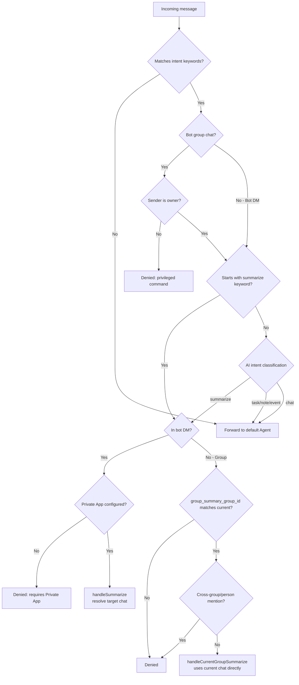
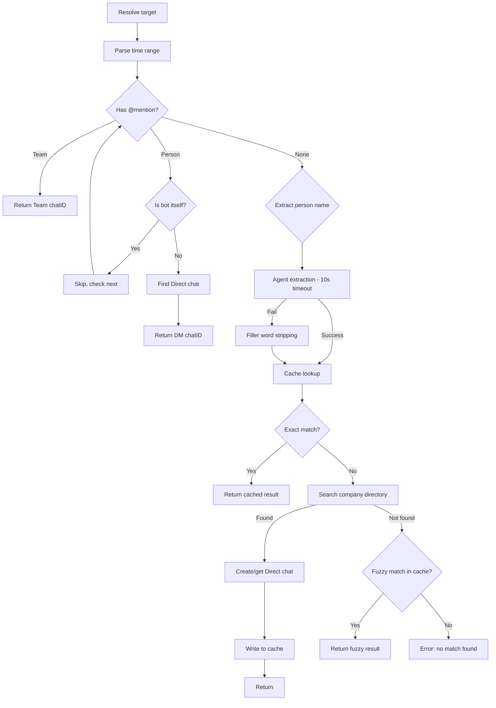
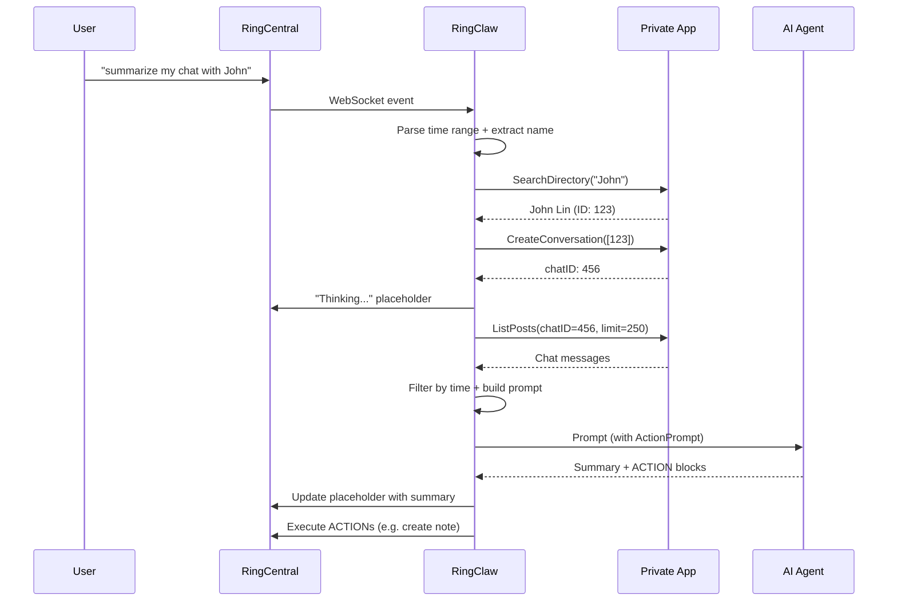

# Chat Summarization

Summarize conversations from any chat:

```
summarize my chat with John              # summarize today's chat with John
总结我和 John 的聊天                       # same in Chinese
summarize my chat with Raye from Monday  # summarize since Monday
总结 Maxwell 上周的聊天                    # summarize last week's chat
```

RingClaw resolves the target chat by name, fetches messages using the Private App client, and sends the summary to the current chat via an AI agent.

## Routing Decision

When a message arrives, RingClaw determines whether it's a summarize request through a two-stage process: keyword matching (fast path) and AI intent classification (fallback).



## Name Resolution

After permission checks pass, RingClaw resolves the target chat through mentions, agent-based name extraction, local cache, and company directory search.



**Name extraction** uses two strategies:
1. **Agent extraction** (preferred): Asks the AI agent to extract the person name from the message (10s timeout)
2. **Filler word stripping** (fallback): Removes summarize keywords, time words, and CJK/English filler words, then returns the remaining text as the name

**Cache** (`~/.ringclaw/chat_cache.json`) persists resolved name → chatID mappings and person info to disk. Exact matches are preferred; fuzzy matches are used only as a last resort.

## Execution Flow

Once the target chat is resolved, RingClaw fetches messages, builds a prompt, and sends it to the AI agent.



## Time Range Parsing

RingClaw supports multilingual time range expressions in 8 languages:

### Relative Expressions

| Expression | Time range | Languages |
|-----------|-----------|-----------|
| today / 今天 | Start of today | ZH, EN, JA, KO |
| yesterday / 昨天 / 昨日 | Start of yesterday | ZH, EN, JA |
| day before yesterday / 前天 | 2 days ago | ZH, EN, JA, KO, FR, ES, DE |
| this week / 本周 / 今週 | Start of Monday | ZH, EN, JA, KO |
| last week / 上周 / 先週 | Previous Monday | ZH, EN, JA, KO |
| this month / 本月 / 今月 | 1st of current month | ZH, EN, JA, KO |
| last month / 上个月 / 先月 | 1st of previous month | ZH, EN, JA, KO |
| recently / 最近 / 近期 | 3 days ago | ZH, EN, JA, KO, FR, ES, DE, RU |
| last N days / 最近N天 | N days ago | ZH, EN |
| last N hours / 最近N小时 | N hours ago | ZH, EN |

### Absolute Dates

| Format | Examples |
|--------|---------|
| Chinese | 4月10日, 4 月 10 号, 12月25日 |
| English | April 10, Apr 10th, January 1st |
| Slash (M/D) | 4/10, 04/10, 12/25 |
| ISO 8601 | 2026-04-10 |

Absolute dates use the current year. When an agent is available, RingClaw also uses agent-based date extraction (10s timeout) which can handle more complex expressions. On failure, it falls back to regex parsing.

If no time range is specified, defaults to **start of today**.

## Group Summarize

By default, summarization is blocked in group chats (since the summary would be visible to all group members). You can enable it for a specific group:

```json
{
  "ringcentral": {
    "group_summary_group_id": "1234567",
    "group_summary_message_limit": 200
  }
}
```

| Field | Default | Description |
|-------|---------|-------------|
| `group_summary_group_id` | — | Only this exact group ID is allowed to use in-group summarize |
| `group_summary_message_limit` | `200` | When group summarize is enabled, pull this many recent messages before time filtering |

When in-group summarize is enabled, RingClaw blocks cross-target requests (mentioning other groups, other users, or "chat with" phrases) to prevent data leaks within the group.

## Security

::: warning
Summarization is blocked in group chats when using a bot client, since the summary would be visible to all group members. Use it in a direct message with the bot instead.
:::

- **Bot DM**: Summarize works — Private App reads target chat, Bot replies with summary
- **Group chat**: **Blocked** unless `group_summary_group_id` is configured and matches
- **Without Private App**: Summarize is **disabled** entirely — the bot cannot access other users' chats

## Requirements

Summarization requires a **Private App** to be configured. The Private App needs `ReadAccounts` permission to:

- Search the company directory to resolve chat names
- Read messages from other chats that the bot cannot access directly
