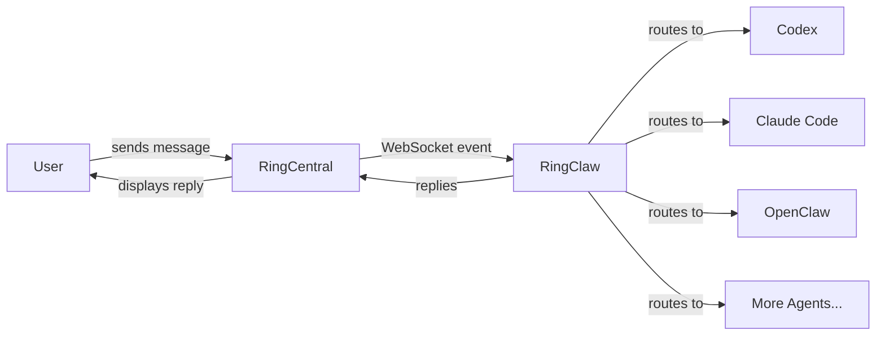
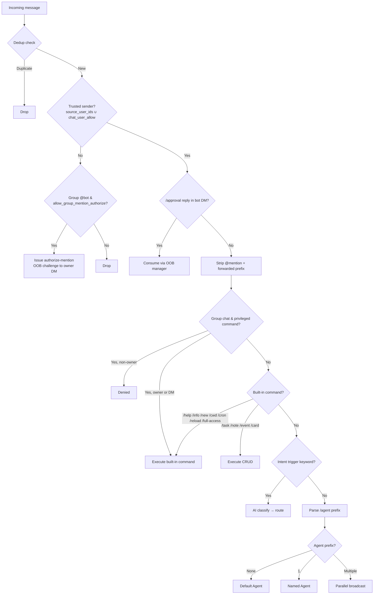
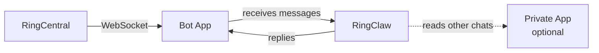

# How It Works



RingClaw connects to RingCentral Team Messaging via WebSocket to receive messages in real-time. When a message arrives, it routes it to the configured AI agent, then posts the reply back to the chat. While the agent is processing, a "Thinking..." placeholder message is shown and updated with the final reply.

## Message Routing

Every incoming message goes through deduplication, permission checks, and a multi-stage routing pipeline:



## Agent Modes

| Mode | How it works | Examples |
|------|-------------|----------|
| ACP  | Long-running subprocess, JSON-RPC over stdio. Fastest — reuses process and sessions. | Claude, Codex, Cursor, Kimi, Gemini, OpenCode, OpenClaw, Pi, Copilot, Droid, iFlow, Kiro, Qwen |
| CLI  | Spawns a new process per message. Supports session resume via `--resume`. | Claude (`claude -p`), Codex (`codex exec`) |
| HTTP | OpenAI-compatible chat completions API. Supports `openai` (default), `nanoclaw`, and `dify` formats. | OpenClaw, Dify Chatflow |

::: tip Auto-detection
Auto-detection picks ACP over CLI when both are available.
:::

## Architecture

RingClaw uses a **Bot App** (required) for messaging and an optional **Private App** for advanced features.



### Routing

Messages from chats not in `chat_ids` are silently dropped by the monitor.

| Source chat | Reply client | Read/Action client |
|-------------|-------------|-------------------|
| Bot DM (auto-discovered) | Bot | Private App (if configured) or Bot |
| Chat in `chat_ids` | Bot | Private App (if configured) or Bot |

### Group Chat Behavior

- **`group_mention_only: true`** (default) — Bot only responds when @mentioned in group chats (bot DMs are unaffected)
- **`group_mention_only: false`** — Bot responds to all messages in allowed group chats
- **`group_summary_group_id: "..."`** — Only this exact group ID is allowed to use in-group summarize
- **`group_summary_message_limit: 200`** (default) — When group summarize is enabled, pull this many recent messages before time filtering

If `group_summary_group_id` is set, in-group summarize is enabled automatically. It is only allowed when the current group ID exactly matches that configured value.

### User Allowlist

`source_user_ids` restricts which users the bot responds to. Accepts numeric RingCentral user IDs or email addresses (resolved to IDs at startup via the directory API). Empty = respond to everyone.

```json
"ringcentral": {
  "source_user_ids": ["alice@example.com", "3061708020"]
}
```

Find a user's numeric ID in RingClaw logs: `creatorID=XXXXXXXX` appears on every received message.

`chat_user_allow` is a **per-chat** allowlist layered on top of `source_user_ids`. Pre-seed it by hand, or let the [authorize-mention OOB flow](../security/sender-allowlist.md#authorize-mention-oob-flow) populate it on operator approval. Approved entries are persisted to `config.json` (email preferred when resolvable).

```json
"ringcentral": {
  "allow_group_mention_authorize": true,
  "chat_user_allow": {
    "chat-engineering-7": ["alice@example.com"],
    "chat-design-9": ["3061708020"]
  }
}
```

Only widens the **sender** allowlist for the listed chat. Privileged Layer 1 commands (`/cwd`, `/cron`, `/new`, `/reload`, `/full-access`, summarize NL trigger) still require Private-App-owner identity — see [Security › Permission Matrix](../security/index.md#permission-matrix).
