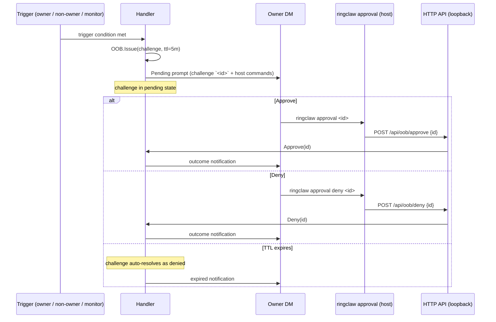

# Approval CLI

The `ringclaw approval` terminal command is the **single point of
truth** for resolving every OOB challenge — `/full-access grant`,
non-owner cross-chat ACTIONs, and the
[authorize-mention OOB flow](./sender-allowlist#authorize-mention-oob-flow).
Approval requires host machine access, decoupling the approval
authority from the RingCentral account.

## Commands

```bash
ringclaw approval <id>          # approve a pending challenge
ringclaw approval deny <id>     # deny a pending challenge
ringclaw approval list          # list all pending challenges
```

Each command reads `~/.ringclaw/api_token`, then calls the local
HTTP API (`127.0.0.1:18011`, loopback-only, token-authenticated).
Requires access to the host machine running `ringclaw`. See
[API & Clients](./api-and-clients) for the API token / loopback
binding details.

## Why terminal-only

The approval flow is intentionally terminal-only for three reasons:

1. **Decoupled authority.** A compromised RingCentral account can
   read the challenge ID in the owner DM but cannot run
   `ringclaw approval <id>` without SSH or physical access to the
   host.
2. **Single audit trail.** Every approve / deny decision lives in
   the host's shell history and the `ringclaw` log; there is no
   "approve from chat" path that bypasses the host log.
3. **Simple revocation.** Restarting the `ringclaw` process clears
   every pending challenge and every active grant — a process
   restart is the universal "panic button".

::: warning Chat-based /approval is disabled by design
Any `/approval ...` message in the bot DM is consumed and the
sender is redirected to the terminal CLI. The bot replies with the
exact `ringclaw approval <id>` command to run. Chat-based
approvals are intercepted and logged as
`INFO oob: chat approval intercepted, redirected to terminal`.
:::

## Three OOB surfaces, one CLI

The same `ringclaw approval <id>` command resolves all three OOB
surfaces. The challenge `intent` field disambiguates them in the
audit log:

| Surface | Intent prefix | Triggered by | Detail page |
|---|---|---|---|
| `/full-access` grant | `grant ACP full-access for <duration>` | Owner sends `/full-access grant` in bot DM | [ACP Full-Access](./full-access) |
| Non-owner cross-chat ACTION | `cross-chat <TYPE>` | AI emits `ACTION: ... chatid=<other>` for a non-trusted requester | [Cross-Chat Actions](./cross-chat-actions) |
| Authorize-mention | `authorize user <userID> in chat <chatID>` | Non-trusted user `@bot` in an allowed group chat (default since v0.4.1; set `allow_group_mention_authorize: false` to disable) | [Sender Allowlist](./sender-allowlist#authorize-mention-oob-flow) |

## Lifecycle



## Audit-log additions

| Event | Log line | Purpose |
|---|---|---|
| Challenge issued | `INFO oob: challenge issued` (`challengeID`, `requesterID`, `intent`, `ttl`) | Track every approval prompt, including ones that timed out unanswered. |
| Challenge approved (via terminal) | `INFO oob: challenge approved via terminal` (`challengeID`) | Audit who approved what and when. |
| Challenge denied (via terminal) | `INFO oob: challenge denied via terminal` (`challengeID`) | Counterpart to approval log line. |
| Chat `/approval` intercepted (redirected to terminal) | `INFO oob: chat approval intercepted, redirected to terminal` | Defense-in-depth — chat-based approval is disabled; any attempt is logged and redirected. |
