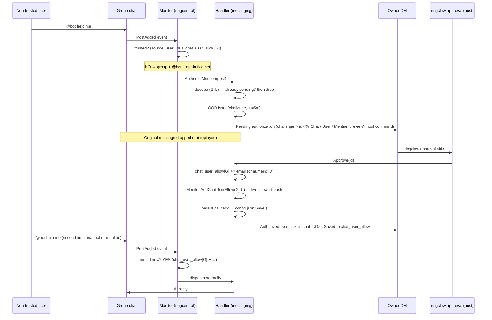

# Sender Allowlist (Layer 0)

Every WebSocket message is gated on the trusted-sender allowlist
before any other layer applies. This page covers the three sources
that build the allowlist, the mandatory-strict-mode startup
behavior, and the **authorize-mention OOB flow** that lets operators
admit a non-trusted user into one specific chat without restarting.

See [Permission Matrix](./index#permission-matrix) for how Layer 0
relates to the other layers.

## How the allowlist is built

When `ringclaw start` boots, the WebSocket monitor and message
handler both switch into **strict sender mode**: only the user IDs
on the trusted allowlist may drive the AI agent. The allowlist is
the **union** of three sources:

1. The Private App owner's user ID (auto-injected when a Private App
   is configured).
2. All entries in `ringcentral.source_user_ids` (resolved to numeric
   user IDs on startup).
3. All entries in `ringcentral.chat_user_allow[<chatID>]` for the
   destination chat (resolved on startup the same way as
   `source_user_ids`). This is a **per-chat layered exception**, not
   a global widening — `chat_user_allow` only admits the listed
   users in the listed chats.

If all three sources are empty, the bot logs a startup error and
**drops every incoming message** until the operator adds at least
one trusted sender. This prevents the "any user in an allowed chat
can run my AI agent" foot-gun.

```yaml
ringcentral:
  source_user_ids:
    - "+15551234567"       # phone number, resolved at boot
    - alice@example.com    # email address, resolved via Private App directory
    - "987654321"          # bare numeric extensionId / user ID
```

::: tip
Email and phone-number entries require a Private App with the
`ReadAccounts` permission so they can be resolved to numeric IDs.
Without the Private App, list the numeric extensionIds directly.
:::

## `chat_user_allow` — per-chat exception layer

`ringcentral.chat_user_allow` is a per-chat allowlist layered on top
of `source_user_ids`:

```jsonc
{
  "ringcentral": {
    "chat_user_allow": {
      "chat-engineering-7": ["alice@example.com", "3061708020"],
      "chat-design-9":      ["bob@example.com"]
    }
  }
}
```

Identifiers may be numeric extension IDs, emails, or E.164 phone
numbers (resolved to numeric IDs at startup via the Private App
directory). Operators may pre-seed by hand, or let the
[authorize-mention OOB flow](#authorize-mention-oob-flow) populate
the map on operator approval.

Key invariant: `chat_user_allow` **only widens the sender allowlist
for the listed chat**. It does **not** unlock privileged Layer 1
commands (`/cwd`, `/cron`, `/new`, `/reload`, `/full-access`,
summarize NL triggers) — those still require Private-App-owner
identity. See [Command Authorization](./command-authorization).

## Authorize-mention OOB flow

A separate OOB surface, layered on the same challenge /
terminal-approval infrastructure as `/full-access` and the
non-owner cross-chat ACTION challenge, lets operators authorize
**per-chat** non-trusted senders without restarting or hand-editing
`config.json`. The feature is controlled by
`ringcentral.allow_group_mention_authorize`:

- **Unset** (default since v0.5.0): feature **on**. Non-trusted
  group `@bot` mentions surface as a `/approval` prompt in the
  owner DM. Requires a Private App + resolved owner DM at runtime;
  if either is missing, ringclaw logs a single INFO line at startup
  and falls back to the legacy silent-drop behavior.
- **`true`**: feature on, identical to the default. The only
  difference is the startup log: a missing Private App is logged at
  ERROR (operator opted in but the runtime cannot deliver) instead
  of INFO.
- **`false`**: feature off. Non-trusted `@bot` is silently dropped,
  preserving the pre-v0.5 behavior. Set this when you want a
  Layer-0-only deployment.

The trigger is narrow: a user who is **not** on the global
`source_user_ids` allowlist and **not** in the destination chat's
`chat_user_allow` entry sends a message with `@bot` (a true
mention) in an allowed group chat. Plain text from the same user,
or `@bot` in a non-allowed chat, still drops as before.



### Key invariants

- **Original message dropped.** The first `@bot` that triggered the
  challenge is **not** replayed on approval. The user must `@bot`
  again to actually drive the AI. This avoids accidental
  side-effects from prompts that were authored before the operator
  approved them.
- **Per-chat scope only.** The grant is recorded under
  `chat_user_allow[<chatID>]`, never in the global
  `source_user_ids`. Approving a user in chat A does not authorize
  them in chat B.
- **Privileged commands NOT unlocked.** `chat_user_allow` only
  widens Layer 0. Non-owner privileged Layer 1 commands still
  require Private-App-owner identity. See
  [Command Authorization](./command-authorization).
- **Pending dedupe.** A pending challenge for a `(chatID, userID)`
  pair blocks new challenges from the same pair for the challenge
  TTL. The pending lock is released on approve / deny / expire /
  prompt-post failure.
- **24h cooldown after deny / expire (v0.5.0+).** When a challenge
  resolves to deny or expire, the same `(chatID, userID)` pair is
  silenced for 24 hours: subsequent `@bot` mentions are dropped
  without re-prompting the owner. This keeps a noisy or hostile
  non-trusted user from spamming the owner DM by repeatedly
  re-mentioning the bot. The window does **not** apply on approve
  (the user becomes trusted via `chat_user_allow` instead) or on
  transient errors (e.g. owner DM post failed) so the operator
  always gets another chance once the underlying issue clears.
  Cooldown state is in-memory only — restarting the bot resets it,
  which is acceptable because restarts are rare and operator-driven.
- **Persistence is best-effort.** The in-memory monitor + handler
  allowlists are updated synchronously on approval; the
  `config.json` Save is fired afterwards. A persist failure is
  logged as `ERROR authorize-mention: persist failed` but the user
  remains authorized for the current process lifetime — operators
  relying on durable persistence should monitor that log line.
- **Email preferred for persistence.** The persisted identifier is
  the resolved email when the directory lookup succeeds; the numeric
  extension ID otherwise (with a
  `WARN authorize-mention: no email available` line). Hand-edited
  entries may use any of the three
  forms `source_user_ids` accepts.
- **No new approval verb.** The same `ringclaw approval <id>` /
  `ringclaw approval deny <id>` CLI handles authorize-mention,
  `/full-access`, and cross-chat OOB challenges uniformly. The
  challenge `intent` field disambiguates them in audit logs. See
  [Approval CLI](./approval-cli).
- **Owner self-challenge guarded.** The handler refuses to issue an
  authorize-mention challenge when `post.CreatorID` equals the
  Private App owner's ID. Monitor's Layer 0 already admits the
  owner, so reaching this path with that condition would only
  happen on a bug or hostile direct caller — failing closed
  prevents the owner from being routed a "user X requesting
  authorization" prompt for themselves.

### Failure modes

| Condition | Behavior |
|---|---|
| `allow_group_mention_authorize` unset (default since v0.5.0) | Feature on. Non-trusted `@bot` issues a `/approval` prompt to the owner DM. |
| `allow_group_mention_authorize: false` | Feature off. Non-trusted `@bot` falls back to silent drop (pre-v0.5 behavior). |
| `allow_group_mention_authorize: true` | Feature on (same as default). The only difference is a missing Private App at startup is logged at ERROR rather than INFO. |
| Private App not configured (no owner DM resolvable) | Feature disabled at startup. ERROR if `allow_group_mention_authorize: true`, INFO if defaulted. Either way, falls back to silent drop. |
| Owner DM not yet resolved at runtime | The single message that hits this race is dropped with `WARN authorize-mention: OOB or owner DM unconfigured; dropping`. Subsequent messages succeed once the DM resolves. |
| Owner denies the challenge | Pending lock released; owner DM notified. The `(chat, user)` pair enters a 24h cooldown — re-mentions drop silently until the window elapses. |
| Challenge expires (5 min TTL) | Pending lock released; owner DM notified. Same 24h cooldown as deny. |
| Owner DM post fails (transient RC error) | Challenge auto-denied; pending lock released. **No** cooldown is recorded so the user's next `@bot` retries the post. |
| Persist callback fails (e.g. config write error) | In-memory grant survives the current process; `ERROR authorize-mention: persist failed` is logged. Restart re-locks the user. |

### Pre-seeding without OOB

Operators who want to authorize a known user without enabling the
OOB flow at all can hand-edit `chat_user_allow` directly:

```jsonc
{
  "ringcentral": {
    "allow_group_mention_authorize": false,  // OOB flow off
    "chat_user_allow": {
      "chat-engineering-7": ["alice@example.com"]
    }
  }
}
```

This admits Alice in `chat-engineering-7` and only there; no
challenge is ever issued. The two fields are independent.

## Audit-log additions

| Event | Log line | Purpose |
|---|---|---|
| Sender allowlist empty at startup | `sender allowlist is empty: ...` | Canonical signal that strict mode dropped to deny-all because no source_user_ids and no Private App owner are configured. |
| Authorize-mention routing (monitor) | `INFO authorize-mention: routing non-trusted group mention` (`chatID`, `userID`) | Confirms the WebSocket monitor handed a non-trusted group `@bot` to the OOB flow instead of dropping it. |
| Authorize-mention challenge issued | `INFO oob: challenge issued` (`intent` starts with `authorize user … in chat …`) | Same `INFO oob: challenge issued` line as `/full-access` and cross-chat OOB; the `intent` field disambiguates. |
| Authorize-mention granted | `INFO authorize-mention: granted` (`challengeID`, `chatID`, `userID`, `identifier`) | Fired after `applyAuthorize` updates the in-memory monitor + handler allowlists and (best-effort) persists the identifier to `chat_user_allow`. |
| Authorize-mention denied / expired | `INFO authorize-mention: denied` or `INFO authorize-mention: challenge expired` (with `cooldown=24h`) | Counterparts to the granted line. The pending `(chat, user)` dedupe is released and a 24h silence window is recorded. |
| Authorize-mention dropped by cooldown | `DEBUG authorize-mention: in cooldown after recent deny/expire, dropping` | A re-mention from a `(chat, user)` pair within their 24h silence window is dropped without re-prompting the owner. |
| Authorize-mention persist failure | `ERROR authorize-mention: persist failed` (with `error`) | The in-memory grant succeeded but writing `config.json` did not — the grant survives the current process but is lost on restart. |
| Authorize-mention prompt failure | `ERROR authorize-mention: post prompt failed` (with `error`) | The owner DM post failed; the challenge is auto-denied and the `(chat, user)` pending lock released so the user can retry. |
| Authorize-mention email unavailable | `WARN authorize-mention: no email available, persisting numeric ID` | Directory lookup did not yield an email; the numeric extension ID is persisted instead (still chat-scoped). |
