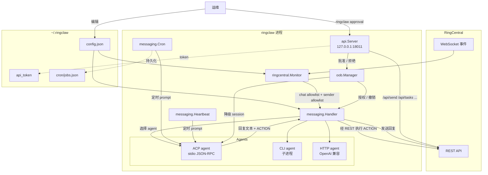

# 架构概览

RingClaw 是一个 Go CLI 工具，把 RingCentral Team Messaging 聊天通
过 [Agent Client Protocol](https://github.com/zed-industries/agent-client-protocol)
（或 HTTP / CLI 子进程回退路径）桥接到本地 AI agent
（Claude、Codex、Cursor、Gemini、Kimi 等）。这一页是对包结构、
运行时数据流，以及它如何与 [安全](../security/) 章节描述的层
次复合的快速地图。

## 包结构

```
main.go                  # 入口 → cmd.Execute()
cmd/                     # Cobra CLI 命令（start、setup、send、...）
agent/                   # Agent 适配器：ACP、HTTP、CLI
messaging/               # 消息派发、斜杠命令、ACTION 执行
ringcentral/             # RC REST 客户端 + WebSocket monitor
config/                  # ~/.ringclaw/config.json + agent 自动检测
api/                     # 本地 HTTP API 服务（仅 loopback）
internal/util/           # 共享小工具
service/                 # systemd / launchd 服务文件
```

| 包 | 职责 | 关键文件 |
|---|---|---|
| `cmd/` | Cobra CLI：`start`、`setup`、`update`、`send`，外加资源子命令（`task`、`note`、`event`、`card`、`chat`、`file`、`user`、`message`）。`cli_client.go` 是 CLI 子命令访问运行中服务的 HTTP 客户端。 | `cmd/start.go`、`cmd/start_init.go`、`cmd/cli_client.go`、`cmd/approval_cmd.go` |
| `agent/` | `Agent` 接口加上三种实现。`ACPAgent` 是首选路径（基于 stdio 的 JSON-RPC）；`CLIAgent` 是一次性子进程回退；`HTTPAgent` 兼容 OpenAI 或 NanoClaw API。 | `agent/acp_agent.go`、`agent/acp_terminal.go`、`agent/acp_rpc.go`、`agent/cli_agent.go`、`agent/http_agent.go` |
| `messaging/` | 运行时核心。`Handler` 派发消息，`handler_commands.go` 处理斜杠命令，`actions.go` 解析并执行 AI 回复中的 `ACTION:` 块，`cron.go` / `heartbeat.go` 跑定时任务，`summarize.go` 总结聊天，`prompts.go` 集中存放每个 prompt 模板。 | `messaging/handler.go`、`messaging/actions.go`、`messaging/cron.go`、`messaging/heartbeat.go`、`messaging/prompts.go` |
| `ringcentral/` | Bot 与 Private App REST 客户端（`client.go`）、WebSocket monitor（`monitor.go`）、JWT / token 认证（`auth.go`）。Monitor 在任何 handler 之前先执行 chat allowlist 与 trusted-sender 白名单。 | `ringcentral/client.go`、`ringcentral/monitor.go`、`ringcentral/auth.go` |
| `config/` | 读取 `~/.ringclaw/config.json`、自动检测已安装的 agent、应用默认值。历史上支持的 `RC_*` / `RINGCLAW_*` / `OPENCLAW_GATEWAY_*` 环境变量已被静默忽略。 | `config/config.go`、`config/detect.go` |
| `api/` | HTTP API 服务，默认绑定 `127.0.0.1:18011`。被 `ringclaw approval` CLI 与外部集成使用；token 鉴权 + `Host` 请求头校验阻断 DNS 重绑定。 | `api/server.go`、`api/auth.go`、`api/oob_handlers.go` |

## 运行时数据流



四个入口（WebSocket、HTTP API、cron、heartbeat）的差异详见
[安全 › 四个入口](../security/index#四个入口不止一个)。只有
WebSocket 路径会经过所有安全层，其他入口各有各的门控。

## 安全层在哪段代码里

| 层 | 代码位置 | 详细页 |
|---|---|---|
| -1（chat allowlist） | `ringcentral/monitor.go`（丢弃 `ringcentral.chat_ids` 之外的聊天） | [安全概览](../security/) |
| 0（sender allowlist） | `ringcentral/monitor.go` + `messaging/handler.go`（双重检查） | [发送者白名单](../security/sender-allowlist) |
| 1（每条命令授权） | `messaging/handler.go` + `messaging/handler_commands.go` | [命令授权](../security/command-authorization) |
| 2（跨聊天 ACTION） | `messaging/actions.go`（`crossChatOOBChallenge`、`announceCrossChatOrRefuse`） | [跨聊天 Action](../security/cross-chat-actions) |
| 3（ACP session 能力） | `agent/acp_agent.go`（`session/set_mode`）、`oob/manager.go`（授权）、`agent.DemoteAllACPFullAccess` | [ACP Full-Access](../security/full-access) |
| 审批通道 | `cmd/approval_cmd.go` → `api/oob_handlers.go` | [审批 CLI](../security/approval-cli) |

## 构建与测试

```bash
go build -o ./ringclaw .         # 构建二进制
go test ./... -count=1 -race -v  # 运行全部测试
go vet ./...                     # 静态检查
make dev                         # 热重载（需要 air）
```

CI 在每个分支上运行 `go test ./... -count=1 -race -v`，并交叉编
译 darwin / linux / windows × amd64 / arm64。

## 进一步阅读

- [安全概览](../security/) —— 威胁模型、四个入口、权限矩阵。
- [配置](../guide/configuration) —— `config.json` 中每个字段的
  默认值与作用。
- [工作原理](../guide/how-it-works) —— 带流程图的消息处理路径。
- [Prompt 自进化](./prompt-evolution) —— RingClaw 计划如何应用
  GEPA 风格的 prompt 优化。
