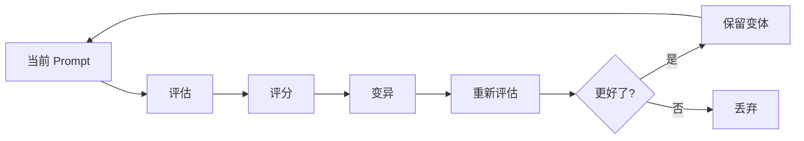
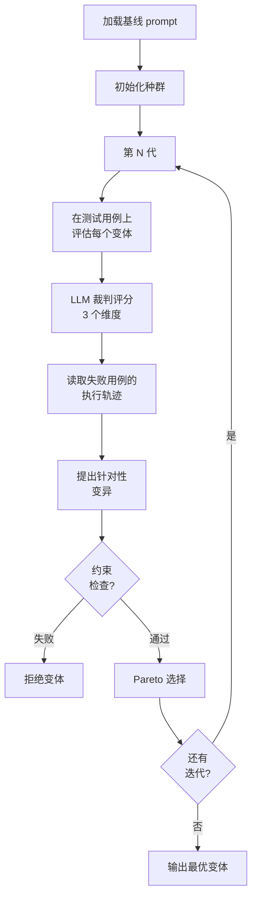
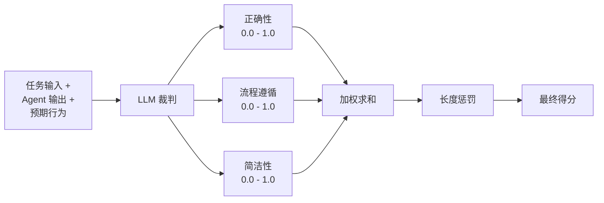
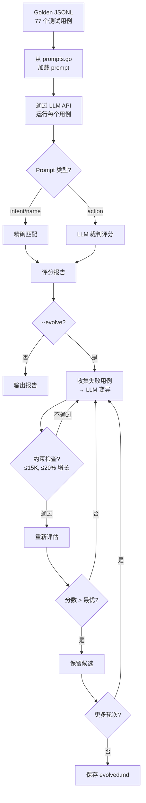

# Prompt 自进化

Prompt 自进化是一种通过自动化评估、变异和选择来系统性改进 prompt 文本的技术——灵感来自进化算法。它将 prompt 优化从凭直觉的手动调优转变为可量化的搜索问题。

本文详细介绍 [GEPA](https://github.com/gepa-ai/gepa)（遗传-Pareto Prompt 进化）算法的原理，该算法在 [hermes-agent-self-evolution](https://github.com/NousResearch/hermes-agent-self-evolution) 中有参考实现，以及 RingClaw 计划如何应用这些思想来改进自身的 prompt。具体实施计划见 [Plan 006](/plan/006-prompt-self-evolution.md)。

## 为什么 Prompt 需要进化

Prompt 是 LLM 系统中影响最大但测试最不严格的组件。一个词的改动就可能移动分类边界、增减故障模式、改变输出质量。然而大多数团队的 prompt 迭代方式是：

1. **手动调优** — 改文本、测几个例子、上线
2. **被动修复** — 等用户报 bug，补丁式修改 prompt
3. **无回归测试** — 无法知道一个修复是否破坏了其他场景

Prompt 自进化用数据驱动的循环替代这种方式：



## GEPA 算法

GEPA（Genetic-Pareto Prompt Evolution，遗传-Pareto Prompt 进化）结合了遗传算法和 LLM 驱动的变异。发表于 ICLR 2026（Oral），完全通过 API 调用运行——无需 GPU 训练。

### 核心循环



**关键步骤：**

1. **种群初始化** — 基线 prompt 加 N 个随机扰动
2. **评估** — 在测试数据集上通过真实 agent 运行每个变体
3. **评分** — LLM 裁判从多个维度为每个输出打分
4. **轨迹反思** — GEPA 读取失败*原因*（执行轨迹），而不仅仅是知道失败了
5. **针对性变异** — 提出专门解决观察到的失败的修改
6. **约束检查** — 拒绝违反大小、增长或测试套件约束的变体
7. **Pareto 选择** — 保留 Pareto 前沿上的变体（没有单个变体在所有维度上都被另一个支配）

### GEPA 的独特之处

传统 prompt 优化（如 DSPy 的 MIPRO）盲目变异——随机插入、删除、改写。GEPA 的核心创新是**反思性变异**：它读取失败测试用例的执行轨迹，然后提出针对性修复。

| 方法 | 变异策略 | 每次迭代成本 |
|------|----------|-------------|
| 随机改写 | 替换随机部分 | 低 |
| MIPRO | 生成指令候选 | 中 |
| **GEPA** | 读取失败轨迹 → 提出针对性修复 | 中 |

例如：如果意图分类器将"总结 John 的代码"错误分类为 `summarize` 而非 `chat`，GEPA 会读取执行轨迹，发现 prompt 没有区分"总结代码"和"总结聊天消息"，然后提出添加澄清规则的修改。

## LLM 裁判评分

每个 agent 输出由一个独立的 LLM 裁判从三个维度评分：



### 评分维度

| 维度 | 权重 | 衡量内容 |
|------|------|---------|
| **正确性** | 0.5 | agent 是否为该任务产生了正确的输出？ |
| **流程遵循** | 0.3 | agent 是否遵循了 prompt 的指令和工作流？ |
| **简洁性** | 0.2 | 响应是否在不遗漏关键信息的前提下适当简洁？ |

### 综合评分公式

```
raw_score = 0.5 × 正确性 + 0.3 × 流程遵循 + 0.2 × 简洁性
final_score = max(0, raw_score - 长度惩罚)
```

**长度惩罚**防止 prompt 无限膨胀：
- 在 ≤90% 大小限制时无惩罚
- 在 90%-100% 之间线性增加，最高 30% 惩罚
- 公式：`penalty = min(0.3, (ratio - 0.9) × 3.0)`，其中 `ratio = size / limit`

### 裁判反馈

除了数值评分，裁判还产出**文本反馈**——具体的、可操作的改进建议。这些反馈被输入 GEPA 的反思性变异步骤，形成一个反馈循环：优化器可以读取*为什么*分数低，然后提出针对性修复。

## 执行轨迹反思

GEPA 最重要的洞察：**仅有分数是不够的**。知道一个测试用例的正确性得分为 0.3，只是告诉你它*失败了*，但没有告诉你*为什么*。执行轨迹揭示了失败机制。

### 轨迹包含什么

轨迹捕获完整的交互过程：

```
输入: "总结 John 的代码"
使用的 Prompt: [完整 IntentPrompt 文本]
Agent 输出: "summarize"
预期输出: "chat"
裁判反馈: "Prompt 说如果用户想总结聊天历史就分类为 'summarize'，
  但这条消息问的是代码，不是聊天消息。Prompt 缺少区分
  '总结代码'和'总结聊天消息'的规则。"
```

### 反思如何工作

1. 收集当前代中所有失败的测试用例及其轨迹
2. 按类别分组失败（如"边界情况"、"复合意图"）
3. 将分组后的失败发送给变异 LLM："这是当前 prompt，这是按类型分组的失败。对于每组失败，请提出一个 prompt 文本的具体修改来修复它。"
4. 变异 LLM 基于真实的失败数据提出修改，而非随机扰动

这与盲目变异根本不同——每个提议的修改都有执行证据支撑的*理由*。

## 约束检查

每个进化后的变体必须通过硬约束检查。任何一个约束失败 = 立即拒绝。

### 约束类型

| 约束 | 限制 | 理由 |
|------|------|------|
| **大小限制** | ≤ 15,000 字符 | 防止无限增长碰到上下文限制 |
| **增长限制** | ≤ 基线的 20% | 防止每次迭代 prompt 失控扩展 |
| **非空检查** | > 0 字符 | 确保优化器没有产出空白结果 |
| **测试套件** | 100% 通过 | 确保进化后的 prompt 不破坏现有行为 |
| **结构完整性** | 有效格式 | 确保必需的段落/字段被保留 |

### 为什么约束重要

没有约束的话，prompt 优化器倾向于：
- **无限增长** — 不断添加更多示例和规则
- **过拟合评估数据** — 添加超特定的规则，破坏泛化能力
- **破坏结构** — 以破坏解析的方式重写段落

约束充当了对抗这些失败模式的进化压力。

## 评估数据来源

进化的质量直接取决于评估数据的质量。有三种来源，各有不同的权衡：

### 1. Golden 数据集（手动策划）

手动编写的测试用例，具有已知正确的预期行为。

```json
{
  "task_input": "总结 John 的代码",
  "expected_behavior": "chat",
  "difficulty": "hard",
  "category": "boundary"
}
```

| 优点 | 缺点 |
|------|------|
| 最高质量 | 创建费力 |
| 覆盖已知边界情况 | 规模有限（通常 15-30 个） |
| 可追溯到真实 bug（通过 source PR） | 可能无法覆盖未知的失败模式 |

### 2. 合成生成（LLM 生成）

强大的 LLM 读取 prompt 文本，自动生成多样化的测试用例。

| 优点 | 缺点 |
|------|------|
| 可扩展——生成数百个用例 | 可能不反映真实使用模式 |
| 覆盖多样化场景 | 可能太容易或太难 |
| 便宜且快速 | 质量取决于生成器模型 |

### 3. 会话历史挖掘（真实使用）

从会话日志中提取真实用户消息，并评估其相关性。

| 优点 | 缺点 |
|------|------|
| 反映实际使用模式 | 需要存储的对话历史 |
| 发现未知的失败模式 | 用户数据隐私问题 |
| 最真实的评估 | 新系统的冷启动问题 |

### 推荐策略

从历史 bug 修复 PR 衍生的 **golden 数据集**开始（信噪比最高），然后用**合成**数据补充覆盖广度。会话挖掘是最强的来源，但需要对话日志基础设施。

## 在 RingClaw 中的应用

RingClaw 在 `messaging/prompts.go` 中有 5 个集中管理的 prompt，每个控制 bot 行为的不同方面：

| Prompt | 用途 | 进化优先级 |
|--------|------|-----------|
| **ActionPrompt** | 指导 agent 生成 ACTION 块 | 高——最复杂，失败模式最多 |
| **IntentPrompt** | 分类用户意图（summarize/task/note/event/chat） | 高——summarize 和 chat 的边界情况 |
| **NameExtractPrompt** | 从消息中提取人名 | 中——时间词污染、复合句 |
| **SummaryPrompt** | 生成聊天消息摘要 | 低——运行良好 |
| **HeartbeatPrompt** | 定时健康检查响应 | 低——运行良好 |

### RingClaw 进化流水线



### 当前 Golden 数据集

RingClaw 有 77 个手动策划的测试用例，源自历史 bug 修复 PR：

| 数据集 | 用例数 | 主要来源 |
|--------|--------|---------|
| `datasets/prompts/intent/golden.jsonl` | 34 | PR #34（边界）、PR #62（时间词）、PR #91（绝对日期） |
| `datasets/prompts/name_extract/golden.jsonl` | 23 | PR #40（复合句）、PR #62（时间词污染）、PR #91（绝对日期） |
| `datasets/prompts/action/golden.jsonl` | 20 | PR #40（代词）、PR #68（person ID 误用） |

每个测试用例标注了 `source_pr`（可追溯性）和 `note`（解释为什么这个 case 难）。

### 基线结果

使用 `deepseek-chat`（通过 Cloudflare AI Gateway）评估：

| Prompt | 分数 | 评分方式 | 主要失败 |
|--------|------|---------|---------|
| **IntentPrompt** | 30/34 (88.2%) | 精确匹配 | "总结代码/文档/PR" 被误判为 summarize |
| **NameExtractPrompt** | 21/23 (91.3%) | 精确匹配 | 复合指令（"总结 maxwell 并创建任务"） |
| **ActionPrompt** | 13/20 (65.0%) | LLM 裁判 | 代词处理、多动作、卡片生成 |

### 自动变异结果

使用 `--evolve`，IntentPrompt 在一轮变异后从 88.2% 提升至 91.2%。变异只添加了一句话：*"The summarize intent applies ONLY to summarizing chat history or messages"*——针对边界 case 的精准修复。

### CI 集成

评估流水线通过三种机制集成到 CI：

1. **变更自动评估** — 当 `messaging/prompts.go`、`datasets/prompts/`、`scripts/eval_prompt.go` 变更时自动运行
2. **Job Summary + PR 评论** — 评估结果发布到 GitHub Actions Summary 和 PR 评论
3. **手动进化工作流** — `evolve.yml`（`workflow_dispatch`）对所有 prompt 运行 `--evolve`，提升 ≥ 3% 时自动创建 PR

### 使用方法

```bash
# 评估所有 prompt
go run scripts/eval_prompt.go --prompt all

# 生成 markdown 报告
go run scripts/eval_prompt.go --prompt intent --markdown report.md

# 对比替代 prompt
go run scripts/eval_prompt.go --prompt intent --compare path/to/new_prompt.md

# 进化 prompt（5 轮变异）
go run scripts/eval_prompt.go --prompt all --evolve 5

# 设定最低提升阈值
go run scripts/eval_prompt.go --prompt intent --evolve 10 --min-improvement 3
```

### 环境变量

| 变量 | 必填 | 默认值 | 说明 |
|------|------|-------|------|
| `LLM_API_KEY` | 是 | — | 任何 OpenAI 兼容 provider 的 API key |
| `LLM_MODEL` | 否 | `deepseek-chat` | 模型名称 |
| `LLM_BASE_URL` | 否 | `https://api.deepseek.com` | API 端点（支持 Cloudflare AI Gateway） |

## 延伸阅读

- [GEPA 论文](https://github.com/gepa-ai/gepa) — 遗传-Pareto Prompt 进化（ICLR 2026 Oral）
- [DSPy](https://github.com/stanfordnlp/dspy) — LLM 流水线编程框架
- [hermes-agent-self-evolution](https://github.com/NousResearch/hermes-agent-self-evolution) — 参考实现
- [Plan 006](/plan/006-prompt-self-evolution.md) — RingClaw 实施路线图
