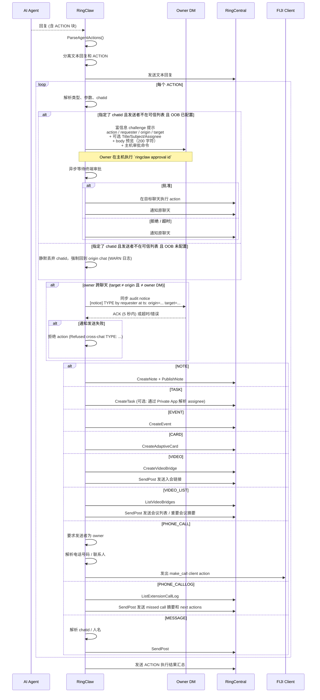

# AI 驱动的自动操作

AI Agent 在对话中可以自动创建笔记、任务、日历事件、Adaptive Card、RingCentral Video bridge、FIJI 客户端电话，以及通话记录总结。当用户的请求暗示需要创建这些资源时，Agent 会在回复中附加 ACTION 块，RingClaw 会执行或发出对应的治理 action。

## 工作流程

当 Agent 的回复包含 ACTION 块时，RingClaw 解析它们，先发送文本回复，再逐个执行 ACTION：



## ACTION 块格式

```
ACTION:NOTE title=会议纪要
今天站会的关键决定...
END_ACTION

ACTION:TASK subject=更新部署脚本
END_ACTION

ACTION:EVENT title=Sprint 评审 start=2026-04-01T14:00:00Z end=2026-04-01T15:00:00Z
END_ACTION

ACTION:VIDEO title=设计评审 type=Scheduled
END_ACTION

ACTION:VIDEO_LIST scope=today important=true limit=5
END_ACTION

ACTION:PHONE_CALL to=+14155550199
END_ACTION

ACTION:PHONE_CALLLOG scope=today missing=true summary=true next_actions=true limit=10
END_ACTION
```

ACTION 可通过 `chatid=<id>` 参数定向到其他聊天。
`ACTION:PHONE_CALL` 仅 owner 可执行，非 owner 触发会被拒绝。它不会从 runtime Pod 直接调用 RingOut。RingClaw 只负责解析目标号码或联系人，记录 `client_action=make_call` action event，然后由 FIJI 以当前登录用户调用已有 Phone `directCall` / `makeCall` 路径。旧 prompt 产生的 `ACTION:RINGOUT` 会作为兼容 alias，走同一条 FIJI client action 链路。

- **非 owner 发送者**：OOB 已配置时（Private App + owner 私聊已解析），系统向 owner 私聊发送富信息 challenge 提示（action 类型、requester 身份、origin / target 聊天名、可选 `Title:` / `Subject:` / `Assignee:`、≤200 字符的 body 预览、效果说明、主机审批命令）。owner 需在主机上执行 `ringclaw approval <id>` 批准。批准后 action 异步在目标聊天执行。OOB 未配置时回退为静默丢弃（强制回到 origin chat）。owner 私聊收到的提示示例：

  ```text
  Pending approval (challenge `def67890`).
  Action: Cross-chat NOTE
  Requester: Alice Cross <alice@example.com> (id=user-7)
  Origin chat: Engineering (id=origin-1)
  Target chat: Customer Support (id=target-9)
  Title: Quarterly review notes
  Body: Highlights for the next quarter ...

  Effect: bot will write a NOTE into the target chat on the requester's behalf.

  Run on the host:
    ringclaw approval def67890        (approve)
    ringclaw approval deny def67890   (deny)

  Expires in 5m.
  ```

- **owner 发起的跨聊天**：派发前经过**同步 fail-closed audit notice**（通过 owner 私聊确认）——完整门控规则见 [安全 › 跨聊天 Action](../security/cross-chat-actions.md)。

无需额外配置 — ACTION 提示词会自动注入。

## 任务命令

```
/task create 修复登录 bug        # 创建任务
/task list                       # 列出当前聊天的任务
/task complete <id>              # 标记任务完成
/task get <id>                   # 获取任务详情
/task update <id> <key=value>    # 更新任务
/task delete <id>                # 删除任务
```

## 笔记命令

```
/note create 会议纪要 | 内容     # 创建笔记（自动发布）
/note list                       # 列出当前聊天的笔记
/note get <id>                   # 获取笔记详情
/note update <id> <key=value>    # 更新笔记
/note lock <id>                  # 锁定编辑
/note unlock <id>                # 解锁
/note delete <id>                # 删除笔记
```

## 日历事件命令

```
/event list                      # 列出日历事件
/event list <chatId>             # 列出指定聊天的事件
/event create <title> <start> <end>  # 创建事件
/event get <id>                  # 获取事件详情
/event update <id> <key=value>   # 更新事件
/event delete <id>               # 删除事件
```

## Adaptive Card（自适应卡片）

AI Agent 可以生成 [Adaptive Card](https://adaptivecards.io/) 用于富文本结构化展示（进度报告、仪表盘、表单等）。当 Agent 在回复中包含 `ACTION:CARD` 块时，RingClaw 会自动将卡片发送到聊天：

```
ACTION:CARD
{"type":"AdaptiveCard","version":"1.3","body":[{"type":"TextBlock","text":"Sprint 状态","weight":"bolder"},{"type":"FactSet","facts":[{"title":"已完成","value":"12"},{"title":"剩余","value":"3"}]}]}
END_ACTION
```

通过聊天命令管理卡片：

```
/card get <id>       # 查看卡片详情
/card delete <id>    # 删除卡片
```

## Video 与 Phone 命令

Video bridge 命令基于 RingCentral Video REST API，会返回或发送入会链接。Phone 命令支持 RingOut 和个人 Call Log，并提供未接来电快捷视图；这些命令和 message 命令一样使用解析后的 RingCentral client，最终选中的 app token 必须具备对应 scope。消息桥接中的 RingOut 仍然仅 owner 可执行。

Video 和 Phone 是 Personal AVA Pro 的默认产品能力。即使 `ringcentral.capabilities` 只配置了 `message` / `summary`，RingClaw action 层也默认允许 Video / Phone；真实 API 调用是否成功仍取决于 Private JWT App 的 scopes 和用户权限。

```
/video list
/video create 设计评审 type=Scheduled
/video get <bridgeId>
/video delete <bridgeId>

/phone ringout +14155550199 callerid=+14155550100
/phone status <ringOutId>
/phone cancel <ringOutId>
/phone calllog direction=Outbound view=Detailed limit=10
/phone calllog result=Missed date_from=2026-05-17T00:00:00+08:00 date_to=2026-06-01T23:59:59+08:00 limit=25
/phone missed limit=25
```

`/phone missed` 是 inbound call log + `result=Missed` 的快捷方式。CLI 中等价命令为 `ringclaw phone calllog --result Missed --limit 25`；JSON 输出也会应用相同的客户端 result 过滤。Result 过滤刻意放在客户端执行，这样 RingClaw 可以先按用户级日期窗口拉取数据，再准确整理较早的 missed call。

## Video 与 Phone 自然语言能力

Video / Phone 的自然语言请求和 message / task / event 使用同一条链路：

```text
用户消息
  -> matchesIntentTrigger
  -> classifyIntent = video | phone
  -> default agent 输出 ACTION 块
  -> ExecuteAgentActions
  -> RingCentral API
  -> SendPost 发回当前聊天
```

RingClaw 不再保留独立的 `matchesVideoMeetingListIntent` fast-path。会议列表查询统一表达为 `ACTION:VIDEO_LIST`，通话记录查询统一表达为 `ACTION:PHONE_CALLLOG`。

### Video 示例

Agent 可以创建 RingCentral Video bridge：

```text
Create a video meeting for release planning.
创建一个视频会议讨论发布计划。
帮我开一个明天的 RCV 会议。
```

预期 ACTION：

```text
ACTION:VIDEO title=发布计划讨论 type=Scheduled
END_ACTION
```

Agent 也可以查询会议列表，并整理今天的重要会议：

```text
Tell me what important meetings I have today.
告诉我今天有啥重要会议。
Show my recent meeting list.
查询我最近的 meeting list。
```

预期 ACTION：

```text
ACTION:VIDEO_LIST scope=today important=true limit=5
END_ACTION
```

`ACTION:VIDEO_LIST` 参数：

| 参数 | 可选值 | 含义 |
| --- | --- | --- |
| `scope` | `today`, `recent` | `today` 按 bridge `createTime` / `updateTime` 过滤；如果 RC Video API 没返回时间，记录不会被隐藏 |
| `important` | `true`, `false` | 按重要会议摘要格式输出 |
| `limit` | 正整数 | 限制返回会议数量 |
| `chatid` | 可选 | 发送到指定聊天，仍受跨聊天治理规则约束 |

### Phone 示例

Agent 可以发起 FIJI 客户端电话：

```text
Call +12123753080.
给 2123753080 打电话。
帮我外呼 +12123753080。
```

预期 ACTION：

```text
ACTION:PHONE_CALL to=+12123753080
END_ACTION
```

Agent 也可以查询今天的 call log，整理 missed call、call summary 和 next actions：

```text
Check today's calls and tell me if I have missing calls. Summarize next actions.
查询我今天 calls 的记录，告诉我有没有 missing 的 call，给我整理下接下来的 action。
查询我今天 call log，帮我整理下 call summary，以及我接下来的 action。
```

预期 ACTION：

```text
ACTION:PHONE_CALLLOG scope=recent days=15 missing=true summary=true next_actions=true limit=10
END_ACTION
```

`ACTION:PHONE_CALLLOG` 参数：

| 参数 | 可选值 | 含义 |
| --- | --- | --- |
| `scope` | `today`, `recent` | `today` 会向 Call Log API 发送 `dateFrom` / `dateTo`，并按 `startTime` 再过滤一次 |
| `days` | 正整数 | 用于 “last 15 days” / “最近15天” 这类最近 N 天窗口；RingClaw 会发送 `dateFrom` / `dateTo` 并过滤返回记录 |
| `date_from`, `date_to` | RFC3339 时间 | Agent 已经知道精确时间范围时使用 |
| `missing` | `true`, `false` | 突出 missed / missing calls |
| `summary` | `true`, `false` | 输出总通话数、未接数、入站、出站、已接 / accepted 数量 |
| `next_actions` | `true`, `false` | 输出后续行动建议，特别是 missed call follow-up |
| `limit` | 正整数 | 设置 `recordCount`；默认 `10` |
| `direction` | `Inbound`, `Outbound` | 可选 Call Log API 方向过滤 |
| `result` | `Missed`, `Accepted` 等 | 可选客户端结果过滤 |
| `view` | `Simple`, `Detailed` | 可选 Call Log API view |

### 所需 scopes

Private JWT App 需要包含：

```text
Video       -> ACTION:VIDEO, ACTION:VIDEO_LIST
Phone       -> ACTION:PHONE_CALL（FIJI client makeCall bridge）
ReadCallLog -> ACTION:PHONE_CALLLOG, /phone calllog, /phone missed
RingOut     -> 仅 /phone ringout 诊断命令
```
