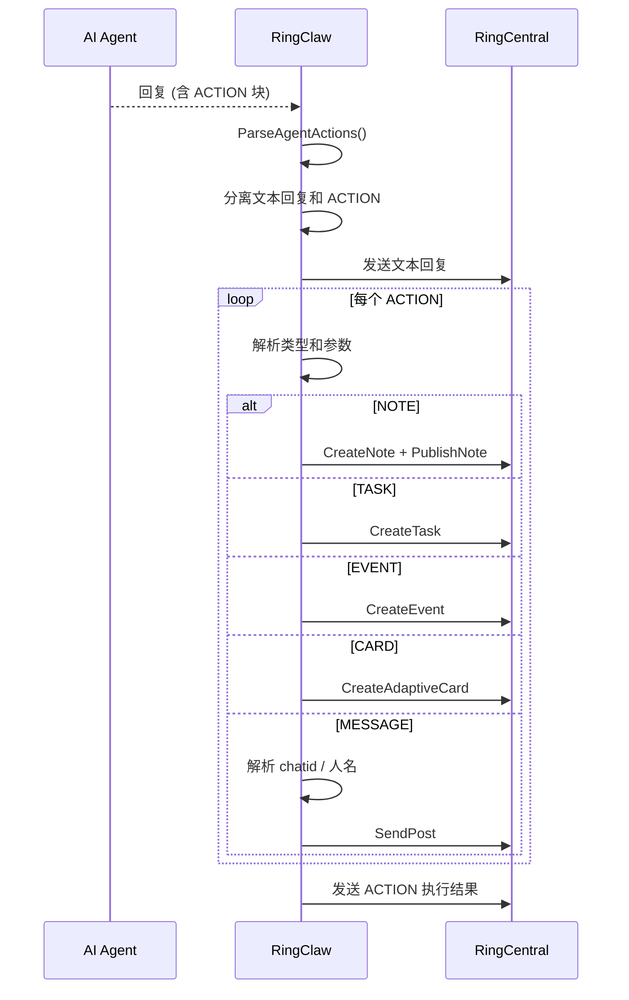

# AI 驱动的自动操作

AI Agent 在对话中可以自动创建笔记、任务、日历事件和 Adaptive Card。当用户的请求暗示需要创建这些资源时，Agent 会在回复中附加 ACTION 块，RingClaw 通过 RC API 自动执行。

## 工作流程

当 Agent 的回复包含 ACTION 块时，RingClaw 解析它们，先发送文本回复，再逐个执行 ACTION：



## ACTION 块格式

```
ACTION:NOTE title=会议纪要
今天站会的关键决定...
END_ACTION

ACTION:TASK subject=更新部署脚本
END_ACTION

ACTION:EVENT title=Sprint 评审 start=2026-04-01T14:00:00Z end=2026-04-01T15:00:00Z
END_ACTION
```

通过 `chatid=<id>` 参数可以将操作定向到其他聊天（Bot 模式下出于安全考虑已禁用）。无需额外配置 — ACTION 提示词会自动注入。

## 任务命令

```
/task create 修复登录 bug        # 创建任务
/task list                       # 列出当前聊天的任务
/task complete <id>              # 标记任务完成
/task get <id>                   # 获取任务详情
/task update <id> <key=value>    # 更新任务
/task delete <id>                # 删除任务
```

## 笔记命令

```
/note create 会议纪要 | 内容     # 创建笔记（自动发布）
/note list                       # 列出当前聊天的笔记
/note get <id>                   # 获取笔记详情
/note update <id> <key=value>    # 更新笔记
/note lock <id>                  # 锁定编辑
/note unlock <id>                # 解锁
/note delete <id>                # 删除笔记
```

## 日历事件命令

```
/event list                      # 列出日历事件
/event list <chatId>             # 列出指定聊天的事件
/event create <title> <start> <end>  # 创建事件
/event get <id>                  # 获取事件详情
/event update <id> <key=value>   # 更新事件
/event delete <id>               # 删除事件
```

## Adaptive Card（自适应卡片）

AI Agent 可以生成 [Adaptive Card](https://adaptivecards.io/) 用于富文本结构化展示（进度报告、仪表盘、表单等）。当 Agent 在回复中包含 `ACTION:CARD` 块时，RingClaw 会自动将卡片发送到聊天：

```
ACTION:CARD
{"type":"AdaptiveCard","version":"1.3","body":[{"type":"TextBlock","text":"Sprint 状态","weight":"bolder"},{"type":"FactSet","facts":[{"title":"已完成","value":"12"},{"title":"剩余","value":"3"}]}]}
END_ACTION
```

通过聊天命令管理卡片：

```
/card get <id>       # 查看卡片详情
/card delete <id>    # 删除卡片
```
