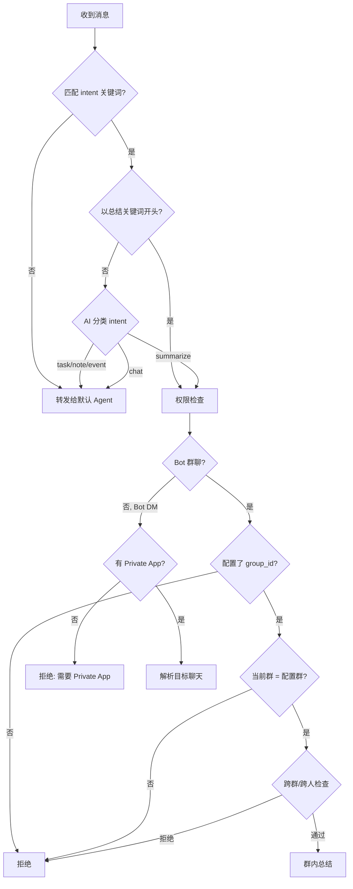
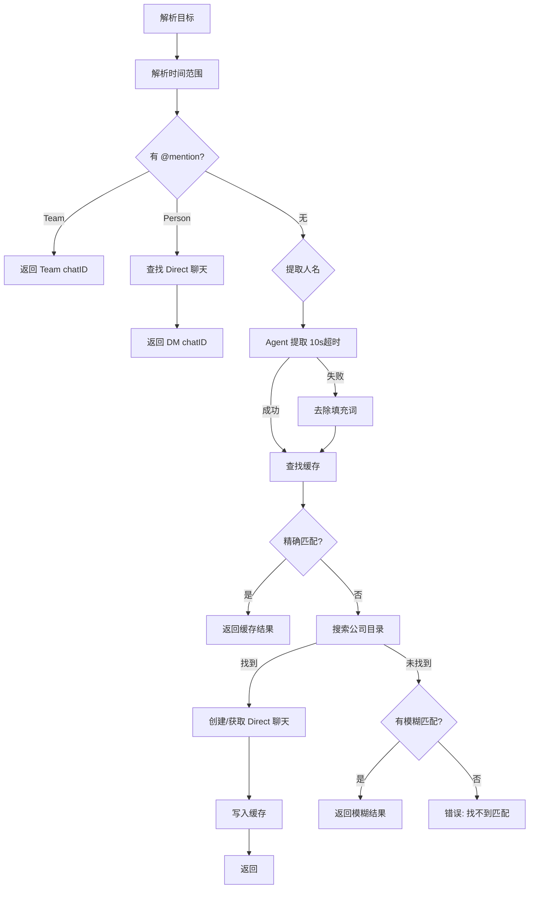
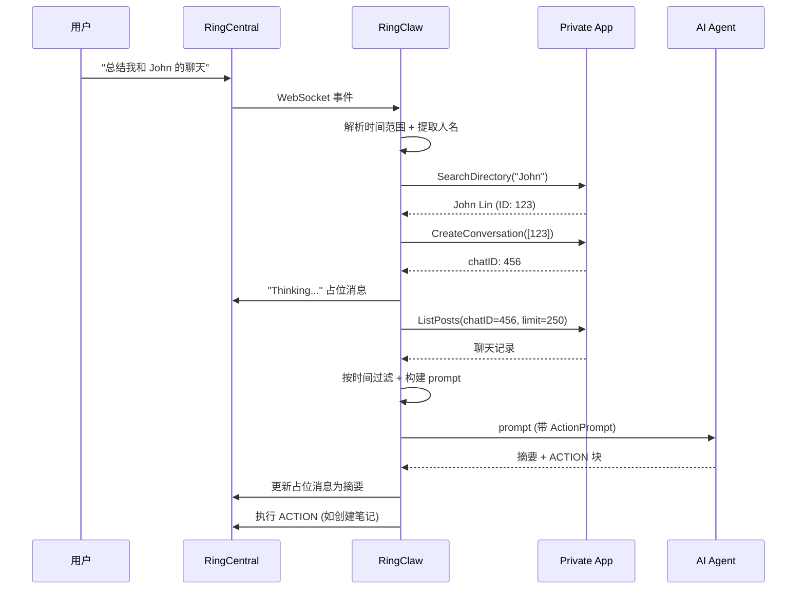

# 聊天总结

总结任意聊天的对话内容：

```
总结我和 John 的聊天                      # 总结今天与 John 的聊天
summarize my chat with Raye from Monday  # 总结从周一开始的聊天
总结 Maxwell 上周的聊天                    # 总结上周的聊天
```

RingClaw 通过名字解析目标聊天，使用 Private App 获取消息，然后通过 AI Agent 生成摘要发送到当前聊天。

## 路由决策

收到消息后，RingClaw 通过两阶段判断是否为总结请求：关键词匹配（快速路径）和 AI 意图分类（回退路径）。



## 名字解析

权限检查通过后，RingClaw 通过 mention、Agent 提取、本地缓存、公司目录搜索来解析目标聊天。



**人名提取**使用两种策略：
1. **Agent 提取**（优先）：让 AI Agent 从消息中提取人名（10秒超时）
2. **填充词去除**（回退）：去除总结关键词、时间词、中日韩/英文填充词，剩余文本即为人名

**缓存**（`~/.ringclaw/chat_cache.json`）将已解析的 名字→chatID 映射和人员信息持久化到磁盘。优先精确匹配，模糊匹配仅作为最后手段。

## 执行流程

目标聊天解析完成后，RingClaw 获取消息、构建 prompt 并发送给 AI Agent。



## 时间范围解析

RingClaw 支持 8 种语言的时间范围表达：

| 表达式 | 时间范围 | 支持语言 |
|--------|---------|---------|
| 今天 / today | 今天开始 | 中、英、日、韩 |
| 昨天 / yesterday / 昨日 | 昨天开始 | 中、英、日 |
| 前天 / day before yesterday | 2 天前 | 中、英、日、韩、法、西、德 |
| 本周 / this week / 今週 | 本周一开始 | 中、英、日、韩 |
| 上周 / last week / 先週 | 上周一开始 | 中、英、日、韩 |
| 本月 / this month / 今月 | 本月 1 号 | 中、英、日、韩 |
| 上个月 / last month / 先月 | 上月 1 号 | 中、英、日、韩 |
| 最近 / recently / 近期 | 3 天前 | 中、英、日、韩、法、西、德、俄 |
| 最近N天 / last N days | N 天前 | 中、英 |
| 最近N小时 / last N hours | N 小时前 | 中、英 |

未指定时间范围时，默认为**今天开始**。

## 群内总结

默认情况下，群聊中禁止使用总结功能（摘要会被群内所有人看到）。可以为特定群启用：

```json
{
  "ringcentral": {
    "group_summary_group_id": "1234567",
    "group_summary_message_limit": 200
  }
}
```

| 字段 | 默认值 | 说明 |
|------|--------|------|
| `group_summary_group_id` | — | 只有这个精确的群 ID 允许在群内触发总结 |
| `group_summary_message_limit` | `200` | 开启群内总结后，先拉取最近这么多条消息，再按时间过滤 |

启用群内总结后，RingClaw 会阻止跨目标请求（mention 其他群/其他用户、"chat with" 等短语），防止群内数据泄露。

## 安全限制

::: warning
使用 Bot 时，群聊中禁止使用总结功能（摘要会被群内所有人看到）。请在与 Bot 的私聊中使用。
:::

- **Bot 私聊**：总结正常工作 — Private App 读取目标聊天，Bot 回复摘要
- **群聊**：**禁止**，除非配置了 `group_summary_group_id` 且与当前群一致
- **无 Private App**：总结**完全不可用** — Bot 无法访问其他用户的聊天

## 前提条件

总结功能需要配置 **Private App**。Private App 需要 `ReadAccounts` 权限来：

- 搜索公司目录以解析聊天名称
- 读取 Bot 无法直接访问的其他聊天中的消息
