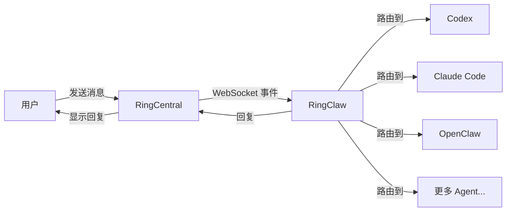
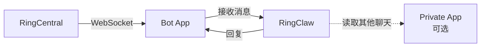

# 工作原理



RingClaw 通过 WebSocket 连接 RingCentral Team Messaging 实时接收消息。当消息到达时，路由到配置的 AI Agent 处理，然后将回复发回聊天。Agent 处理期间，会显示 "Thinking..." 占位消息，处理完成后更新为最终回复。

## Agent 接入模式

| 模式 | 工作方式 | 支持的 Agent |
|------|---------|-------------|
| ACP  | 长驻子进程，通过 stdio JSON-RPC 通信。速度最快，复用进程和会话。 | Claude, Codex, Cursor, Kimi, Gemini, OpenCode, OpenClaw, Pi, Copilot, Droid, iFlow, Kiro, Qwen |
| CLI  | 每条消息启动一个新进程，支持通过 `--resume` 恢复会话。 | Claude (`claude -p`)、Codex (`codex exec`) |
| HTTP | OpenAI 兼容的 Chat Completions API。支持 `openai`（默认）、`nanoclaw`、`dify` 三种格式。 | OpenClaw、Dify Chatflow |

::: tip 自动检测
同时存在 ACP 和 CLI 时，自动优先选择 ACP。
:::

## 架构

RingClaw 使用 **Bot App**（必需）进行消息收发，可选的 **Private App** 提供高级功能。



### 路由规则

不在 `chat_ids` 中的消息会被 monitor 直接丢弃。

| 消息来源 | 回复客户端 | 读取/操作客户端 |
|----------|-----------|---------------|
| Bot 私聊（自动发现） | Bot | Private App（如已配置）或 Bot |
| `chat_ids` 中的聊天 | Bot | Private App（如已配置）或 Bot |

### 群聊行为

- **`bot_mention_only: true`**（默认）— Bot 在群聊中只有被 @mention 时才响应
- **`bot_mention_only: false`** — Bot 响应允许群中的所有消息
- **`group_summary_group_id: "..."`** — 只有这个精确的群 ID 允许在群内触发总结
- **`group_summary_message_limit: 200`**（默认）— 开启群内总结后，先拉取当前群最近这么多条消息，再按时间范围过滤

只要配置了 `group_summary_group_id`，群内总结功能就会自动启用。只有当前群 ID 与该配置完全一致时，才允许在群内触发总结。

### 用户白名单

`source_user_ids` 限制 Bot 只响应指定用户的消息。支持数字用户 ID 或邮箱（启动时通过目录 API 自动解析为 ID）。不配置则响应所有用户。

```json
"ringcentral": {
  "source_user_ids": ["alice@example.com", "3061708020"]
}
```

用户数字 ID 可以从 RingClaw 日志中获取：收到消息时会打印 `creatorID=XXXXXXXX`。
