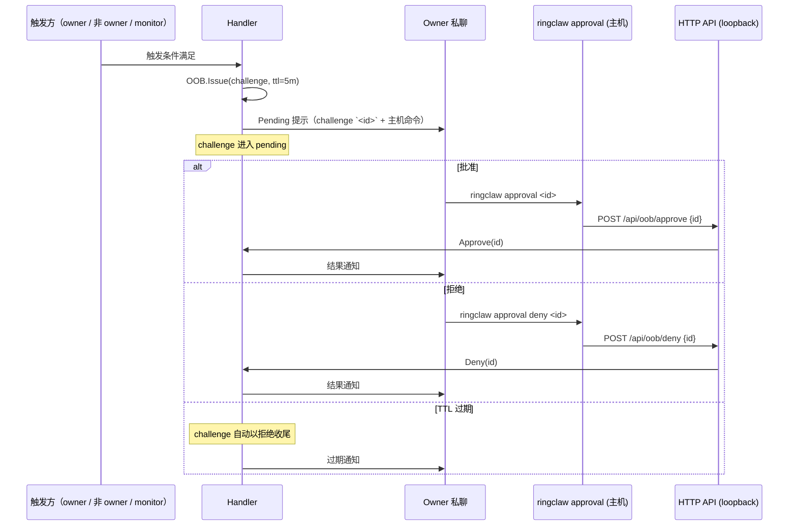

# 审批 CLI

`ringclaw approval` 是解决所有 OOB challenge 的**唯一入口**——
`/full-access grant`、非 owner 跨聊天 ACTION 以及
[authorize-mention OOB 流程](./sender-allowlist#authorize-mention-oob-流程)
都通过它批准。审批要求主机访问权，把审批权与 RingCentral 账
号解耦。

## 命令

```bash
ringclaw approval <id>          # 批准一个 pending challenge
ringclaw approval deny <id>     # 拒绝一个 pending challenge
ringclaw approval list          # 列出所有 pending challenge
```

每条命令都会读取 `~/.ringclaw/api_token`，再调用本地 HTTP API
（`127.0.0.1:18011`、loopback-only、token 鉴权）。需要能访问
运行 `ringclaw` 的主机。详见
[API 与客户端](./api-and-clients) 关于 API token / loopback
绑定的说明。

## 为什么仅终端

把审批做成只能从终端执行有三个理由：

1. **审批权解耦。** 被盗 RC 账号能在 owner 私聊中看到
   challenge ID，但没有 SSH / 物理访问就无法执行
   `ringclaw approval <id>`。
2. **单一审计轨迹。** 每次批准 / 拒绝都同时落在主机的 shell
   history 与 `ringclaw` 日志里，没有"在聊天里批准"这种绕过
   主机日志的旁路。
3. **撤销简单。** 重启 `ringclaw` 即清空所有 pending challenge
   与活动授权——重启就是统一的"恐慌按钮"。

::: warning 设计上禁用聊天侧 /approval
Bot 私聊中任何 `/approval ...` 消息都会被消费，发送者会被重
定向到终端 CLI。Bot 回复中给出要在主机上执行的精确命令
`ringclaw approval <id>`。聊天侧的批准被拦截并记录为
`INFO oob: chat approval intercepted, redirected to terminal`。
:::

## 三个 OOB 入口，一条 CLI

同一条 `ringclaw approval <id>` 命令同时解决三个 OOB 入口。
Challenge 的 `intent` 字段在审计日志中区分类型：

| 入口 | Intent 前缀 | 触发方式 | 详细页 |
|---|---|---|---|
| `/full-access` 授权 | `grant ACP full-access for <duration>` | Owner 在 bot 私聊中发送 `/full-access grant` | [ACP Full-Access](./full-access) |
| 非 owner 跨聊天 ACTION | `cross-chat <TYPE>` | AI 为非授信发起者生成 `ACTION: ... chatid=<other>` | [跨聊天 Action](./cross-chat-actions) |
| Authorize-mention | `authorize user <userID> in chat <chatID>` | 非授信用户在允许群聊中 `@bot`（`allow_group_mention_authorize: true` 时） | [发送者白名单](./sender-allowlist#authorize-mention-oob-流程) |

## 生命周期



## 审计日志条目

| 事件 | 日志行 | 用途 |
|---|---|---|
| Challenge 发起 | `INFO oob: challenge issued`（`challengeID`、`requesterID`、`intent`、`ttl`） | 跟踪每个审批 prompt，包括无人响应而超时的。 |
| Challenge 终端批准 | `INFO oob: challenge approved via terminal`（`challengeID`） | 审计谁在何时批准了什么。 |
| Challenge 终端拒绝 | `INFO oob: challenge denied via terminal`（`challengeID`） | 与批准对偶。 |
| 聊天侧 `/approval` 被拦截（重定向到终端） | `INFO oob: chat approval intercepted, redirected to terminal` | 纵深防御——禁用聊天侧批准；任何尝试都会被记录并重定向。 |
