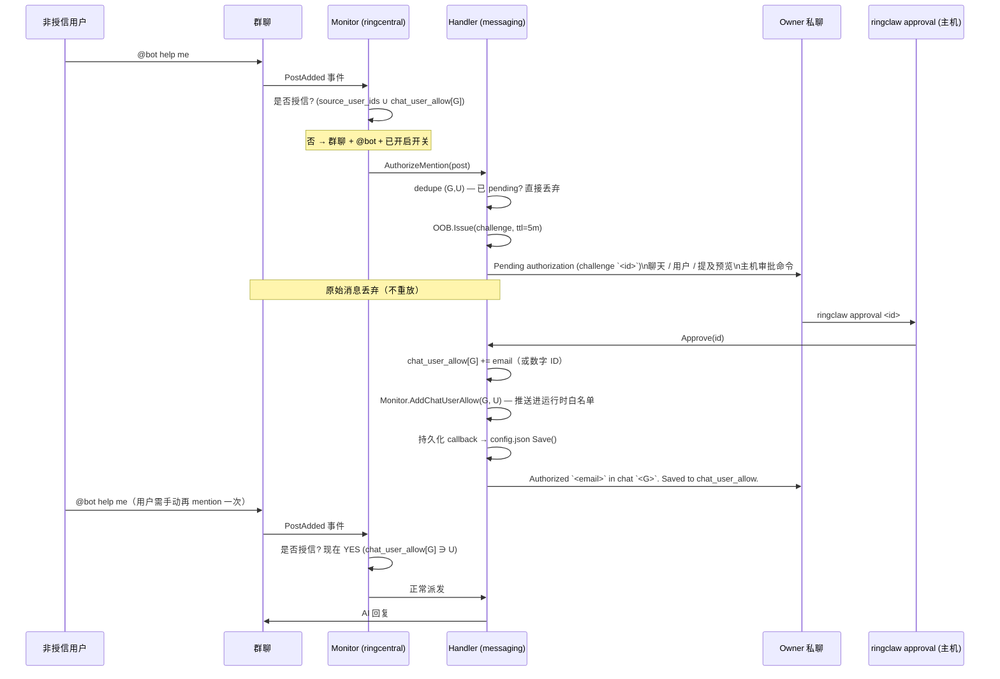

# 安全

## 本地 API 认证

HTTP API 服务（默认 `127.0.0.1:18011`）需要 Token 认证。首次启动时自动生成随机 Token，存储在 `~/.ringclaw/api_token`。

除 `/health` 外，所有 API 请求必须携带 `X-RingClaw-Token` 请求头：

```bash
curl -H "X-RingClaw-Token: $(cat ~/.ringclaw/api_token)" \
  http://127.0.0.1:18011/api/send -d '{"text":"hello"}'
```

服务还会验证 `Host` 请求头以防止 DNS 重绑定攻击 — 仅接受 `localhost`、`127.0.0.1` 和 `::1`。

::: danger
不要将 `config.json` 中的 `api_addr` 设为 `0.0.0.0`，这会将未加密的企业 RingCentral 账号网关暴露在局域网中。默认的 `127.0.0.1` 绑定已满足所有正常使用场景。
:::

## ACP Agent 文件权限

默认情况下，ACP Agent 仅获得**只读**文件访问权限。如需允许文件写入，请在 Agent 配置中设置 `allow_write: true`：

```json
"claude-acp": {
  "type": "acp",
  "command": "claude-agent-acp",
  "allow_write": true
}
```

## 工作目录路径限制

`/cwd` 命令会阻止进入敏感目录：`.ssh`、`.gnupg`、`.ringclaw`、`.aws`、`.kube`、`.config/gcloud`。

## Phase 2 — Authorize-mention OOB 授权流程（可选开关）

RingClaw 在 Phase 2 OOB 基础设施之上叠加了一条**按群授权**的 OOB 入口，
让运维不必修改 `config.json` 或重启 bot 就能临时把某个非 `source_user_ids`
用户加入信任范围。该流程默认**关闭**，由
`ringcentral.allow_group_mention_authorize: true` 显式开启；不开启时行为与
之前完全一致——非授信用户在允许群聊里 `@bot` 仍然被静默丢弃。

触发条件很窄：用户**不在**全局 `source_user_ids` 白名单，**也不在**目标聊天
的 `chat_user_allow` 条目中，并且在允许的群聊里发出真正的 `@bot` 消息。
同一用户的纯文本消息、或非允许聊天里的 `@bot` 仍然按旧逻辑丢弃。



**关键不变量：**

- **原始消息丢弃。** 触发 challenge 的那条 `@bot` **不会**在批准后重放。
  用户必须再 `@bot` 一次才能真正驱动 AI。这避免了"先写好的 prompt 在
  运维批准之后被无意触发"。
- **仅按群作用域。** 授权落在 `chat_user_allow[<chatID>]`，绝不会写入
  全局 `source_user_ids`。在群 A 批准的用户不会因此在群 B 也被信任。
- **特权命令仍未解锁。** `chat_user_allow` 只放宽第零层。非 owner 的特权
  Layer 1 命令（`/cwd`、`/cron`、`/new`、`/reload`、`/full-access`、总结
  自然语言触发）仍然要求 Private-App-owner 身份。详见下方 [权限矩阵](#权限矩阵)。
- **Pending dedupe。** 同一 `(chatID, userID)` 在 challenge TTL 内同时只能
  存在一个 pending challenge。批准 / 拒绝 / 过期 / prompt 发送失败任一
  收尾路径都会释放这把锁，用户下次 `@bot` 可重新发起。
- **持久化是 best-effort。** 批准时同步更新 monitor + handler 的内存
  白名单，再触发 `config.json` Save。Save 失败时打 `ERROR
  authorize-mention: persist failed`，本进程内仍然信任，但下次重启会
  丢失——重视持久化的运维请关注该日志行。
- **持久化优先存邮箱。** 目录解析能拿到邮箱时存邮箱；否则存数字 extension
  ID 并打 `WARN authorize-mention: no email available`。手工编辑时也可使用
  `source_user_ids` 接受的三种形式（数字 / 邮箱 / E.164 电话），下次启动会
  自动解析。
- **不引入新审批命令。** 主机 CLI 仍然是
  `ringclaw approval <id>` / `ringclaw approval deny <id>`，同一条命令
  统一审批 authorize-mention、`/full-access` 与跨聊天 OOB challenge。
  challenge 的 `intent` 字段在审计日志中区分类型。

**失败模式：**

| 条件 | 行为 |
|---|---|
| `allow_group_mention_authorize` 未设 / `false` | 功能关闭——非授信 `@bot` 回退为旧的静默丢弃。 |
| 未配置 Private App（解析不到 owner 私聊） | 启动时打 `ERROR allow_group_mention_authorize requires Private App + resolved owner DM; feature disabled` 并禁用功能；保留旧的静默丢弃。 |
| 运行时 owner 私聊尚未解析 | 命中竞争窗口的那一条消息丢弃并打 `WARN authorize-mention: OOB or owner DM unconfigured; dropping`；私聊解析完成后后续消息正常。 |
| 运维拒绝 challenge | 释放 pending 锁；challenge 立刻终结；owner 私聊收到通知。下次 `@bot` 重新发起 challenge。 |
| Challenge 过期（5 分钟 TTL） | 释放 pending 锁；owner 私聊收到过期通知。下次 `@bot` 重新发起 challenge。 |
| Owner 私聊发送失败（RC 瞬时错误） | challenge 自动 deny；释放 pending 锁。下次 `@bot` 重新尝试。 |
| 持久化 callback 失败（如配置文件写错） | 内存中的授权仍然有效；打 `ERROR authorize-mention: persist failed`。重启后用户重新被锁。 |

**不开启 OOB 直接预置授权。** 想在不启用 OOB 流程的情况下信任已知用户，
可以手工编辑 `chat_user_allow`：

```jsonc
{
  "ringcentral": {
    "allow_group_mention_authorize": false,  // OOB 关闭
    "chat_user_allow": {
      "chat-engineering-7": ["alice@example.com"]
    }
  }
}
```

这只在 `chat-engineering-7` 中信任 Alice，不会触发任何 challenge。两个
字段互相独立。

**审计日志（在 `INFO oob: ...` 通用行之外另加的 authorize-mention 专用行）：**

| 事件 | 日志行 | 用途 |
|---|---|---|
| Monitor 路由非授信群聊 mention | `INFO authorize-mention: routing non-trusted group mention` | 记录 monitor 把非授信 `@bot` 交给 OOB 流程而非丢弃。 |
| 授权完成 | `INFO authorize-mention: granted`（含 `challengeID`、`chatID`、`userID`、`identifier`） | 在 `applyAuthorize` 更新内存白名单并持久化后触发。 |
| 拒绝 / 过期 | `INFO authorize-mention: denied` 或 `INFO authorize-mention: challenge expired` | granted 行的对偶。pending dedupe 锁同时释放。 |
| 持久化失败 | `ERROR authorize-mention: persist failed`（含 `error`） | 内存授权成功但写 `config.json` 失败——本进程内仍生效，重启会丢。 |
| Prompt 发送失败 | `ERROR authorize-mention: post prompt failed`（含 `error`） | Owner 私聊发送失败；challenge 自动 deny，pending 锁释放，用户可重试。 |
| 没有可用邮箱 | `WARN authorize-mention: no email available, persisting numeric ID` | 目录解析无邮箱；改存数字 extension ID（仍按群作用域）。 |

## 权限矩阵

### 读表前提 — RingClaw 有四个入口，不只 WebSocket 一条

下面的三层模型只覆盖 **WebSocket 消息路径**；其他三条入口有各自的门控。
别把"群聊非 owner 用不了 `/cwd`"等同于"非 owner 无法让 bot 做任何事"：

| 入口 | 第零层 (sender) | 第一层 (命令) | 第二层 (ACTION 派发) | 第三层 (ACP 模式) | 实际门控 |
|---|---|---|---|---|---|
| WebSocket 消息 | ✅ | ✅ | ✅ | ✅ | Chat allowlist + Phase 1 sender allowlist + handler 检查 |
| HTTP API（`/api/send`、`/api/tasks`、`/api/notes`、`/api/events`、`/api/cards`） | ❌ | ❌ | ❌ | n/a | **仅 API token + loopback Host**（`api/auth.go`） |
| Cron 定时任务 | ❌ | 任务通过 `/cron add`（第一层）创建；执行时无人类 sender | ❌ **ACTION 块不执行** — 回复原样发出 | ✅ | 任务配置在 `~/.ringclaw/cron/jobs.json` |
| 心跳（Heartbeat） | ❌ | n/a（配置驱动） | ❌ **ACTION 块不执行** | ✅ | `heartbeat.enabled` + `HEARTBEAT.md` |

::: danger API token = 机器操作者
任何能读到 `~/.ringclaw/api_token` 的人都会 **直接绕过第零至第二层**——
可向任意聊天发送文本/媒体，也可通过 `/api/...` 创建/删除任意 task/note/
event/card。请像对待 SSH 私钥一样对待 token 文件。默认的 loopback 绑定
（`api_addr: 127.0.0.1:18011`）把影响面限制在本机同机进程。
:::

::: tip Chat allowlist 是最外层护栏
**第 -1 层**：不在 `ringcentral.chat_ids` 中的聊天消息会被 WebSocket
monitor 直接丢弃，连第零层都到不了（`ringcentral/monitor.go:380-383`）。
如果发现消息被静默吞掉，优先检查 chat allowlist——日志会打印
`ignoring message from non-allowed chat`。
:::

### WebSocket 路径的三层模型

RingClaw 通过三层正交门控处理 WebSocket 消息，消息必须逐层通过才能生效。

1. **第一层 — 聊天命令授权**：谁在哪种聊天中可以触发哪些斜杠命令。
2. **第二层 — AI 驱动的 ACTION 派发**：AI 回复中嵌入的 `ACTION:` 块能否执行（尤其是跨聊天场景）。
3. **第三层 — ACP 会话内能力**：ACP agent 在会话内可以读写什么、执行什么。

::: tip Full access 只影响第三层
`/full-access` 授权（以及静态配置 `full_access: true`）只改变 ACP **会话模式**。它不会解锁任何聊天命令——非 owner 在群聊中仍然无法使用 `/cwd`，`/full-access` 本身也仍然只在私聊中可用。它同样不会放宽第二层的跨聊天 fail-closed 通知机制。
:::

**第零层提示** — 每条消息首先经过 **两重** Phase 1 trusted-sender allowlist
（`ringcentral/monitor.go:395-403` 在 socket 层，`messaging/handler.go:444-448`
在 handler 层，属于纵深防御）。不在允许列表中的发送者消息会被直接丢弃，
以下三层均不适用。

第零层的集合是 `ringcentral.source_user_ids`、自动注入的 Private App
owner ID，以及目标聊天的 `ringcentral.chat_user_allow[<chatID>]`（若有）
**三者的并集**。authorize-mention 批准的用户写入 `chat_user_allow`——它
**只放宽第零层**，不会触及下面任何一层。

::: warning 私聊是信任边界，不是"仅 owner"
第一层的"仅 owner"门控（`/cwd`、`/cron`、`/new`、`/reload`、总结自然语言
触发）在 **群聊** 里始终生效。在 **Bot 私聊** 里，只有配置了 Private App
才会生效——此时特权命令只允许 Private App owner 运行，即便是其他
trusted sender 在自己的私聊里也不行。没有 Private App 时，RingClaw 无法
区分"owner"和"另一个 trusted sender 的私聊"，所以每个 trusted sender 都
拥有自己私聊中的特权命令权限。如果你在 `ringcentral.source_user_ids` 里
列了多人又没配 Private App，就等于给所有人同等信任——包括 `/cron add`，
它可以在发送者离开后长期运行任意 prompt。
:::

### 第一层 — 聊天命令授权

列说明：✅ 允许；❌ 拒绝（bot 回复明确拒绝消息或静默丢弃）；⚠️ 允许但有额外检查。

"Owner" 指配置了 Private App 时的 Private App owner（真正的机器操作者）。
"Bot 私聊（其他 trusted sender）" 列只在 `ringcentral.source_user_ids`
配了多人时有意义——参阅上面的"私聊是信任边界"提示。

| 命令 / 消息形式 | Bot 私聊 (owner) | Bot 私聊（其他 trusted sender，有 Private App） | Bot 群聊 (owner) | Bot 群聊 (非 owner) | 门控位置 |
|---|---|---|---|---|---|
| 无 `/` 前缀的纯文本（→ 默认 agent） | ✅ | ✅ | ✅ | ✅ | `handler.go:528-530` |
| `/help` | ✅ | ✅ | ✅ | ✅ | `handler.go:491` |
| `/info` / `/status` | ✅ | ✅ | ✅ | ✅ | `handler.go:475` |
| `/chatinfo [id]` | ✅ | ✅ | ✅ | ✅ | `handler.go:505` |
| `/task` / `/note` / `/event` / `/card` | ✅ | ✅ | ✅ | ✅ | `actions_commands.go:30` |
| `/<agent> <消息>`（发送 / 广播） | ✅ | ✅ | ✅ | ✅ | `handler.go:562` |
| `/<agent>`（切换默认 agent） | ✅ | ✅ | ✅ | ❌ | `handler.go:537-539` |
| `/new` / `/clear` | ✅ | ❌ | ✅ | ❌ | `handler.go:462-496` + `handler_commands.go:248` |
| `/cwd [路径]` | ✅ ⚠️ | ❌ | ✅ ⚠️ | ❌ | `handler_commands.go:19`（allowlist + denylist） |
| `/cron add\|list\|delete` | ✅ | ❌ | ✅ | ❌ | `handler.go:462-496` + `handler_commands.go:254` |
| `/reload` | ✅ | ❌ | ✅ | ❌ | `handler.go:462-496` + `handler_commands.go:257` |
| 总结（自然语言触发，如"总结"、"summarize"） | ✅（需 Private App） | ❌ | ⚠️ 仅限配置的群组 | ❌ | `handler_summarize.go:57-82` + `handler_commands.go:245` |
| 总结（无 Private App） | ❌ 不可用 | n/a | ❌ 不可用 | ❌ 不可用 | `handler_summarize.go:76` |
| `/full-access status\|grant\|revoke` | ✅ ⚠️ | ❌（owner-only、DM-only） | ❌（DM-only） | ❌（DM-only） | `handler_fullaccess.go:62-67` |
| `/approval <id>` / `/approval deny <id>` | ✅ 已消费；重定向到终端（`ringclaw approval <id>`）——同一条 CLI 统一处理 `/full-access`、跨聊天与 authorize-mention challenge | ✅ 已消费；重定向到终端 | ❌ 明确拒绝并给出提示 | ❌ 明确拒绝并给出提示 | `handler.go:603-628` + `oob/authorize.go:118-132` |
| `/mem add [user\|chat\|global] <文本>` | ✅ | ❌ | ✅ | ❌ | `handler_persona.go` + `handler_commands.go` 特权门控 |
| `/mem del [scope] [confirm]` | ✅ | ❌ | ✅ | ❌ | 同 `/mem add`；需要二次 `confirm` |
| `/mem show [scope]` | ✅ | ✅ | ✅ | ✅ | 只读、非特权 |
| `/persona` | ✅ | ✅ | ✅ | ✅ | 只读、非特权 |

额外检查说明：

- `/cwd` — 绝对路径必须在 `agent_allow_workspace_list ∪ agent_workspace ∪ ~/.ringclaw/workspace` 范围内，且不含 denylist 目录（`.ssh`、`.gnupg`、`.ringclaw`、`.aws`、`.kube`、`.config/gcloud`）。两项检查与 full-access 状态无关。
- `/full-access grant [时长]` — 仅在 owner 在主机执行 `ringclaw approval <id>` 后才真正激活。challenge TTL 5 分钟，默认授权 24 小时，上限 30 天。
- `/approval` — Bot 私聊中任何 `/approval ...` 消息都会被消费并重定向到终端 CLI（`oob/authorize.go:118-132`）。审批需要在主机上执行 `ringclaw approval <id>`。在 Bot 私聊之外发送的 `/approval ...` 格式消息会被明确拒绝，不会转发给默认 agent。
- 群聊总结 — 只允许 chatID 等于 `ringcentral.group_summary_group_id` 的群；跨群 / 跨人总结会被拒绝（`handler_summarize.go:84-115`）。
- `/mem add` 与 `/mem del` — 第一层特权命令（和 `/cron` 同一道门控）。所有 memory 文件写入严格落在 `persona.memory_dir` 之内；恶意 chat/user ID 会被 `SanitizeID` 转义成安全文件名，无法逃出 memory 树。scope 布局见 [配置 › persona](../guide/configuration.md#persona)。
- `/mem del` 不带 `confirm` 时不会真正清空——第一次调用会打印解析出的文件路径、当前大小以及最后几行预览，方便 operator 在再次发送 `confirm` 之前确认自己要删的就是这个 scope。`/mem del confirm` **不会** 重置 agent session：下次消息时 banner 会从磁盘重新拼装，但当前正在运行的 session 依然带着旧 memory 上下文。如果想让在线 agent 也立刻"忘掉"旧上下文，清空后再发一条 `/new`。
- **Cron / Heartbeat / HTTP API 不会注入 persona banner。** 这些非交互入口没有真实的 chat / user 上下文；banner 仅拼接在 WebSocket 用户消息之前（`dispatchToAgent` 与 `broadcastToAgents`）。

### 第二层 — AI 驱动的 ACTION 派发

`ACTION: NOTE|TASK|EVENT|CARD|MESSAGE ... END_ACTION` 块由 `ParseAgentActions` 解析，由 `ExecuteAgentActions` 对接 RC API 执行（`messaging/actions.go:166`）。**与 full-access 无关**。

**典型触发场景**（用户输入 → agent 可能生成的 ACTION）：

```text
用户："记个笔记：本周优先级 A/B/C"
→ agent 回复中包含：
    ACTION: NOTE title=本周优先级
    A. …
    B. …
    END_ACTION

用户："创建一个任务交给 Alice：跟进 PR #42"
→ ACTION: TASK subject=跟进 PR #42 assignee=Alice END_ACTION

用户："把刚才的会议要点发消息告诉 David"
→ ACTION: MESSAGE chatid=David
    会议要点:
    …
    END_ACTION

用户："这个讨论的摘要发到 #engineering 频道"
→ ACTION: MESSAGE chatid=engineering
    …
    END_ACTION    # ← 触发第二层跨聊天 fail-closed 路径
```

| 场景 | 行为 | 门控位置 |
|---|---|---|
| ACTION 在 origin chat（任意发送者） | ✅ 始终允许 | `actions.go:166-310` |
| `chatid=` 覆盖，发起者**不在** trusted-sender allowlist | ⚠️ **OOB 已配置时发起 challenge**（Private App + owner 私聊已解析）：向 owner 私聊发送富信息 challenge 提示（action 类型、requester 身份、origin / target 聊天名、可选 `Title:` / `Subject:` / `Assignee:`、≤200 字符 body 预览、效果说明、主机审批命令）；owner 在主机执行 `ringclaw approval <id>` 批准；批准后 action 异步在目标聊天执行。OOB 未配置时回退为静默丢弃（强制回到 origin chat）。 | `actions.go:177-193`；`crossChatOOBChallenge` 在 `actions.go:401` |
| `chatid=` 覆盖（owner 发起，target = origin） | ✅ 允许（同第 1 行） | — |
| `chatid=` 覆盖（owner 发起，target = owner 自己的私聊） | ✅ 允许，无需 audit notice | `actions.go:195`（guard） |
| `chatid=` 覆盖（owner 发起，target ≠ origin 且 ≠ owner 私聊） | 🔒 **fail-closed**：先同步向 owner 私聊发 `[notice] <TYPE> by <requesterID> at <RFC3339>: origin=<id> target=<id>`；在 `crossChatNoticeTimeout`（5 秒）内送达则派发 action，否则**拒绝**（`Refused cross-chat <TYPE>: …`） | `actions.go:195-203`；`announceCrossChatOrRefuse` 在 `actions.go:329-357` |
| owner 发起跨聊天 action，但 OOB 未配置（未解析到 owner 私聊） | ❌ 拒绝，返回 `Refused cross-chat <TYPE>: no owner DM audit channel configured` | `actions.go:330-332` |

### 第三层 — ACP 会话内能力（full-access 开关）

**仅适用于 ACP agent**（`agent/acp_agent.go`）。HTTP / CLI agent 没有对应的 `session/set_mode` 机制。

`full_access` 开关控制新建 ACP session 时调用 `session/set_mode "default"` 还是 `session/set_mode "full-access"`（`acp_agent.go:570-620`）。RingClaw 侧的实际门控如下：

| 能力 | Default 模式 | Full-access 模式 | 门控位置 |
|---|---|---|---|
| `session/set_mode` 参数 | `"default"` | `"full-access"` | `acp_agent.go:570-620` |
| `session/request_permission` 回调 | **RingClaw 自动允许**（始终回复第一个 `"allow"` 选项）——RingClaw 本身不做交互式工具调用审批 | agent 在 full-access 模式下通常不再发出 `request_permission` | `acp_rpc.go:230-265` |
| `fs/read_text_file`（ACP 协议） | ✅ 允许；无路径检查，无沙箱 | ✅ 允许（不变） | `acp_terminal.go:420-463` |
| `fs/write_text_file`（ACP 协议） | ✅ 仅当 agent 配置 `allow_write: true`；否则返回 `write permission denied: allowWrite is false` | ✅ 仍需 `allow_write: true`——**full-access 不覆盖 `allow_write`** | `acp_terminal.go:472-475` |
| `terminal/create`（shell 子进程） | ✅ 任意命令、任意 `cwd`，**不检查 `allow_write`，不检查路径 allowlist** | ✅ 相同（不变） | `acp_terminal.go:295-315`，`acp_terminal.go:128-187` |
| Agent 可见的工具清单 | ACP agent 在 `default` 模式下暴露的工具（由 agent 自身策略决定） | ACP agent 在 `full-access` 模式下暴露的工具 | 取决于具体 ACP agent |
| 顶层 `/cwd` allowlist + denylist | 仅约束 `/cwd` 命令和 `Agent.SetCwd` 初始目录 | **不变**——allowlist 不作用于 agent 在工具调用内自行选择的路径 | `handler_commands.go:19-98` |

::: warning 第三层的重要安全边界
- **`allow_write: false` 并非完整沙箱。** 它只拦截 ACP 协议层的 `fs/write_text_file`。它**不能**阻止 agent 通过 `terminal/create` 执行 `echo … > file`、`sed -i`、`git commit` 等 shell 命令来写文件。请将 `allow_write` 视为提示而非沙箱。
- **RingClaw 不做逐次工具调用审批。** `handlePermissionRequest` 自动选择第一个 `allow` 选项。更严格的门控在 ACP agent 自身（例如 Claude 的工具审批逻辑），而不在 RingClaw。从 default → full-access 并不是翻转 RingClaw 侧的某个开关，而是改变 RingClaw 请求 agent 采用的 `session/set_mode` 参数。
- **`/cwd` allowlist ≠ 文件访问沙箱。** allowlist 只约束 `/cwd` 命令可以将 agent 的起始工作目录切换到哪里。ACP agent 仍然可以读写任何它有 OS 权限访问的文件，也可以在任意目录中打开终端。
- **Full-access 有两种激活方式。** 静态方式：`config.json` 中 agent 的 `full_access: true` + 顶层 `full_access_ack: true`（`acp_agent.go:246-252`），重启后仍生效，需修改配置才能撤销。动态方式：在 owner 私聊中执行 `/full-access grant [时长]` → 在主机执行 `ringclaw approval <id>` 激活，TTL 到期或 `/full-access revoke` 即失效，全内存状态，重启清空（`handler_fullaccess.go`、`oob/manager.go`）。撤销或 TTL 到期时，`DemoteAllACPFullAccess` 会向每个 live ACP session 发送 `session/set_mode "default"`；降级失败的 session 会从 session map 中移除，下次调用时重建（`acp_agent.go:703-728`）。
:::

## 客户端职责

| 职责 | 使用的客户端 | 原因 |
|------|------------|------|
| WebSocket 连接 | Bot App | Bot Token 驱动 WS 连接 |
| 发送回复和占位消息 | Bot App | 所有聊天中使用 Bot 身份 |
| 读取其他聊天和总结 | Private App（可选） | Bot 无法访问他人的私聊 |
| `/task`、`/note`、`/event` API | Private App（如有），否则 Bot | Private App 有更广的访问权限 |
| ACTION block 执行 | Private App（如有），否则 Bot | 跨聊天操作需要 Private App |

## Bot App 与 Private App 权限对比

两种客户端拥有不同的 RingCentral API 权限。了解这些差异可以帮助你决定是否需要配置 Private App。

**Bot App** 自动获得 `TeamMessaging` 权限。**Private App**（REST API + JWT）可以被授予 `TeamMessaging` + `ReadAccounts` 权限。

| 功能 | API 端点 | 所需权限 | Bot App | Private App |
|------|---------|---------|---------|-------------|
| 发送 / 更新 / 删除帖子 | `/team-messaging/v1/chats/{chatId}/posts` | TeamMessaging | 支持 | 支持 |
| 列出 / 管理聊天 | `/team-messaging/v1/chats` | TeamMessaging | 支持 | 支持 |
| 上传文件 | `/team-messaging/v1/files` | TeamMessaging | 支持 | 支持 |
| 任务 CRUD | `/team-messaging/v1/tasks` | TeamMessaging | 支持 | 支持 |
| 笔记 CRUD | `/team-messaging/v1/notes` | TeamMessaging | 支持 | 支持 |
| 日历事件 CRUD | `/team-messaging/v1/events` | TeamMessaging | 支持 | 支持 |
| 自适应卡片 CRUD | `/team-messaging/v1/adaptive-cards` | TeamMessaging | 支持 | 支持 |
| 获取用户信息 | `/team-messaging/v1/persons/{id}` | TeamMessaging | 支持 | 支持 |
| 创建会话（私聊） | `/team-messaging/v1/conversations` | TeamMessaging | 支持 | 支持 |
| 获取自身扩展信息 | `/restapi/v1.0/account/~/extension/~` | （自身信息） | 支持 | 支持 |
| **搜索公司目录** | `/restapi/v1.0/account/~/directory/entries/search` | **ReadAccounts** | **不支持** | 支持 |

### 需要 Private App 的功能

| 功能 | 没有 Private App 时的表现 |
|------|------------------------|
| 总结会话 | 禁用 — Bot 无法读取其他用户的聊天 |
| ACTION block 中的姓名解析（`chatid=张三`、`assignee=李四`） | 失败 — 无法按姓名查找用户 |
| 基于邮箱的 `source_user_ids`（`alice@example.com`） | 忽略 — 无法将邮箱解析为用户 ID |
| 跨聊天操作（在其他聊天中创建任务/笔记） | 仅限 Bot 所在的聊天 |

::: tip
如果只需要基本的消息和 Agent 交互，Bot App 就足够了。当你需要总结会话、姓名解析或跨聊天功能时，再添加 Private App。
:::
