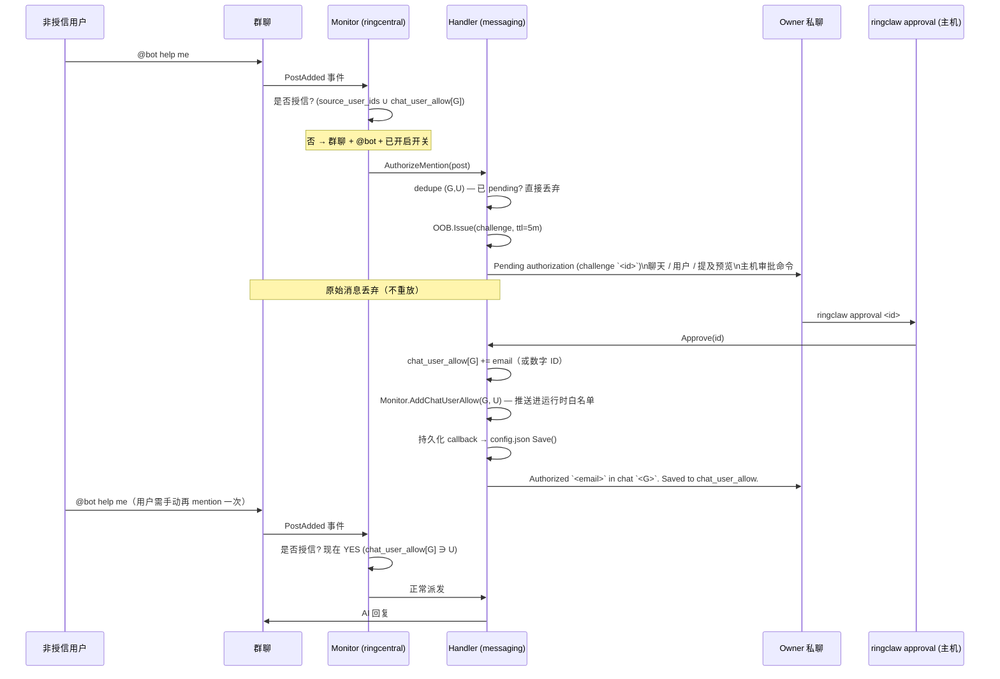

# 发送者白名单（第零层）

每条 WebSocket 消息在进入下面任意一层之前，都先经过 trusted
sender 白名单。这一页讲清三个白名单源、强制 strict mode 启动
行为，以及让运维可以**在不重启的情况下**把非授信用户加入特定
聊天的 **authorize-mention OOB 流程**。

第零层与其他层的关系见 [权限矩阵](./index#权限矩阵)。

## 白名单如何拼装

`ringclaw start` 启动后，WebSocket monitor 与消息 handler 都进入
**strict sender 模式**：只有 trusted sender 白名单上的用户 ID
才能驱动 AI agent。该白名单是以下 **三者的并集**：

1. Private App owner ID（配置了 Private App 时自动注入）。
2. `ringcentral.source_user_ids` 中所有条目（启动时解析为数字
   user ID）。
3. 目标聊天的 `ringcentral.chat_user_allow[<chatID>]`（启动时
   按 `source_user_ids` 同样的方式解析）。这是**按群分层叠加的
   例外**而不是全局放宽——`chat_user_allow` 只在列出的群里允许
   列出的用户。

如果三者全空，bot 在启动时打 ERROR 并 **丢弃所有** 收到的消息，
直到运维加入至少一个 trusted sender。这避免了"任意进入允许
聊天的人都可以驱动 AI agent"这种隐患。

```yaml
ringcentral:
  source_user_ids:
    - "+15551234567"       # 电话号码，启动时解析
    - alice@example.com    # 邮箱，通过 Private App directory 解析
    - "987654321"          # 直接的数字 extensionId / user ID
```

::: tip
邮箱与电话号码条目需要带 `ReadAccounts` 权限的 Private App
才能解析为数字 ID。没有 Private App 时请直接列数字 extensionId。
:::

## `chat_user_allow` —— 按群例外层

`ringcentral.chat_user_allow` 是叠加在 `source_user_ids` 之上的
按群白名单：

```jsonc
{
  "ringcentral": {
    "chat_user_allow": {
      "chat-engineering-7": ["alice@example.com", "3061708020"],
      "chat-design-9":      ["bob@example.com"]
    }
  }
}
```

标识符可以是数字 extension ID、邮箱或 E.164 电话号码（启动时
通过 Private App directory 解析为数字 ID）。运维可以手工预置，
也可以让 [authorize-mention OOB 流程](#authorize-mention-oob-流程)
在批准时自动写入。

关键不变量：`chat_user_allow` **只放宽列出聊天的发送者白名单**。
它**不会**解锁特权第一层命令（`/cwd`、`/cron`、`/new`、`/reload`、
`/full-access`、总结自然语言触发）—— 这些仍要求
Private-App-owner 身份。详见 [命令授权](./command-authorization)。

## Authorize-mention OOB 流程

RingClaw 在与 `/full-access`、跨聊天 OOB challenge 共用一套
::: danger 安全公告（v0.4.2 → v0.4.3）
v0.4.3 之前任何变成"trusted"的发件人——无论是通过
`source_user_ids`、`chat_user_allow` 还是 v0.4.1 OOB 审批——
都驱动与 bot 操作员相同的 agent 后端，能在 agent 工具调用通道
里发起文件系统（`List`、`Read`、`Write`）、终端（`Bash`）、
外部 HTTP 调用。

**v0.4.3（本版本）—— 针对 `fs/*` + `terminal/*` 的双层 fail-closed
非-owner 隔离：**

- "Owner" 现在严格只是 **`source_user_ids`** 集合（加上解析出
  的 Private App 机主）。`chat_user_allow` 用户、v0.4.0 OOB
  审批通过的用户都被视为 **non-owner**，按下述受限上限运行。
- **第一层（协议）：** 创建非-owner 的 ACP 会话之后立刻发送
  `session/set_mode <restricted>`。modeID 走每家 agent 一张表：
  `droid → spec`，`claude → plan`，`gemini → plan`，
  `qwen → plan`，`cursor-agent → plan`。未知 agent 走启发式：
  在 `availableModes` 里找名称含 `plan`/`spec`/`read`/`safe`
  的 mode。
- **第二层（客户端 fail-closed gate）：** ringclaw 拒绝来自
  非-owner 会话的任何 `fs/read_text_file` /
  `fs/write_text_file` / `terminal/create` /
  `terminal/output` / `terminal/wait_for_exit` /
  `terminal/kill` / `terminal/release` JSON-RPC 请求，无视 agent
  本身对 mode 的执行情况。`session/request_permission` 也会被
  deny（agent 收到的是 `kind=deny` 选项或 `cancelled` 结果）。
- **找不到只读 mode = fail-closed。** 当 agent 没有任何只读
  mode 且运维也没配 override 时，非-owner 消息**不会**进入
  agent；用户拿到一段拒绝文案；审计日志打
  `restricted_mode_unsupported_no_mode`。
- **`chat_user_allow` 仍每次启动强制清空**（v0.4.2 止血措施）。

**第一层已知局限（best-effort）：** 部分上游 agent 不会强制执行
只读 mode（qwen-code#1806 set_mode 返回成功但不强制；
gemini-cli#22191 plan mode 在 ACP 路径有已知 bug）。`fs/*` +
`terminal/*` 的真正安全边界由第二层提供。**WebFetch /
WebSearch / 内置 HTTP 工具 / MCP 自定义工具** 由 agent 进程
本身发起，ringclaw 看不到对应的 JSON-RPC 请求，因此第二层无法
覆盖——这部分仍只能依赖第一层 best-effort。v0.5.0 计划用 OS
级别 sandbox 把这部分也封住。

**运维 override：** 每家 agent 的默认 modeID 可以通过
`config.json` 中的 `agents.<name>.restricted_mode_id` 覆盖。
override 必须在 agent 自己的 `availableModes` 列表里，否则
内置选择仍然生效。
:::

challenge / 主机审批基础设施之上叠加了一条独立 OOB 入口，让
运维可以**按群**临时把非授信用户加入信任范围而无需重启或手工
编辑 `config.json`。开关字段是
`ringcentral.allow_group_mention_authorize`：

- **未设置**（v0.4.2 起的默认）：功能**关闭**。非授信群聊
  `@bot` 静默丢弃——与 v0.4.0 行为一致。
- **`true`**：功能开启。非授信群聊 `@bot` 会在 owner 私聊里
  弹出 `/approval` 审批提示。要求运行时存在 Private App + 已
  解析的 owner 私聊；缺失时启动时打 ERROR 日志并禁用功能。
  ringclaw 还会在启动时打一条 WARN 提醒运维：被批准的用户当
  前会获得 agent 完整能力。
- **`false`**：功能关闭，等同未设置。

触发条件很窄：用户**不在**全局 `source_user_ids` 白名单，**也
不在**目标聊天的 `chat_user_allow` 条目中，并且在允许的群聊里
发出真正的 `@bot` 消息。同一用户的纯文本消息、或非允许聊天里
的 `@bot` 仍然按旧逻辑丢弃。



### 关键不变量

- **原始消息丢弃。** 触发 challenge 的那条 `@bot` **不会**在
  批准后重放。用户必须再 `@bot` 一次才能真正驱动 AI。这避免
  了"先写好的 prompt 在运维批准之后被无意触发"。
- **仅按群作用域。** 授权落在 `chat_user_allow[<chatID>]`，绝
  不会写入全局 `source_user_ids`。在群 A 批准的用户不会因此在
  群 B 也被信任。
- **特权第一层命令仍未解锁。** `chat_user_allow` 只放宽第零
  层。非 owner 的特权第一层命令仍要求 Private-App-owner 身
  份。详见 [命令授权](./command-authorization)。

::: warning 第二层（agent 工具调用）—— 非-owner 上限（v0.4.3+）
被列入的用户可以像任何 trusted sender 一样驱动 AI agent，**但**
v0.4.3 在他们的会话上加了一道 fail-closed 上限：

- `fs/read_text_file`、`fs/write_text_file`、
  `terminal/create` / `output` / `wait_for_exit` / `kill` /
  `release`、`session/request_permission` 在 ringclaw
  客户端层就被 deny。agent 拿到的是 `code=-32001`（"非-owner
  发件人调用被拒"）。
- 会话同时被请求切换到只读 mode（droid 走 `spec`，其余走
  `plan`）作为纵深防御。当 agent 不支持任何合适 mode 时，
  消息会直接被拒，不进入 agent。
- 文字回复与 RingCentral
  `ACTION:MESSAGE / TASK / NOTE / EVENT` 仍可用（后者走
  RingCentral REST API，不走 ACP）。

**第二层覆盖不到的部分：** `WebFetch`、`WebSearch`、MCP 自定义
工具。这些是 agent 进程内部派发的，ringclaw 看不到。v0.5.0 计
划通过 OS 级 sandbox 把这部分也封住。在那之前，把
`chat_user_allow` 用户视为"可以让 agent 读公网、可以让 agent
说话"，但**不再**是"可以 shell 进你的主机"。
:::
- **Pending dedupe。** 同一 `(chatID, userID)` 在 challenge TTL
  内同时只能存在一个 pending challenge。批准 / 拒绝 / 过期 /
  prompt 发送失败任一收尾路径都会释放这把锁。
- **24 小时冷却（v0.4.1+）。** challenge 走完拒绝或过期路径
  后，同一 `(chatID, userID)` 进入 24 小时静默期：期间该用户
  在该群再次 `@bot` 会被直接丢弃，不再向 owner 私聊投递新的
  审批提示。这能避免一个吵闹或恶意的非授信用户反复 `@bot` 把
  owner 私聊灌爆。批准路径**不**写冷却（用户已通过
  `chat_user_allow` 信任），瞬时错误（如 owner 私聊发送失败）
  也**不**写冷却，让运维下次有机会再处理。冷却状态仅存在内存
  中，进程重启会清空——这是可以接受的，因为重启本就是运维主
  动操作。
- **持久化是 best-effort。** 批准时同步更新 monitor + handler
  的内存白名单，再触发 `config.json` Save。Save 失败时打
  `ERROR authorize-mention: persist failed`，本进程内仍然信任，
  但下次重启会丢失——重视持久化的运维请关注该日志行。
- **持久化优先存邮箱。** 目录解析能拿到邮箱时存邮箱；否则存
  数字 extension ID 并打 `WARN authorize-mention: no email
  available`。手工编辑时也可使用 `source_user_ids` 接受的三种
  形式（数字 / 邮箱 / E.164 电话），下次启动会自动解析。
- **不引入新审批命令。** 主机 CLI 仍然是
  `ringclaw approval <id>` / `ringclaw approval deny <id>`，同
  一条命令统一审批 authorize-mention、`/full-access` 与跨聊天
  OOB challenge。challenge 的 `intent` 字段在审计日志中区分类
  型。详见 [审批 CLI](./approval-cli)。
- **Owner self-challenge 守卫。** 当 `post.CreatorID` 与
  Private App owner 的 ID 相同时，handler 拒绝发起
  authorize-mention challenge。Monitor 的第零层已经允许 owner
  通过；走到这里意味着出现 bug 或恶意直接调用，fail-closed 防
  止 owner 被路由到一条"用户 X 申请授权"的 prompt（其实 X 就
  是自己）。

### 失败模式

| 条件 | 行为 |
|---|---|
| `allow_group_mention_authorize` 未设置（v0.4.2 起的默认） | 功能关闭，非授信 `@bot` 静默丢弃（v0.4.0 基线）。 |
| `allow_group_mention_authorize: false` | 显式关闭，行为与未设置一致。 |
| `allow_group_mention_authorize: true` | 显式开启。ringclaw 启动时打一条 WARN 提醒运维：被批准的用户获得 agent 完整能力。 |
| Private App 未配置（owner 私聊不可解析） | 启动时禁用功能并打 ERROR 日志；非授信 `@bot` 静默丢弃。 |
| 磁盘上残留的 `chat_user_allow` 条目（v0.4.1 遗留） | 启动时强制清空并打 ERROR 日志，运维必须重新评估后手工添加。 |
| 非-owner 命中没有只读 mode 的 agent | v0.4.3 fail-closed：消息**不**进入 agent；用户收到一段拒绝文案；审计日志打 `restricted_mode_unsupported_no_mode`。 |
| 非-owner + agent 拒绝 `session/set_mode` | v0.4.3 fail-closed：同上；(`agentCmd`, `modeID`) 被缓存，后续尝试跳过该 RPC。 |
| 运行时 owner 私聊尚未解析 | 命中竞争窗口的那一条消息丢弃并打 `WARN authorize-mention: OOB or owner DM unconfigured; dropping`；私聊解析完成后后续消息正常。 |
| 运维拒绝 challenge | 释放 pending 锁；owner 私聊收到通知。`(chat, user)` 进入 24 小时冷却——期间再 `@bot` 会被静默丢弃。 |
| Challenge 过期（5 分钟 TTL） | 释放 pending 锁；owner 私聊收到过期通知。同样进入 24 小时冷却。 |
| Owner 私聊发送失败（RC 瞬时错误） | challenge 自动 deny；释放 pending 锁。**不**写冷却，下次 `@bot` 重新尝试。 |
| 持久化 callback 失败（如配置文件写错） | 内存中的授权仍然有效；打 `ERROR authorize-mention: persist failed`。重启后用户重新被锁。 |

### 不开启 OOB 直接预置授权

想在不启用 OOB 流程的情况下信任已知用户，可以手工编辑
`chat_user_allow`：

```jsonc
{
  "ringcentral": {
    "allow_group_mention_authorize": false,  // OOB 关闭
    "chat_user_allow": {
      "chat-engineering-7": ["alice@example.com"]
    }
  }
}
```

这只在 `chat-engineering-7` 中信任 Alice，不会触发任何
challenge。两个字段互相独立。

## 审计日志条目

| 事件 | 日志行 | 用途 |
|---|---|---|
| 启动时 sender 白名单为空 | `sender allowlist is empty: ...` | strict mode 因为没有 source_user_ids 也没有 Private App owner 而退化为 deny-all 的标准信号。 |
| Authorize-mention 路由（monitor） | `INFO authorize-mention: routing non-trusted group mention`（含 `chatID`、`userID`） | 确认 WebSocket monitor 把非授信 `@bot` 交给 OOB 流程而非丢弃。 |
| Authorize-mention challenge 发起 | `INFO oob: challenge issued`（`intent` 以 `authorize user … in chat …` 开头） | 与 `/full-access`、跨聊天 OOB 共用同一行；`intent` 字段区分类型。 |
| 授权完成 | `INFO authorize-mention: granted`（含 `challengeID`、`chatID`、`userID`、`identifier`） | 在 `applyAuthorize` 更新内存白名单并持久化后触发。 |
| 拒绝 / 过期 | `INFO authorize-mention: denied` 或 `INFO authorize-mention: challenge expired`（含 `cooldown=24h`） | granted 行的对偶。pending dedupe 锁释放，并写入 24 小时静默窗口。 |
| 命中冷却 | `DEBUG authorize-mention: in cooldown after recent deny/expire, dropping` | `(chat, user)` 在 24 小时静默期内的再次 `@bot` 会被静默丢弃，不再打扰 owner。 |
| 持久化失败 | `ERROR authorize-mention: persist failed`（含 `error`） | 内存授权成功但写 `config.json` 失败——本进程内仍生效，重启会丢。 |
| Prompt 发送失败 | `ERROR authorize-mention: post prompt failed`（含 `error`） | Owner 私聊发送失败；challenge 自动 deny，pending 锁释放，用户可重试。 |
| 没有可用邮箱 | `WARN authorize-mention: no email available, persisting numeric ID` | 目录解析无邮箱；改存数字 extension ID（仍按群作用域）。 |
| v0.4.3：非-owner 应用受限 mode | `WARN acp restricted-mode event`（`event=restricted_mode_applied`、`mode_id`、`mode_source`、`conversation`、`sender_id`） | 第一层成功：agent 接受了非-owner 会话的只读 mode。 |
| v0.4.3：受限 mode 不可用（无候选） | `WARN acp restricted-mode event`（`event=restricted_mode_unsupported_no_mode`、`available_modes`） | 第一层 fail-closed：内置表与启发式都没匹配。非-owner 消息被拒。 |
| v0.4.3：受限 mode 不可用（`set_mode` 被拒） | `WARN acp restricted-mode event`（`event=restricted_mode_unsupported`、`error="Method not found"`） | 第一层 fail-closed：agent 拒绝调用。被缓存，后续跳过。 |
| v0.4.3：第二层工具调用被拒 | `WARN acp non-owner tool call denied`（`event=tool_call_denied`、`method`、`session`、`reason`） | 客户端 fail-closed 拒绝 `fs/*` / `terminal/*` / `session/request_permission`，按 (session, method) 去重。 |
