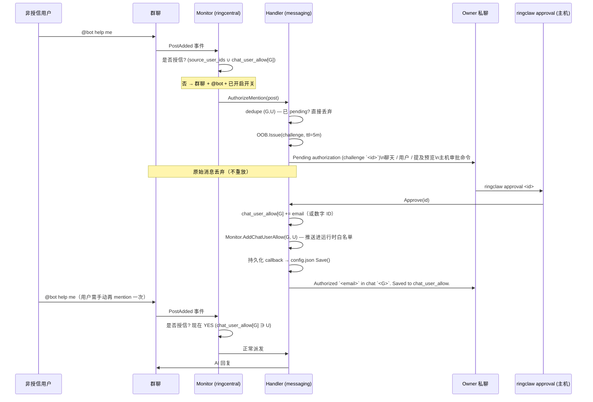

# 发送者白名单（第零层）

每条 WebSocket 消息在进入下面任意一层之前，都先经过 trusted
sender 白名单。这一页讲清三个白名单源、强制 strict mode 启动
行为，以及让运维可以**在不重启的情况下**把非授信用户加入特定
聊天的 **authorize-mention OOB 流程**。

第零层与其他层的关系见 [权限矩阵](./index#权限矩阵)。

## 白名单如何拼装

`ringclaw start` 启动后，WebSocket monitor 与消息 handler 都进入
**strict sender 模式**：只有 trusted sender 白名单上的用户 ID
才能驱动 AI agent。该白名单是以下 **三者的并集**：

1. Private App owner ID（配置了 Private App 时自动注入）。
2. `ringcentral.source_user_ids` 中所有条目（启动时解析为数字
   user ID）。
3. 目标聊天的 `ringcentral.chat_user_allow[<chatID>]`（启动时
   按 `source_user_ids` 同样的方式解析）。这是**按群分层叠加的
   例外**而不是全局放宽——`chat_user_allow` 只在列出的群里允许
   列出的用户。

如果三者全空，bot 在启动时打 ERROR 并 **丢弃所有** 收到的消息，
直到运维加入至少一个 trusted sender。这避免了"任意进入允许
聊天的人都可以驱动 AI agent"这种隐患。

```yaml
ringcentral:
  source_user_ids:
    - "+15551234567"       # 电话号码，启动时解析
    - alice@example.com    # 邮箱，通过 Private App directory 解析
    - "987654321"          # 直接的数字 extensionId / user ID
```

::: tip
邮箱与电话号码条目需要带 `ReadAccounts` 权限的 Private App
才能解析为数字 ID。没有 Private App 时请直接列数字 extensionId。
:::

## `chat_user_allow` —— 按群例外层

`ringcentral.chat_user_allow` 是叠加在 `source_user_ids` 之上的
按群白名单：

```jsonc
{
  "ringcentral": {
    "chat_user_allow": {
      "chat-engineering-7": ["alice@example.com", "3061708020"],
      "chat-design-9":      ["bob@example.com"]
    }
  }
}
```

标识符可以是数字 extension ID、邮箱或 E.164 电话号码（启动时
通过 Private App directory 解析为数字 ID）。运维可以手工预置，
也可以让 [authorize-mention OOB 流程](#authorize-mention-oob-流程)
在批准时自动写入。

关键不变量：`chat_user_allow` **只放宽列出聊天的发送者白名单**。
它**不会**解锁特权第一层命令（`/cwd`、`/cron`、`/new`、`/reload`、
`/full-access`、总结自然语言触发）—— 这些仍要求
Private-App-owner 身份。详见 [命令授权](./command-authorization)。

## Authorize-mention OOB 流程

RingClaw 在与 `/full-access`、跨聊天 OOB challenge 共用一套
challenge / 主机审批基础设施之上叠加了一条独立 OOB 入口，让
运维可以**按群**临时把非授信用户加入信任范围而无需重启或手工
编辑 `config.json`。它由单一开关
（`ringcentral.allow_group_mention_authorize: true`）显式开启，
默认**关闭**——不开启时行为与之前完全一致。

触发条件很窄：用户**不在**全局 `source_user_ids` 白名单，**也
不在**目标聊天的 `chat_user_allow` 条目中，并且在允许的群聊里
发出真正的 `@bot` 消息。同一用户的纯文本消息、或非允许聊天里
的 `@bot` 仍然按旧逻辑丢弃。



### 关键不变量

- **原始消息丢弃。** 触发 challenge 的那条 `@bot` **不会**在
  批准后重放。用户必须再 `@bot` 一次才能真正驱动 AI。这避免
  了"先写好的 prompt 在运维批准之后被无意触发"。
- **仅按群作用域。** 授权落在 `chat_user_allow[<chatID>]`，绝
  不会写入全局 `source_user_ids`。在群 A 批准的用户不会因此在
  群 B 也被信任。
- **特权命令仍未解锁。** `chat_user_allow` 只放宽第零层。非
  owner 的特权第一层命令仍要求 Private-App-owner 身份。详见
  [命令授权](./command-authorization)。
- **Pending dedupe。** 同一 `(chatID, userID)` 在 challenge TTL
  内同时只能存在一个 pending challenge。批准 / 拒绝 / 过期 /
  prompt 发送失败任一收尾路径都会释放这把锁，用户下次 `@bot`
  可重新发起。
- **持久化是 best-effort。** 批准时同步更新 monitor + handler
  的内存白名单，再触发 `config.json` Save。Save 失败时打
  `ERROR authorize-mention: persist failed`，本进程内仍然信任，
  但下次重启会丢失——重视持久化的运维请关注该日志行。
- **持久化优先存邮箱。** 目录解析能拿到邮箱时存邮箱；否则存
  数字 extension ID 并打 `WARN authorize-mention: no email
  available`。手工编辑时也可使用 `source_user_ids` 接受的三种
  形式（数字 / 邮箱 / E.164 电话），下次启动会自动解析。
- **不引入新审批命令。** 主机 CLI 仍然是
  `ringclaw approval <id>` / `ringclaw approval deny <id>`，同
  一条命令统一审批 authorize-mention、`/full-access` 与跨聊天
  OOB challenge。challenge 的 `intent` 字段在审计日志中区分类
  型。详见 [审批 CLI](./approval-cli)。
- **Owner self-challenge 守卫。** 当 `post.CreatorID` 与
  Private App owner 的 ID 相同时，handler 拒绝发起
  authorize-mention challenge。Monitor 的第零层已经允许 owner
  通过；走到这里意味着出现 bug 或恶意直接调用，fail-closed 防
  止 owner 被路由到一条"用户 X 申请授权"的 prompt（其实 X 就
  是自己）。

### 失败模式

| 条件 | 行为 |
|---|---|
| `allow_group_mention_authorize` 未设 / `false` | 功能关闭——非授信 `@bot` 回退为旧的静默丢弃。 |
| 未配置 Private App（解析不到 owner 私聊） | 启动时打 `ERROR allow_group_mention_authorize requires Private App + resolved owner DM; feature disabled` 并禁用功能；保留旧的静默丢弃。 |
| 运行时 owner 私聊尚未解析 | 命中竞争窗口的那一条消息丢弃并打 `WARN authorize-mention: OOB or owner DM unconfigured; dropping`；私聊解析完成后后续消息正常。 |
| 运维拒绝 challenge | 释放 pending 锁；challenge 立刻终结；owner 私聊收到通知。下次 `@bot` 重新发起 challenge。 |
| Challenge 过期（5 分钟 TTL） | 释放 pending 锁；owner 私聊收到过期通知。下次 `@bot` 重新发起 challenge。 |
| Owner 私聊发送失败（RC 瞬时错误） | challenge 自动 deny；释放 pending 锁。下次 `@bot` 重新尝试。 |
| 持久化 callback 失败（如配置文件写错） | 内存中的授权仍然有效；打 `ERROR authorize-mention: persist failed`。重启后用户重新被锁。 |

### 不开启 OOB 直接预置授权

想在不启用 OOB 流程的情况下信任已知用户，可以手工编辑
`chat_user_allow`：

```jsonc
{
  "ringcentral": {
    "allow_group_mention_authorize": false,  // OOB 关闭
    "chat_user_allow": {
      "chat-engineering-7": ["alice@example.com"]
    }
  }
}
```

这只在 `chat-engineering-7` 中信任 Alice，不会触发任何
challenge。两个字段互相独立。

## 审计日志条目

| 事件 | 日志行 | 用途 |
|---|---|---|
| 启动时 sender 白名单为空 | `sender allowlist is empty: ...` | strict mode 因为没有 source_user_ids 也没有 Private App owner 而退化为 deny-all 的标准信号。 |
| Authorize-mention 路由（monitor） | `INFO authorize-mention: routing non-trusted group mention`（含 `chatID`、`userID`） | 确认 WebSocket monitor 把非授信 `@bot` 交给 OOB 流程而非丢弃。 |
| Authorize-mention challenge 发起 | `INFO oob: challenge issued`（`intent` 以 `authorize user … in chat …` 开头） | 与 `/full-access`、跨聊天 OOB 共用同一行；`intent` 字段区分类型。 |
| 授权完成 | `INFO authorize-mention: granted`（含 `challengeID`、`chatID`、`userID`、`identifier`） | 在 `applyAuthorize` 更新内存白名单并持久化后触发。 |
| 拒绝 / 过期 | `INFO authorize-mention: denied` 或 `INFO authorize-mention: challenge expired` | granted 行的对偶。pending dedupe 锁同时释放。 |
| 持久化失败 | `ERROR authorize-mention: persist failed`（含 `error`） | 内存授权成功但写 `config.json` 失败——本进程内仍生效，重启会丢。 |
| Prompt 发送失败 | `ERROR authorize-mention: post prompt failed`（含 `error`） | Owner 私聊发送失败；challenge 自动 deny，pending 锁释放，用户可重试。 |
| 没有可用邮箱 | `WARN authorize-mention: no email available, persisting numeric ID` | 目录解析无邮箱；改存数字 extension ID（仍按群作用域）。 |
